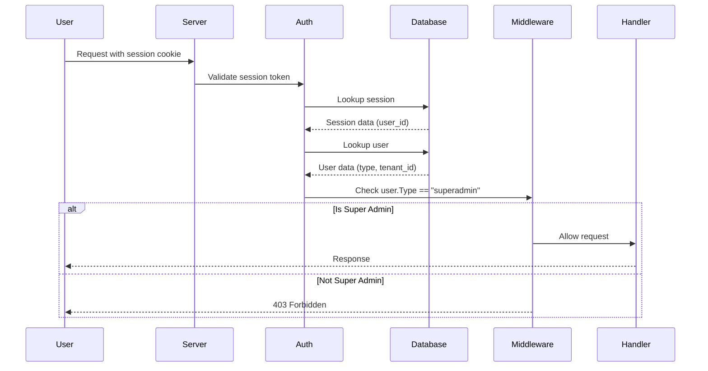

# Super Admin Server Documentation

## Table of Contents
1. [Overview](#overview)
2. [Architecture](#architecture)
3. [Deployment](#deployment)
4. [Authentication Flow](#authentication-flow)
5. [API Endpoints](#api-endpoints)
6. [Development Setup](#development-setup)
7. [Production Deployment](#production-deployment)
8. [Monitoring & Logging](#monitoring--logging)
9. [Security Considerations](#security-considerations)

---

## Overview

The Super Admin Server is a separate deployment of IOTA SDK designed specifically for platform-wide operations and tenant management. It runs as an isolated service with restricted access, ensuring that only authorized super administrators can perform critical operations.

### Key Characteristics

- **Isolated Deployment**: Runs independently from the main application server
- **Minimal Module Loading**: Only loads `core` and `superadmin` modules for optimal performance
- **Global Authentication**: All routes protected by super admin middleware
- **Shared Infrastructure**: Uses same database and environment configuration as main app
- **Tenant Management**: Cross-tenant operations and analytics
- **Platform Operations**: System-wide settings and monitoring

---

## Architecture

### Module Structure

The Super Admin server uses a minimal module configuration:

```go
// Loaded Modules
- core         // Essential services (auth, users, sessions)
- superadmin   // Platform management functionality

// NOT Loaded (unlike main app)
- finance, warehouse, crm, hrm, projects, etc.
```

This selective loading reduces memory footprint and improves security by eliminating unnecessary code paths.

### Middleware Stack

The server applies a global middleware chain to all routes:

```
Request → Logging → Database → Authorization → Provide User → Super Admin Check → Handler
```

**Key Middleware:**
- `RequireSuperAdmin()`: Validates user type is `TypeSuperAdmin` (blocks all non-superadmin users)
- Standard auth middleware: Session validation, user context injection
- Database middleware: Provides database pool to handlers

### Data Model

**User Types:**
```go
const (
    TypeRegular    = "regular"    // Normal tenant users
    TypeSuperAdmin = "superadmin" // Platform administrators
)
```

Super admin users have:
- No tenant affiliation (or special system tenant)
- Access to all tenant data
- Permission to create/modify/delete tenants
- Platform-wide analytics visibility

---

## Deployment

### Environment Variables

The Super Admin server uses the **same environment variables** as the main application. This is intentional - both servers share the same database and core configuration.

**Required Variables:**
```bash
# Core Application
LOG_LEVEL=debug
SESSION_DURATION=720h
DOMAIN=superadmin.yourdomain.com
GO_APP_ENV=production

# Database (shared with main app)
DB_HOST=localhost
DB_PORT=5432
DB_NAME=iota_erp
DB_USER=postgres
DB_PASSWORD=postgres

# Server
PORT=3000  # Different container, so same var name is fine

# Authentication
GOOGLE_CLIENT_ID=your-client-id
GOOGLE_CLIENT_SECRET=your-client-secret
GOOGLE_REDIRECT_URL=https://superadmin.yourdomain.com/auth/google/callback

# Optional: OpenTelemetry
OTEL_ENABLED=true
OTEL_SERVICE_NAME=iota-superadmin
OTEL_TEMPO_URL=http://tempo:4318
```

**Important:** Update `DOMAIN` and `GOOGLE_REDIRECT_URL` to match your Super Admin deployment URL.

### Build Configuration

**Docker Build:**
```bash
# Build Super Admin image
docker build -f Dockerfile.superadmin -t iota-sdk-superadmin:latest .

# Tag for registry
docker tag iota-sdk-superadmin:latest your-registry/iota-sdk-superadmin:latest

# Push to registry
docker push your-registry/iota-sdk-superadmin:latest
```

**Local Build:**
```bash
# Build binary
go build -o run_superadmin cmd/superadmin/main.go

# Run locally
./run_superadmin
```

---

## Authentication Flow

### Super Admin Authentication

The server enforces a strict authentication flow:



### Session Management

Sessions are managed identically to the main application:

1. **Login**: User authenticates via OAuth (Google) or credentials
2. **Session Creation**: Server creates session with `user_id` and `tenant_id`
3. **Cookie**: Session ID stored in HTTP-only cookie
4. **Validation**: Each request validates session and checks user type
5. **Expiration**: Configurable via `SESSION_DURATION` (default 720h/30 days)

### Creating Super Admin Users

Super admin users must be created directly in the database:

```sql
-- Create superadmin user
INSERT INTO users (
    id,
    email,
    first_name,
    last_name,
    type,
    tenant_id,
    created_at,
    updated_at
) VALUES (
    gen_random_uuid(),
    'admin@yourdomain.com',
    'Super',
    'Admin',
    'superadmin',
    NULL,  -- No tenant affiliation
    NOW(),
    NOW()
);
```

**Note:** Super admin users are NOT created through the standard registration flow.

---

## API Endpoints

### Health & Status

```http
GET /health
```
Returns server health status and loaded modules.

**Response:**
```json
{
  "status": "healthy",
  "modules": ["core", "superadmin"],
  "timestamp": "2025-09-30T10:00:00Z"
}
```

### Dashboard

```http
GET /superadmin
```
Super admin dashboard with platform analytics.

**Authentication:** Required (super admin)

**Response:** HTML page with:
- Total tenants count
- Active users across all tenants
- System resource usage
- Recent platform activity

### Tenant Management

```http
GET /superadmin/tenants
```
List all tenants in the system.

**Authentication:** Required (super admin)

```http
GET /superadmin/tenants/:id
```
View detailed tenant information.

**Authentication:** Required (super admin)

```http
POST /superadmin/tenants
```
Create a new tenant.

**Authentication:** Required (super admin)

**Request Body:**
```json
{
  "name": "New Company",
  "domain": "newcompany.com",
  "plan": "enterprise",
  "max_users": 100
}
```

```http
PUT /superadmin/tenants/:id
```
Update tenant settings.

**Authentication:** Required (super admin)

```http
DELETE /superadmin/tenants/:id
```
Delete a tenant (soft delete).

**Authentication:** Required (super admin)

### Analytics

```http
GET /superadmin/analytics
```
Platform-wide analytics and metrics.

**Authentication:** Required (super admin)

**Response:**
```json
{
  "tenants": {
    "total": 150,
    "active": 142,
    "trial": 8
  },
  "users": {
    "total": 5420,
    "active_today": 1230,
    "new_this_month": 89
  },
  "usage": {
    "storage_gb": 245.3,
    "api_calls_today": 89432,
    "database_size_gb": 12.7
  }
}
```

### User Management

```http
GET /superadmin/users
```
List all users across all tenants.

**Authentication:** Required (super admin)

**Query Parameters:**
- `tenant_id` - Filter by tenant
- `type` - Filter by user type
- `search` - Search by name/email
- `page` - Pagination page
- `limit` - Results per page

```http
GET /superadmin/users/:id
```
View detailed user information.

**Authentication:** Required (super admin)

### GraphQL API

```http
POST /graphql
```
GraphQL endpoint for complex queries.

**Authentication:** Required (super admin)

**Example Query:**
```graphql
query GetTenantMetrics($tenantId: ID!) {
  tenant(id: $tenantId) {
    id
    name
    userCount
    storageUsed
    lastActivity
    plan {
      name
      maxUsers
      features
    }
  }
}
```

---

## Development Setup

### Prerequisites

- Go 1.24.10+
- PostgreSQL 13+
- Make
- Docker (optional)

### Local Development

1. **Clone Repository:**
```bash
git clone https://github.com/iota-uz/iota-sdk.git
cd iota-sdk
```

2. **Configure Environment:**
```bash
cp .env.example .env.superadmin
# Edit .env.superadmin with your settings
```

3. **Run Database Migrations:**
```bash
make db migrate up
```

4. **Create Super Admin User:**
```bash
# Run SQL from "Creating Super Admin Users" section
psql $DATABASE_URL -f scripts/create-superadmin.sql
```

5. **Build and Run:**
```bash
# Build
go build -o run_superadmin cmd/superadmin/main.go

# Run
./run_superadmin
```

6. **Access Server:**
```
http://localhost:3000
```

### Development with DevHub

If using [DevHub](https://github.com/iota-uz/devhub):

```bash
# Add superadmin service to devhub.yaml
devhub add superadmin go run cmd/superadmin/main.go

# Start all services including superadmin
devhub start
```

### Testing

```bash
# Run tests for superadmin module
go test -v ./modules/superadmin/...

# Run integration tests with verbose output
go test -v ./modules/superadmin/...
```

---

## Production Deployment

### Railway Deployment

Railway.app deployment requires two separate services:

**Service 1: Main Application**
```toml
# railway.toml
[build]
builder = "dockerfile"
dockerfilePath = "Dockerfile"

[deploy]
startCommand = "/home/iota-user/run_server"
restartPolicyType = "on-failure"
```

**Service 2: Super Admin**
```toml
# railway.superadmin.toml
[build]
builder = "dockerfile"
dockerfilePath = "Dockerfile.superadmin"

[deploy]
startCommand = "/home/iota-user/run_superadmin"
restartPolicyType = "on-failure"
```

**Environment Configuration:**
- Both services share the same PostgreSQL database
- Set environment variables in Railway dashboard
- Use different domains: `app.yourdomain.com` and `admin.yourdomain.com`

### Kubernetes Deployment

**Deployment YAML:**
```yaml
apiVersion: apps/v1
kind: Deployment
metadata:
  name: iota-superadmin
  namespace: iota-production
spec:
  replicas: 2
  selector:
    matchLabels:
      app: iota-superadmin
  template:
    metadata:
      labels:
        app: iota-superadmin
    spec:
      containers:
      - name: superadmin
        image: your-registry/iota-sdk-superadmin:latest
        ports:
        - containerPort: 3000
        env:
        - name: DATABASE_URL
          valueFrom:
            secretKeyRef:
              name: iota-secrets
              key: database-url
        - name: PORT
          value: "3000"
        - name: GO_APP_ENV
          value: "production"
        resources:
          requests:
            memory: "256Mi"
            cpu: "250m"
          limits:
            memory: "512Mi"
            cpu: "500m"
        livenessProbe:
          httpGet:
            path: /health
            port: 3000
          initialDelaySeconds: 30
          periodSeconds: 10
        readinessProbe:
          httpGet:
            path: /health
            port: 3000
          initialDelaySeconds: 5
          periodSeconds: 5
---
apiVersion: v1
kind: Service
metadata:
  name: iota-superadmin-service
  namespace: iota-production
spec:
  selector:
    app: iota-superadmin
  ports:
  - protocol: TCP
    port: 80
    targetPort: 3000
  type: ClusterIP
---
apiVersion: networking.k8s.io/v1
kind: Ingress
metadata:
  name: iota-superadmin-ingress
  namespace: iota-production
  annotations:
    cert-manager.io/cluster-issuer: "letsencrypt-prod"
spec:
  tls:
  - hosts:
    - admin.yourdomain.com
    secretName: superadmin-tls
  rules:
  - host: admin.yourdomain.com
    http:
      paths:
      - path: /
        pathType: Prefix
        backend:
          service:
            name: iota-superadmin-service
            port:
              number: 80
```

### Docker Compose

**docker-compose.superadmin.yml:**
```yaml
version: '3.8'

services:
  superadmin:
    build:
      context: .
      dockerfile: Dockerfile.superadmin
    ports:
      - "3001:3000"  # Different host port
    environment:
      - DATABASE_URL=postgres://postgres:postgres@db:5432/iota_erp
      - PORT=3000
      - GO_APP_ENV=production
      - DOMAIN=admin.yourdomain.com
    depends_on:
      - db
    restart: unless-stopped
    networks:
      - iota-network

  db:
    image: postgres:13
    environment:
      POSTGRES_DB: iota_erp
      POSTGRES_USER: postgres
      POSTGRES_PASSWORD: postgres
    volumes:
      - postgres_data:/var/lib/postgresql/data
    networks:
      - iota-network

networks:
  iota-network:
    driver: bridge

volumes:
  postgres_data:
```

**Run:**
```bash
docker-compose -f docker-compose.superadmin.yml up -d
```

---

## Monitoring & Logging

### Application Logs

The Super Admin server uses structured logging with logrus:

```go
logger.WithFields(logrus.Fields{
    "user_id": userId,
    "tenant_id": tenantId,
    "action": "tenant_created",
}).Info("Super admin created new tenant")
```

**Log Levels:**
- `DEBUG`: Detailed debugging information
- `INFO`: General operational messages
- `WARN`: Warning messages (non-critical issues)
- `ERROR`: Error messages (critical issues)

**Configuration:**
```bash
LOG_LEVEL=info  # debug, info, warn, error
```

### OpenTelemetry Tracing

Enable distributed tracing for performance monitoring:

```bash
OTEL_ENABLED=true
OTEL_SERVICE_NAME=iota-superadmin
OTEL_TEMPO_URL=http://tempo:4318
```

**Trace Propagation:**
- Automatic trace context injection
- Parent-child span relationships
- Cross-service correlation

### Health Checks

**Endpoint:**
```http
GET /health
```

**Response:**
```json
{
  "status": "healthy",
  "database": "connected",
  "modules": ["core", "superadmin"],
  "uptime_seconds": 3600,
  "timestamp": "2025-09-30T10:00:00Z"
}
```

**Use for:**
- Kubernetes liveness/readiness probes
- Load balancer health checks
- Monitoring system integration

### Metrics Collection

Recommended metrics to track:

- **Request Metrics:**
  - Requests per second
  - Response times (p50, p95, p99)
  - Error rates

- **Database Metrics:**
  - Connection pool usage
  - Query execution times
  - Active connections

- **Business Metrics:**
  - Tenant operations (create, update, delete)
  - Super admin logins
  - API usage per endpoint

---

## Security Considerations

### Access Control

1. **Super Admin Creation:**
   - Only create super admin accounts via direct database access
   - Never expose super admin creation through API
   - Use strong, unique passwords for OAuth accounts

2. **Session Security:**
   - HTTP-only cookies prevent XSS attacks
   - Secure flag in production (HTTPS only)
   - Configurable session expiration
   - Session invalidation on logout

3. **Network Isolation:**
   - Deploy on separate subdomain (admin.yourdomain.com)
   - Consider VPN or IP whitelist for additional security
   - Use TLS/HTTPS in production

### Database Security

1. **Connection Security:**
   - Use SSL/TLS for database connections
   - Store credentials in secrets management
   - Rotate database passwords regularly

2. **Query Safety:**
   - All queries use parameterized statements
   - No raw SQL string concatenation
   - Input validation on all endpoints

### Audit Logging

All super admin actions should be logged:

```go
logger.WithFields(logrus.Fields{
    "super_admin_id": user.ID(),
    "action": "delete_tenant",
    "tenant_id": tenantId,
    "ip_address": r.RemoteAddr,
    "user_agent": r.UserAgent(),
}).Warn("Super admin deleted tenant")
```

**Logged Actions:**
- Tenant create/update/delete
- User modifications across tenants
- Platform configuration changes
- Access to sensitive data

### Best Practices

1. **Principle of Least Privilege:**
   - Minimal number of super admin accounts
   - Regular review of super admin access
   - Remove unused accounts promptly

2. **Multi-Factor Authentication:**
   - Require MFA for super admin accounts
   - Use hardware security keys when possible
   - Enforce strong password policies

3. **Regular Security Audits:**
   - Review audit logs regularly
   - Monitor for suspicious activity
   - Update dependencies promptly

4. **Incident Response:**
   - Document security procedures
   - Maintain contact information
   - Test incident response plan

---

## Troubleshooting

### Common Issues

**1. 403 Forbidden on all routes**

**Cause:** User is not a super admin.

**Solution:**
```sql
-- Check user type
SELECT id, email, type FROM users WHERE email = 'your-email@domain.com';

-- Update user to superadmin
UPDATE users SET type = 'superadmin' WHERE email = 'your-email@domain.com';
```

**2. Database connection errors**

**Cause:** Database not accessible or incorrect credentials.

**Solution:**
```bash
# Test database connection
psql $DATABASE_URL

# Check environment variables
env | grep DB_
```

**3. Module registration errors**

**Cause:** Module dependencies not satisfied.

**Solution:**
```bash
# Rebuild with dependencies
go mod download
go build -o run_superadmin cmd/superadmin/main.go
```

**4. Session validation failures**

**Cause:** Session cookie not being set or expired.

**Solution:**
- Check `SESSION_DURATION` configuration
- Verify cookie domain matches deployment URL
- Clear browser cookies and re-login

### Debug Mode

Enable debug logging for troubleshooting:

```bash
LOG_LEVEL=debug ./run_superadmin
```

### Support

For issues and questions:
- GitHub Issues: https://github.com/iota-uz/iota-sdk/issues
- Discord Community: https://discord.gg/zKeTEZAQqF
- Documentation: https://github.com/iota-uz/iota-sdk/tree/main/docs

---

## Further Reading

- [IOTA SDK Architecture](./ARCHITECTURE.md)
- [Authentication & Authorization](./AUTH.md)
- [Deployment Guide](./DEPLOYMENT.md)
- [Contributing Guidelines](./CONTRIBUTING.MD)
