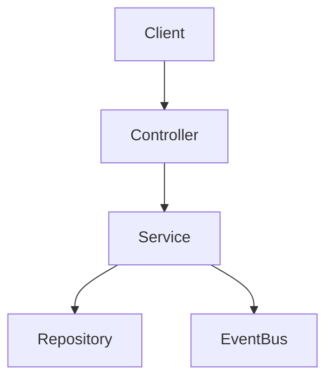

# DEV-PLAN-001：技术详细设计文档模板 (TDD Template)

**状态**: 已完成（2025-12-14 01:30 UTC）

## 模板说明
本模板旨在建立“代码级详细设计”标准（Level 4-5），确保文档交付后，开发人员无需再进行猜测或设计决策即可直接编码。适用于核心模块、复杂特性或涉及跨团队协作的变更。请复制以下内容作为新 DEV-PLAN 的起点。

---

# DEV-PLAN-XXX：[特性名称] 详细设计

**状态**: 规划中（YYYY-MM-DD HH:MM UTC）

## 1. 背景与上下文 (Context)
- **需求来源**: [链接到 PRD/Issue/User Story]
- **当前痛点**: 简述现状及为何需要此变更（例如：当前实现无法满足并发写入需求）。
- **业务价值**: 解决什么用户问题，预期的业务成果。

## 2. 目标与非目标 (Goals & Non-Goals)
- **核心目标**:
  - [ ] 实现 X 功能，响应时间 < 200ms (P99)。
  - [ ] 确保数据一致性，特别是 [特定场景]。
  - [ ] 通过 `make check lint` 与所有 CI 门禁。
  - [ ] 明确本计划命中的工具链/门禁触发器，并按 SSOT 执行与引用（见“工具链与门禁（SSOT 引用）”）。
  - [ ] (可选) 定义 Feature Flag 策略（如 `ENABLE_X_FEATURE`），明确灰度路径。
- **非目标 (Out of Scope)**:
  - 不包含 UI 动画效果。
  - 不处理跨租户的数据迁移（留待后续计划）。

## 2.1 工具链与门禁（SSOT 引用）
> **目的**：避免在 dev-plan 里复制工具链细节导致 drift；本文只声明“本计划命中哪些触发器/工具链”，并给出可复现的入口链接。

- **触发器清单（勾选本计划命中的项）**：
  - [ ] Go 代码（`go fmt ./... && go vet ./... && make check lint && make test`）
  - [ ] `.templ` / Tailwind（`make generate && make css`，并确保生成物提交）
  - [ ] 多语言 JSON（`make check tr`）
  - [ ] Authz（`make authz-test && make authz-lint`；策略聚合用 `make authz-pack`）
  - [ ] 路由治理（`make check routing`；必要时更新 `config/routing/allowlist.yaml`）
  - [ ] DB 迁移 / Schema（按模块/域对应的 dev-plan + `Makefile` 入口执行，如 `make db plan/lint/migrate ...`）
  - [ ] sqlc（按对应 dev-plan + `Makefile` 入口执行，如 `make sqlc-generate`）
  - [ ] Outbox（按 `DEV-PLAN-017` 与 runbook 约定执行与验收）

- **SSOT 链接（按需保留/补充）**：
  - 触发器矩阵与本地必跑：`AGENTS.md`
  - 命令入口与脚本实现：`Makefile`
  - CI 门禁定义：`.github/workflows/quality-gates.yml`
  - 工具链复用索引：`docs/dev-plans/009A-r200-tooling-playbook.md`

## 3. 架构与关键决策 (Architecture & Decisions)
### 3.1 架构图 (Mermaid)


### 3.2 关键设计决策 (ADR 摘要)
- **决策 1**: [例如：使用 ltree 存储层级关系]
  - **选项 A**: 邻接表。缺点：递归查询性能差。
  - **选项 B**: 闭包表。缺点：写放大严重。
  - **选项 C (选定)**: `ltree`。优点：Postgres 原生支持，读写平衡，符合项目技术栈。

## 4. 数据模型与约束 (Data Model & Constraints)
> **标准**: 必须精确到字段类型、空值约束、索引策略及数据库级约束（Check/Exclude）。

### 4.1 Schema 定义 (Atlas HCL / SQL)
```hcl
table "org_nodes" {
  column "id" { type = uuid, default = sql("gen_random_uuid()") }
  column "tenant_id" { type = uuid }
  column "code" { type = varchar(64) }

  // Valid Time（业务有效期）统一使用 date（日粒度）；时间戳仅用于 Audit/Tx Time（SSOT：DEV-PLAN-064）。
  column "effective_date" { type = date }
  column "end_date" { type = date, default = "9999-12-31" }

  primary_key { columns = [column.id] }

  // 强约束示例：同一租户下 Code 唯一
  index "idx_org_nodes_code" {
    columns = [column.tenant_id, column.code]
    unique  = true
  }

  // 高级约束示例：防时间重叠 (Postgres EXCLUDE)
  // 注：day 闭区间 [effective_date,end_date] 在 DB 用 daterange 的半开表示实现：
  // exclude using gist (tenant_id with =, code with =, daterange(effective_date, end_date + 1, '[)') with &&)
}
```

### 4.2 迁移策略
- **Up**: 创建表，添加索引，启用扩展（如 `ltree`）。
- **Down**: 删除表（注意：生产环境通常禁止破坏性 Down，需说明数据备份策略）。

## 5. 接口契约 (API Contracts)
> **标准**: 定义 URL、Method、Payload 字段（必填/选填/类型）、错误码。对于 UI 交互，需定义 HTMX 行为。

### 5.1 JSON API: `POST /api/v1/resource`
- **Request**:
  ```json
  {
    "code": "HR-001", // Required, unique
    "parent_id": "uuid", // Optional
    "effective_date": "2024-01-01" // Valid Time: YYYY-MM-DD（日粒度）
  }
  ```
- **Response (201 Created)**:
  ```json
  { "id": "uuid", ... }
  ```
- **Error Codes**:
  - `409 Conflict`: Code 已存在 (`ERR_CODE_DUPLICATE`).
  - `422 Unprocessable Entity`: 父节点不存在或形成环路.

### 5.2 HTMX 交互 (UI Partials)
- **Action**: 用户点击“保存”按钮。
- **Request**: `POST /resource/form` (Form Data)
- **Response (200 OK)**:
  - Body: 返回 HTML 片段 `<div id="target">...</div>` (例如更新后的列表行)。
  - Headers: `HX-Trigger: {"entityCreated": "uuid"}` (触发前端事件)。
- **Error Response**:
  - 422 Unprocessable Entity: 返回带错误信息的表单片段。

## 6. 核心逻辑与算法 (Business Logic & Algorithms)
> **标准**: 伪代码或状态机，消除歧义，特别是复杂写操作。

### 6.1 节点插入算法 (Insert Node)
1. **开启事务**。
2. **校验父节点**: 查询 `parent_id` 是否存在且 `status=active`；若不存在 -> Return Error `PARENT_NOT_FOUND`。
3. **计算 Path**: `new_path = parent.path + "." + new_id`；校验深度是否超限。
4. **时间片处理 (Effective Dating)**:
   - 锁定目标时间线 (`SELECT FOR UPDATE`)。
   - 若存在重叠片段 -> 截断旧片段 `end_date = new_effective_date - 1 day`。
   - 插入新片段 `[new_effective_date, 9999-12-31]`。
5. **发布事件**: 写入 Outbox `OrgNodeCreated`。
6. **提交事务**。

## 7. 安全与鉴权 (Security & Authz)
- **Casbin Policy**:
  - Subject: `tenant:{id}:user:{id}`
  - Object: `module.resource` (e.g., `org.nodes`)
  - Action: `create` / `read`
- **数据隔离**: 所有 SQL 查询必须包含 `WHERE tenant_id = $1`。

## 8. 依赖与里程碑 (Dependencies & Milestones)
- **依赖**:
  - 需先完成 DEV-PLAN-XXX (Schema)。
- **里程碑**:
  1. [ ] Schema 迁移脚本与 Atlas 校验。
  2. [ ] Repository 层 CRUD 与单元测试。
  3. [ ] Service 层复杂校验逻辑与算法实现。
  4. [ ] API 控制器与 E2E 测试。
  5. [ ] Readiness 验证记录。

## 9. 测试与验收标准 (Acceptance Criteria)
- **单元测试**:
  - [ ] 覆盖边界：时间重叠、环路检测、空值/默认值、并发、幂等、错误映射等。
  - [ ] 覆盖率门禁（如适用）：目标阈值、口径（Line/Branch）、统计范围与排除项（生成代码/第三方等），以及审计方式与证据链接。
- **集成测试**: 真实 DB 环境下，并发写入不产生脏数据。
- **Lint**: `make check lint` 通过，无 go-cleanarch 违规。
- **Readiness**: 执行 `docs/dev-records/DEV-PLAN-XXX-READINESS.md` 记录命令与结果。

## 10. 运维与监控 (Ops & Monitoring)
- **Feature Flag**:
  - 开关名称: `ENABLE_XXX` (默认: false/shadow/enforce)。
  - 灰度策略: 按租户 ID 逐步开启。
- **关键日志**: 结构化日志需包含 `request_id`, `tenant_id`, `change_type`。
- **指标**: 关键路径的 Latency 与 Error Rate。
- **回滚方案**: 
  - 代码回滚: `git revert`。
  - 数据回滚: 使用 `scripts/rollback_xxx.sql` 或恢复快照（需提供具体命令）。
