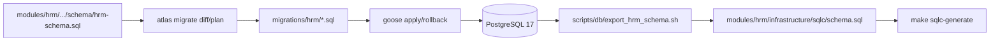

# DEV-PLAN-011A：HRM Atlas + Goose 基线缺口复核与补齐方案

**状态**: 规划中（2025-12-14 02:33 UTC）

## 1. 背景与上下文 (Context)
- `DEV-PLAN-011` 文档标记为“已完成”，且 `README.MD` / `docs/CONTRIBUTING.MD` / `AGENTS.md` 已引用 “HRM Atlas + Goose 流水线”。
- 但当前仓库实际缺少 `atlas.hcl`、`modules/hrm/infrastructure/atlas/**`、`migrations/hrm/**`、`scripts/db/run_goose.sh` 等关键资产，导致：
  - `make db plan` / `make db lint` 在启用 `hrm-atlas` 过滤器时无法稳定运行；
  - 文档与代码/CI 行为存在漂移；
  - 一旦 PR 触发 `hrm-atlas`（例如改动 `scripts/db/export_hrm_schema.sh`），CI 可能在“工具链缺失”层面直接失败。
- 本 011A 的定位是：把“缺口调查结果 + 可执行补齐方案”固化为可实施的计划文档，并定义清晰验收口径，避免继续扩大 drift。

## 2. 目标与非目标 (Goals & Non-Goals)
### 2.1 核心目标
- [ ] 让 HRM 的 Atlas/Goose 工具链在本仓库**真实可用**：本地与 CI 均可执行 `make atlas-install`、`make db plan`、`make db lint`，并有明确的失败诊断路径。
- [ ] 补齐 HRM 迁移执行面：实现 `scripts/db/run_goose.sh`，使 `HRM_MIGRATIONS=1 make db migrate up|down|redo|status` 可用。
- [ ] 建立 HRM Atlas “受控目录”与最小闭环资产：`atlas.hcl`、`modules/hrm/infrastructure/atlas/**`、`migrations/hrm/**`、`docs/dev-records/DEV-PLAN-011-HRM-ATLAS-POC.md`。
- [ ] 修正文档与实现的**单一事实来源**：README/CONTRIBUTING/AGENTS 不再描述不存在的路径或命令；`quality-gates` 的 `hrm-atlas` 过滤器命中后不会因缺文件而失败。

### 2.2 非目标（本计划不做）
- 不将全仓库迁移系统从 `rubenv/sql-migrate` 迁移到 goose（仅补齐 HRM 专用链路）。
- 不改动冻结模块：`modules/billing`、`modules/crm`、`modules/finance`。
- 不在本计划内新增 HRM 业务表/字段（仅对齐已有 `hrm-schema.sql` 的结构基线与工具链）。

## 3. 现状复核与缺口清单 (Gap Analysis)
### 3.1 仓库实际状态（已验证）
- [X] `Makefile` 已包含 `atlas-install` 与 `db plan/db lint` 入口，但 `db plan` 目前调用 `atlas schema diff` 且依赖不存在的 `modules/hrm/infrastructure/atlas/schema.hcl`（`Makefile:83`-`Makefile:90`）。
- [X] `.github/workflows/quality-gates.yml` 已定义 `hrm-atlas` 过滤器，并在命中时运行 `make atlas-install`、`make db plan`、`make db lint`（`.github/workflows/quality-gates.yml:65`-`.github/workflows/quality-gates.yml:71`、`.github/workflows/quality-gates.yml:113`-`.github/workflows/quality-gates.yml:115`、`.github/workflows/quality-gates.yml:226`-`.github/workflows/quality-gates.yml:245`）。
- [X] 仓库缺失以下关键文件/目录（导致工具链不可用）：
  - [X] `atlas.hcl`（CI/Makefile 期望存在）
  - [X] `modules/hrm/infrastructure/atlas/`（CI/文档期望存在）
  - [X] `migrations/hrm/`（CI/文档期望存在）
  - [X] `scripts/db/run_goose.sh`（Makefile/CI/文档期望存在）
  - [X] `docs/dev-records/DEV-PLAN-011-HRM-ATLAS-POC.md`（CI/文档期望存在）
- [X] `tools.go` 未锁定 `ariga.io/atlas/cmd/atlas`（当前仅通过 `make atlas-install` 从源码构建锁版本），与 011 文档描述存在差异（`tools.go`）。

### 3.2 风险与影响
- 触发 `hrm-atlas` 过滤器后，CI 可能在“缺文件/错误入口”阶段失败，无法体现真实质量门禁（迁移漂移、lint 失败等）。
- 文档宣称 “HRM 已迁入 migrations/hrm 并由 goose 执行”，但现状并非如此，会误导后续 DEV-PLAN（例如 `DEV-PLAN-017/020/021`）对工具链能力的依赖判断。

## 4. 架构与关键决策 (Architecture & Decisions)
### 4.1 目标架构图（HRM 专用链路）

### 4.2 关键决策（需要在实施前锁定）
1. **迁移目录格式（Atlas migration.format）**
   - 选项 A：`format = goose`（单文件包含 `-- +goose Up/Down`）。
   - 选项 B：`format = golang-migrate`（`*.up.sql/*.down.sql` 双文件）。
   - 建议：优先选 A（与 goose 原生格式一致，减少自研解析/拼接脚本），并同步修正文档中对 `changes_<unix>.{up,down}.sql` 的描述（若继续沿用该命名，需明确 goose 是否支持）。
2. **Schema Source（`atlas.hcl` 的 `src` 取值）**
   - 选项 A：`src = "file://modules/hrm/infrastructure/atlas/schema.hcl"`（与 011 文档一致，但需要解决 HRM 外键引用到 core 表时的建模边界）。
   - 选项 B：`src = "file://modules/hrm/infrastructure/persistence/schema/hrm-schema.sql"`（直接复用现有 SQL，避免为外键引用补齐 core 表的 HCL 建模；但需更新文档/过滤器/库存表中的 “Atlas Schema File” 列）。
   - 建议：以“能在本仓库落地并可重复执行”为第一优先级，先落地 B（最小闭环），再按需要补 A（将 SQL 逐步迁入 HCL 并解决跨表引用的建模策略）。

## 5. 接口契约与命令口径 (CLI / Make Targets)
### 5.1 必须支持的命令（对齐文档与 CI）
- `make atlas-install`
- `make db plan`：输出 dry-run 的 SQL 计划（不落盘、不写迁移文件）
- `make db lint`：运行 `atlas migrate lint`（至少覆盖 destructive/dependent 等规则）
- `HRM_MIGRATIONS=1 make db migrate up|down|redo|status`：通过 `scripts/db/run_goose.sh` 执行 HRM 迁移
- `scripts/db/export_hrm_schema.sh SKIP_MIGRATE=1`：导出 HRM schema（要求 HRM 表已存在）
- `make sqlc-generate`：生成 HRM sqlc 产物并保证 `git status --short` 干净

### 5.2 `scripts/db/run_goose.sh` 行为约束（拟定）
- 输入：子命令 `up|down|redo|status`（从 `make db migrate <cmd>` 传入）。
- DSN：使用 `postgres://${DB_USER}:${DB_PASSWORD}@${DB_HOST}:${DB_PORT}/${DB_NAME}?sslmode=disable`。
- 迁移目录：固定 `migrations/hrm`。
- Down/Redo：尊重 `GOOSE_STEPS`（例如 `GOOSE_STEPS=1` 时仅回滚/重做 1 步）。
- 失败处理：任何失败返回非 0；打印关键环境与 goose 输出；禁止吞错。

## 6. 实施步骤 (Execution Plan)
1. [ ] **补齐缺失文件与目录骨架**
   - [ ] 新增 `atlas.hcl`（至少包含 `dev/test/ci` env、`migration.dir` 指向 `migrations/hrm`、`src` 指向 HRM schema 源）。
   - [ ] 新增 `modules/hrm/infrastructure/atlas/`（若采用 SQL 作为 src，可先放置 README/占位说明；若采用 HCL 作为 src，则包含 `schema.hcl`）。
   - [ ] 新增 `migrations/hrm/`（至少包含一条 baseline 迁移与 `atlas.sum`）。
   - [ ] 新增 `scripts/db/run_goose.sh`（按 5.2 约束实现）。
   - [ ] 新增 `docs/dev-records/DEV-PLAN-011-HRM-ATLAS-POC.md`（按“时间-命令-预期-实际-结论/回滚”模板）。

2. [ ] **修正 Makefile 与文档声明的漂移**
   - [ ] `make db plan`：与 `atlas.hcl` 的 env 定义对齐（决定是 `schema diff` 还是 `migrate diff --dry-run`，并确保 CI 有可连接 dev-db）。
   - [ ] `make db lint`：确保无需手工参数即可运行（通过 `atlas.hcl` 或显式 `--dir/--dev-url`）。
   - [ ] 修正 `README.MD` / `docs/CONTRIBUTING.MD` / `AGENTS.md` 中关于文件路径、迁移文件命名与命令等描述，避免宣称不存在的产物。
   - [ ] 同步更新 `docs/dev-records/hrm-sql-inventory.md` 的 “Atlas Schema File / Latest HRM Migration” 列，使其可点击且真实存在。

3. [ ] **完善 CI 的 `hrm-atlas` 质量门禁闭环**
   - [ ] 确保 `lint-and-format` job 在 `hrm-atlas=true` 时能连接 Postgres 并成功运行 `make db plan`、`make db lint`。
   - [ ] （可选但推荐）当 `hrm-atlas` 与 `hrm-sqlc` 同时命中时，增加步骤：运行 HRM goose 迁移、导出 HRM schema、执行 `make sqlc-generate`，并用 `git status --short` 兜底确保无遗留 diff。

4. [ ] **Readiness 记录与回归验证**
   - [ ] 本地执行并记录（建议写入 `docs/dev-records/DEV-PLAN-011-HRM-ATLAS-POC.md`）：
     - [ ] `make atlas-install`
     - [ ] `make db plan`
     - [ ] `make db lint`
     - [ ] `HRM_MIGRATIONS=1 make db migrate up` / `... down`（至少 1 步 smoke）
     - [ ] `scripts/db/export_hrm_schema.sh SKIP_MIGRATE=1 && make sqlc-generate`
     - [ ] `make check lint`（避免 cleanarch/golangci 漂移）

## 7. 测试与验收标准 (Acceptance Criteria)
- CI：任意触发 `hrm-atlas` 的 PR，`lint-and-format` job 不因缺文件/缺脚本失败；`make db plan`、`make db lint` 可重复通过。
- 本地：在干净 PG17 数据库上可按文档执行完整闭环：生成/应用 HRM 迁移 → 导出 schema → sqlc generate → `git status --short` 干净。
- 文档：README/CONTRIBUTING/AGENTS/Inventory 中引用的所有路径都真实存在且命令可执行。

## 8. 回滚与降级策略 (Rollback)
- 如补齐方案引入 CI 不稳定：优先把 `hrm-atlas` 过滤器临时收敛到“仅在存在 atlas/goose 资产后再启用”的最小集合（以避免误触发）。
- 如 HRM 迁移链路阻塞其它开发：允许短期继续使用 `modules/hrm/infrastructure/persistence/schema/hrm-schema.sql` 的手工执行（仅限 e2e/本地验证），但必须在 011A 完成后移除临时路径并补齐记录。

## 9. 里程碑与交付物 (Milestones & Deliverables)
- 里程碑 M1（可跑通）：`atlas.hcl` + `scripts/db/run_goose.sh` + `migrations/hrm` 基线产物 + `make db plan/lint` 可执行。
- 里程碑 M2（闭环）：CI 在 `hrm-atlas` 命中时通过；`DEV-PLAN-011-HRM-ATLAS-POC.md` 有可复现日志；文档/Inventory 无漂移。

## 10. 后续动作 (Next)
- 完成 011A 后，允许 `DEV-PLAN-017`（outbox）与 `DEV-PLAN-021`（org atlas/goose）复用同一套“Atlas+Goose”约定，避免每个模块重复踩坑。
