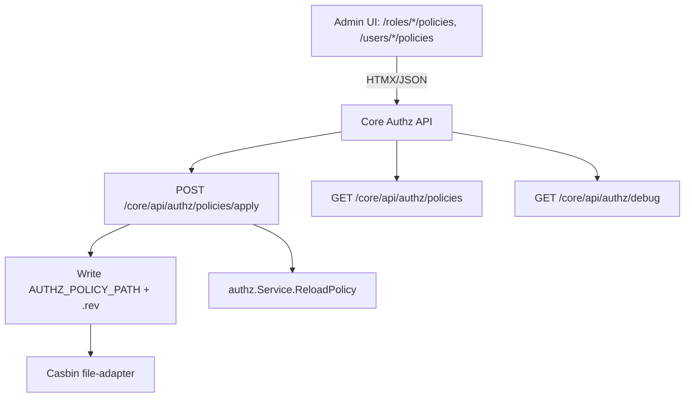

# DEV-PLAN-015C：简化授权管理（移除草稿/审批/bot，直接维护生效）

**状态**: 已完成（2025-12-26）  
**范围**: 彻底移除“提交申请→状态轮询→审批/驳回→回写/重试 bot”与策略草稿（requests 列表/详情）；保留并简化可观测性与直接策略维护能力；补齐 DEV-PLAN-044 指出的 UI 验收缺口

## 1. 背景与上下文 (Context)
- **需求来源**：`docs/dev-plans/015A-casbin-policy-platform.md`、`docs/dev-plans/015B-casbin-policy-ui-and-experience.md`、`docs/dev-plans/015B4-ui-integration-feedback.md`、`docs/dev-plans/044-frontend-ui-verification-playbook.md`。
- **当前痛点**：
  - 当前 Casbin 授权管理已实现“策略草稿（requests）+ 审批/回写 + bot 联动 + UI 轮询/重试”闭环，流程与运维依赖较重、维护面较大。
  - DEV-PLAN-044 强调的“可复现证据/脚本化主路径/多 viewport 抽检/稳定锚点”尚未在 Authz 模块形成稳定闭环。
- **业务价值**：
  - 将授权管理收敛为“管理员直接维护生效”，把变更闭环从“请求→审批→bot→PR→合并”缩短为“apply→reload”。
  - 删除 requests/bot/轮询链路，降低维护面与故障面，释放 UI 稳定性与验收投入。
- **决策声明**：本计划按产品/工程决策，**彻底删除策略草稿与权限申请流程**，不再设计“用户自助申请权限”，仅保留管理员维护入口与诊断能力。

## 2. 目标与非目标 (Goals & Non-Goals)

### 2.1 核心目标
1. **彻底删除**“提交申请→状态轮询→审批/驳回→回写/重试 bot”的全部功能链路（含 API、UI、脚本、数据结构、测试与文档）。
2. **彻底删除**策略草稿页面（requests 列表与详情）及其支撑能力。
3. 保留“授权调试/可观测性”的最小集合（例如 Authz Debug、trace/latency、request-id 串联），并将“直接维护生效”作为唯一授权管理入口。
4. 针对 DEV-PLAN-044 提出的缺口形成落地方案：**脚本化可复现的主路径**、**多 viewport 抽检**、**稳定选择器约定**、**a11y smoke**。

### 2.2 非目标
- 不提供“用户自助申请权限/提交申请”的任何替代方案（包括但不限于：requests、邮件/工单自动化、bot PR 流程）。
- 不在本计划内强制引入第三方 SaaS（线上录屏/视觉回归平台等），以本地/CI 可复现为先（对齐 DEV-PLAN-044）。

### 2.3 工具链与门禁（SSOT 引用）
> 避免在 dev-plan 内复制脚本细节；命令入口以 `Makefile` 为准；触发器矩阵以 `AGENTS.md` 为准。

- **本计划命中触发器**：
  - [x] Authz（`make authz-test && make authz-lint`；涉及策略文件写入/回滚需补齐验收）
  - [x] Go 代码（删 API/服务/脚本后需通过 lint/test 门禁）
  - [x] `.templ` / presentation assets（Unauthorized/PolicyInspector/角色/用户页会改动）
  - [x] 文档（`make check doc`）
  - [x] E2E/a11y（对齐 `docs/dev-plans/044-frontend-ui-verification-playbook.md`）
  - [ ] DB 迁移 / Schema（默认不 drop `policy_change_requests`，见 §4）

- **SSOT 链接**：`AGENTS.md`、`Makefile`、`.github/workflows/quality-gates.yml`

## 3. 架构与关键决策 (Architecture & Decisions)

### 3.1 范围与删除清单（SSOT 引用）
> 具体命令入口与门禁矩阵以 `AGENTS.md` / `Makefile` / `.github/workflows/quality-gates.yml` 为准；本计划只列出“需要删除/改造的能力面”。

### 需要彻底删除的能力面
- **策略草稿（requests）全链路**：
  - API：requests API（创建/列表/详情/审批/驳回/取消/回滚/触发 bot 等）。
  - UI：requests 列表与详情页面。
  - DB：`policy_change_requests` 及相关读写/领域服务/DTO/viewmodel。
  - e2e：所有依赖 requests 的断言与用例。
  - 文档与 runbook：涉及 requests/bot 的说明与操作手册。
- **状态轮询、SLA 展示、bot 重试**：
  - 前端轮询脚本、retry_token、bot 冷却/限流逻辑、状态徽标/倒计时等。
- **权限申请入口**：
  - Unauthorized/PolicyInspector 等处的“Request access/提交申请”交互与相关文案。

### 需要保留并简化的能力面
- **Authz Debug/可观测性**：保留 `/core/api/authz/debug`，继续提供 trace/latency/request-id 关联能力（对齐 DEV-PLAN-044 “可观测性与诊断”）。
- **直接维护生效（管理员）**：提供唯一的“生效策略维护”入口（详见下一节）。
- **统一的 403 UX**：保留统一 Forbidden 页面/partial，但移除“申请权限”与“请求状态”相关 UI。

### 3.2 架构图 (Mermaid)


### 3.3 关键决策（保持简单，默认选定）
- **生效策略 SSOT**：维持现状的“文件型策略源”——`AUTHZ_POLICY_PATH`（默认 `config/access/policy.csv`）与 `AUTHZ_POLICY_PATH.rev`（默认 `config/access/policy.csv.rev`）。`/policies/apply` 直接写入并 `ReloadPolicy`；不引入 DB policy store（后续如需再开计划）。
- **变更语义**：`apply` 采用“显式 add/remove 变更列表（可从 stage 生成）”，避免 JSON Patch 的 index/路径复杂度；`base_revision` 用于乐观并发控制。
- **并发与一致性**：进程内互斥串行写文件 + `base_revision` 冲突检测；写入采用临时文件 + 原子 rename，避免半写入。
- **审计与可观测性**：不引入新表，默认仅结构化日志（含 `request_id`、操作者、base/new revision、added/removed）。
- **部署限制**：仅在 `AUTHZ_POLICY_PATH` 可写且（多实例场景）文件在共享卷上时启用；否则 `apply` 返回明确错误并提示使用“改策略碎片 + `make authz-pack` + 部署”路径。
- **回滚策略**：写入前可选落一份同目录备份（例如 `policy.csv.bak`/`policy.csv.rev.bak`，覆盖式即可）；紧急回滚以恢复备份或重新部署为准。

### 3.4 方案：直接维护生效（管理员路径）
#### 方案概述
- 将 Authz 管理收敛为“管理员直接修改生效策略”，不再经过 requests/审批/bot。
- UI 侧仅保留“策略可视化 + 直接增删改（可选：轻量确认）+ 立即生效反馈”。
- 后端侧提供“写入生效策略 + ReloadPolicy”的同步接口；必要时加入最小的并发保护与审计字段（不引入 requests）。

#### API 与权限模型（选定）
- **保留读能力**：
  - `GET /core/api/authz/policies`（管理员可见，用于核对“当前生效策略”；沿用 `Authz.Debug` 权限）。
  - `GET /core/api/authz/debug`（管理员可见，用于定位；沿用 `Authz.Debug` 权限与现有限流）。
- **保留暂存能力**：
  - `POST/DELETE /core/api/authz/policies/stage` 继续作为 UI 暂存（session/in-memory）能力，用于批量编辑体验。
- **新增直接生效写能力**：
  - `POST /core/api/authz/policies/apply`：从请求体 `changes` 或当前用户暂存区读取变更，直接写入 `AUTHZ_POLICY_PATH`，更新 `.rev`，并 `ReloadPolicy`。
  - 为保持简单：015C **默认沿用**现有 `Authz.Requests.Write` 作为“可写策略”的权限门槛（避免一次性调整权限 schema/seed）；后续如需重命名为 `Authz.Policies.Update`，另开子计划处理权限兼容与迁移。

#### UI 变更（选定）
- `components/authorization/unauthorized.templ`：
  - 移除：请求提交表单、SLA/状态轮询、查看请求/重试 bot 入口与文案。
  - 保留：明确的“权限不足”提示；对管理员保留 Debug 链接与缺失策略（用于定位）。
- `components/authorization/policy_inspector.templ`：
  - 移除：生成草稿/提交申请相关能力、请求状态 UI。
  - 保留：Debug、trace、attributes 可视化（用于诊断策略命中）。
- 角色/用户权限页：
  - 将“Submit Draft/提交草稿”改为“Apply Now/立即生效”，调用 `POST /core/api/authz/policies/apply`。
  - 保留 stage 作为 UX 暂存（减少频繁写文件）；`apply` 成功后清空 stage 并提示成功。

## 4. 数据模型与约束 (Data Model & Constraints)

### 4.1 DB：`policy_change_requests`
- **015C 默认不 drop 表**：保留历史数据与索引，不再写入/读取该表（只删除功能入口与代码路径）。
- 如未来需要 drop/归档：另开 follow-up DEV-PLAN，必须包含“数据备份/导出/审计保留期/回滚”说明。

### 4.2 生效策略文件（SSOT）
- 生效策略读取路径：`AUTHZ_POLICY_PATH`（默认 `config/access/policy.csv`），由 `pkg/authz.Service` 使用 Casbin file-adapter 读取。
- Revision 元数据：`AUTHZ_POLICY_PATH.rev`（默认 `config/access/policy.csv.rev`，SHA256 + 生成时间 + entries），用于 `base_revision` 并发控制与 UI 展示。

### 4.3 行格式（必须一致）
> 本节约束同时影响 `/core/api/authz/policies` 列表、`/policies/stage` 暂存、以及新 `/policies/apply` 写入。

- `p` 行（RBAC/ABAC 允许规则）：`p, <subject>, <object>, <action>, <domain>, <effect>`
- `g` 行（用户→角色绑定）：`g, <subject>, <role>, <domain>`
- 约束：
  - `<effect>`：015C 默认仅允许 `allow`（当前 `config/access/model.conf` 的 `[policy_effect]` 仅认 allow；如需 deny 必须先改模型并另开计划）。
  - `<domain>`：允许 `global`、`*`、或租户 uuid（小写字符串）。
  - `<action>`：统一做 `authz.NormalizeAction`（空视为 `*`）。
  - `g2`：本计划不引入/不支持（现网未使用）。

## 5. 接口契约 (API Contracts)

### 5.1 保留端点
- `GET /core/api/authz/policies`：读取当前生效策略（分页/过滤参数保持现状）；权限：`Authz.Debug`。
- `GET /core/api/authz/debug`：诊断策略命中；权限：`Authz.Debug`；限流保持现状（20 req/min/IP）。
- `POST/DELETE /core/api/authz/policies/stage`：暂存策略变更（UX 用）；权限：沿用 `Authz.Requests.Write`。

### 5.2 新增：直接生效写入
#### `POST /core/api/authz/policies/apply`
**权限**：沿用 `Authz.Requests.Write`（015C 默认）；建议再叠加页面语义权限（例如在角色页需 `Roles.Update`）。

**请求（JSON，推荐）**：
```json
{
  "base_revision": "sha256-from-policy.csv.rev",
  "subject": "role:core.superadmin",
  "domain": "global",
  "reason": "optional free text for audit log",
  "changes": [
    {
      "stage_kind": "add",
      "type": "p",
      "subject": "role:reporting",
      "object": "core.users",
      "action": "read",
      "domain": "global",
      "effect": "allow"
    },
    {
      "stage_kind": "remove",
      "type": "g",
      "subject": "tenant:<tid>:user:<uid>",
      "object": "role:core.viewer",
      "domain": "<tid>"
    }
  ]
}
```

**请求（HTMX 表单，UI 默认）**：
- 仅提交 `subject/domain/base_revision`（不提交 changes），服务端从当前用户暂存区读取 `entries` 并 apply。
- 表单字段：`subject`、`domain`、`base_revision`、`reason`（可选）。

**响应（200 OK）**：
```json
{
  "base_revision": "old-sha",
  "revision": "new-sha",
  "added": 3,
  "removed": 1
}
```

**HTMX 行为（200 OK）**：
- 设置 `HX-Trigger`：
  - `policies:staged`（total=0，用于刷新矩阵/工作台计数）
  - `authz:policies-applied`（包含 `revision/added/removed`，用于 toast）

**错误码**：
- `400 AUTHZ_INVALID_BODY`：JSON/表单字段缺失或格式不合法。
- `403 AUTHZ_FORBIDDEN`：无权限。
- `409 AUTHZ_BASE_REVISION_MISMATCH`：`base_revision` 与当前 `.rev` 不一致；`meta.base_revision` 返回当前值。
- `422 AUTHZ_POLICY_APPLY_FAILED`：变更校验失败（例如 remove 的规则不存在、effect 非 allow、type 非法）。
- `500 AUTHZ_POLICY_WRITE_FAILED`：写文件/生成 revision/ReloadPolicy 失败（应携带 `request_id` 便于排障）。

### 5.3 移除端点与页面
- 移除：requests API（创建/列表/详情/approve/reject/cancel/trigger-bot/revert 等）。
- 移除：requests 列表与详情页面及其所有导航入口。

### 5.4 403 UX 契约调整
- 统一 403 响应不再暴露“申请权限/请求状态”字段与文案：
  - 移除 `request_url`、`suggest_diff` 作为“申请入口”的默认指引（保留 debug_url 与 request_id 串联诊断）。
  - 对管理员：保留 Debug 链接与必要的 missing_policies 信息以定位。

## 6. 核心逻辑与算法 (Business Logic & Algorithms)

### 6.1 Apply 算法（伪代码）
1. 校验权限（`Authz.Requests.Write`）与请求体。
2. 读取当前 revision：从 `AUTHZ_POLICY_PATH.rev` 取得 `currentRevision`。
3. 并发控制：若 `base_revision != currentRevision`，返回 `409 AUTHZ_BASE_REVISION_MISMATCH`。
4. 组装变更：
   - 若请求包含 `changes`：直接使用（按 `stage_kind=add/remove`）。
   - 否则：从 policy stage store 按 `currentUser+tenantID` 读取暂存条目（按 `subject/domain` 过滤）。
5. 读入当前 `policy.csv`（跳过 `#` 注释行），解析为集合（按 §4.3 的行格式）。
6. 对每条变更做校验与标准化：type/subject/object/domain/action/effect；禁止 `deny`；action 做 normalize。
7. 应用变更：
   - add：若已存在则跳过；否则加入。
   - remove：若不存在则返回 `422 AUTHZ_POLICY_APPLY_FAILED`（避免静默失败）。
8. 生成新 `policy.csv` 内容：保留 1 行 header（“DO NOT EDIT”），其余按稳定排序输出。
9. 写入：写临时文件 → 以原子 rename 覆盖 `AUTHZ_POLICY_PATH`；同时写 `.rev`（sha256 + timestamp + entries）。
10. 校验与生效：调用 `authz.Service.ReloadPolicy`；成功后清空对应 subject/domain 的 stage；返回 `revision/added/removed`。

## 7. 安全与鉴权 (Security & Authz)
- **权限模型（保持简单）**：
  - `Authz.Debug`：读 policies、debug。
  - `Authz.Requests.Write`：stage + apply（015C 临时语义为“可写策略”）。
  - requests 相关的 `Read/Review/Delete` 权限不再被任何在线功能使用（可后续清理）。
- **速率限制**：建议对 `/core/api/authz/policies/apply` 增加与 debug 类似的限流（例如 20 req/min/IP），避免误操作风暴。
- **最小泄露**：403 页面/PolicyInspector 不再提供“申请入口”，避免引导非管理员触发无意义写操作。

## 8. 依赖与里程碑 (Dependencies & Milestones)

### 8.1 文档同步清单（Contract First）
> 在删除 requests/bot/申请入口相关代码前，必须先把下列文档更新为“直接维护生效 + 删除草稿/轮询/bot”的真实口径，避免继续把已决定删除的能力当作 SSOT。

#### 需要同步调整的 015 系列 dev-plan
- [x] `docs/dev-plans/015-casbin-policy-ui-and-workflow.md`
- [x] `docs/dev-plans/015A-casbin-policy-platform.md`
- [x] `docs/dev-plans/015B-casbin-policy-ui-and-experience.md`
- [x] `docs/dev-plans/015B1-core-roles-ui.md`
- [x] `docs/dev-plans/015B2-core-users-ui.md`
- [x] `docs/dev-plans/015B3-business-authz-experience.md`
- [x] `docs/dev-plans/015B4-ui-integration-feedback.md`（标注退役并迁入 `docs/Archived/` 或明确 deprecated）

#### 强相关 runbook / records（需同步归档/改写）
- [x] `docs/runbooks/authz-policy-draft-api.md`
- [x] `docs/runbooks/AUTHZ-BOT.md`
- [x] `docs/dev-records/DEV-PLAN-015-CASBIN-UI.md`
- [x] `AGENTS.md`（Authz 工作流摘要需移除 bot/requests 口径）

### 8.2 实施步骤（落地顺序）
1. [x] 文档同步（§8.1）。
2. [x] 契约冻结：确认删除范围、保留页面集合、以及“文件可写/多实例限制”的部署前置条件。
3. [x] 删除 requests（后端）：移除 requests API、PolicyDraftService、bot 相关代码与测试；保留表但不再访问。
4. [x] 删除 requests（前端/UI）：移除 requests 页面与导航；移除轮询/重试/状态 UI。
5. [x] 实现 `POST /core/api/authz/policies/apply`：写 `AUTHZ_POLICY_PATH` + `.rev` 并 `ReloadPolicy`；补齐并发/错误码/日志。
6. [x] UI 串联：角色/用户权限页的“Submit Draft”改为“Apply Now”；成功后清空 stage、toast 提示并展示新 revision。
7. [x] Readiness：按 `AGENTS.md` 触发器跑门禁并记录结果。

## 9. 测试与验收标准 (Acceptance Criteria)

### 9.1 对齐 DEV-PLAN-044 的 UI 验收缺口
- **脚本化可复现主路径（E2E）**：角色/用户权限页 → add/remove 一条策略 → apply → 业务页面验证权限变化；产物为 Playwright trace/截图（CI artifact）。
- **多 viewport 抽检**：关键 Authz 页面覆盖 3 个 viewport（移动/笔记本/大屏）。
- **稳定锚点**：统一使用 `data-testid` 覆盖关键交互点（Apply/Save/Discard、抽屉表单、策略列表、无权态）。
- **a11y smoke**：保留并扩展现有 `e2e/tests/a11y/authz-ui.spec.ts`，剔除 requests 页面并覆盖保留页面集合。

### 9.2 覆盖页面集合（计划内）
- 角色权限矩阵：`/roles/{id}/policies`
- 用户权限看板：`/users/{id}/policies`
- 统一未授权页（示例页即可）：例如 `/person/persons` 的 401/403 页面内渲染
- Authz Debug（API）：`/core/api/authz/debug`

### 9.3 验收标准（功能）
- requests 全链路不可用且代码/路由/导航/文档/测试均无残留引用（编译期与运行期均验证）。
- Unauthorized/PolicyInspector 不再出现“申请权限/查看请求/状态轮询/bot 重试”等交互；对管理员仍可诊断（Debug/trace）。
- 管理员可在角色/用户权限页直接变更策略并立即生效；业务页面权限表现与变更一致。
- `base_revision` 冲突返回 409 且可被 UI toast 解释（提示刷新重试）。

## 10. 运维与回滚 (Ops & Rollback)
- **策略写入介质风险**：若部署形态不允许写 `AUTHZ_POLICY_PATH`，则 `apply` 必须禁用并提示“改策略碎片 + `make authz-pack` + 部署”路径。
- **数据留存风险**：015C 默认保留 `policy_change_requests` 数据；如需删除必须先做归档/备份计划。
- **回滚（简单路径）**：
  - 若实现了 `.bak`：恢复 `policy.csv.bak` 与 `policy.csv.rev.bak` 后调用 `ReloadPolicy` 或重启服务。
  - 否则：重新部署上一版本镜像/配置；或在可写环境中重新生成并恢复基线策略（例如运行 `make authz-pack` 并重启）。
