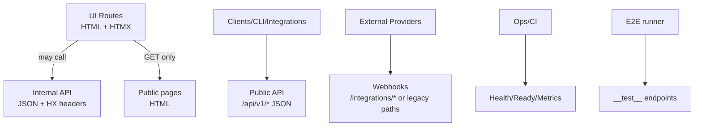

# DEV-PLAN-018：全局路由策略统一（UI/HTMX/API/Webhooks）

**状态**: 规划中（2025-12-15 00:22 UTC）

## 1. 背景与上下文 (Context)
- **需求来源**：
  - 项目同时包含：服务端渲染 UI（`templ` + HTMX）、内部 JSON API（用于权限申请/调试/局部交互）、第三方回调（支付/短信/聊天）、测试专用端点以及运维端点。
  - 当前路由命名空间与返回形态存在“不完全一致”的现象：同类能力在不同模块下使用不同前缀/协商规则，导致实现、鉴权与测试口径分散。
- **现状盘点（示例，非穷举）**：
  - UI（HTML/HTMX）：`/hrm/employees`、`/logs`、`/finance/*`、`/warehouse/*` 等。
  - 内部 API（JSON）：`/core/api/authz/*`，以及少量 `/_dev`、`/api/*` 风格的内部端点。
  - Webhooks/第三方回调：`/twilio`、支付网关回调（路径可能由配置决定）。
  - 运维/测试：`/health`、`/__test__/*`、`/ws`、`/assets/*`。
- **痛点**：
  1. **命名空间语义不清**：`/api/*` 既可能是内部 JSON，也可能被误解为“对外 API”；`/core/api/*` 又被 UI 直接依赖（如权限申请）。
  2. **内容协商不一致**：部分 UI 路由在 `Hx-Request` 时返回 partial，但 `Accept: application/json` 时是否返回 JSON/HTML 的规则不统一，容易出现“HTMX 误拿 JSON / API 误拿 HTML”的边缘情况。
  3. **鉴权/错误返回口径分散**：403 的返回格式（HTML 页面 vs HTML partial vs JSON payload）在模块间存在差异，增加 E2E 与排障成本。
- **目标定位**：
  - 本计划产出“全局路由空间划分 + 命名约束 + 内容协商/鉴权/错误返回规范 + 迁移策略”，作为后续新增/重构路由的 SSOT（Single Source of Truth）。

## 2. 目标与非目标 (Goals & Non-Goals)
### 2.1 核心目标
- [ ] 定义**全局路由命名空间**与语义：哪些前缀用于 UI、哪些用于内部 API、哪些用于对外 API、哪些用于 Webhooks/运维/测试。
- [ ] 定义**返回形态契约**：每类命名空间默认返回 HTML 还是 JSON；HTMX 如何协作（partial/OOB/HX-* headers）。
- [ ] 定义**内容协商优先级**与一致实现方式（避免控制器各自手写分支逻辑）。
- [ ] 定义**鉴权与 403 行为**：HTML 页面/partial 与 JSON forbidden payload 的统一口径，并明确允许的例外场景。
- [ ] 给出**迁移与兼容策略**：不要求一次性改完所有路由，但要求“新增按新规、存量可渐进收敛”，并提供 deprecate/alias 的节奏。

### 2.2 非目标 (Out of Scope)
- 不在本计划内一次性重写所有控制器与前端引用（避免大范围破坏性变更）。
- 不引入新的路由框架（继续使用 `gorilla/mux`）。
- 不强制改变第三方回调路径（支付/短信等通常受外部平台约束），但要求纳入统一分类与安全基线。

## 3. 架构与关键决策 (Architecture & Decisions)
### 3.1 路由空间总览（Mermaid）

### 3.2 关键设计决策（ADR 摘要）
- **决策 1：保留“软隔离”，新增能力走“强命名空间”**
  - 原因：项目已存在 UI 路由 + 内部 JSON API + webhooks 混存的现实；全量硬隔离需要大规模迁移与外部对接变更，性价比不高。
  - 策略：从现在开始，新增/重构路由必须落在明确命名空间；存量逐步迁移并保留 alias/redirect。
- **决策 2：对外 API 强制 `/api/v1/*`，内部 API 统一 `/core/api/*`**
  - `/api/v1/*`：稳定、版本化、面向程序消费（CLI/下游系统/自动化），默认 JSON-only。
  - `/core/api/*`：面向本应用 UI 的内部 JSON API（含 HTMX 触发头），默认 session-based（同源）而非 token-based。
  - 说明：现有 `/core/api/authz/*` 已被 UI 广泛依赖；因此选择以它为内部 API 的统一前缀，减少迁移成本。
- **决策 3：UI 成功响应以 HTML 为主；JSON 主要用于内部/对外 API 与“错误诊断”**
  - UI（HTML/HTMX）侧不追求“成功也返回 JSON”，避免前端二次渲染与协议复杂化。
  - 允许 UI 路由在显式 `Accept: application/json` 时返回 JSON（至少 403 forbidden payload），用于 E2E/调试/自动化断言。

## 4. 路由命名空间与约束 (Route Space & Constraints)
### 4.1 顶层前缀（规范）
| 类别 | 前缀 | 默认返回 | 认证模型 | 备注 |
|---|---|---|---|---|
| UI（Authenticated） | `/{module}/...` + 少量根路径（如 `/settings`） | HTML | Session（cookie） | HTMX partial 通过 `Hx-Request` 返回 |
| UI（Public） | `/login`、`/`（公开页）等 | HTML | 可选 | 以现有实现为准 |
| 内部 API（Internal） | `/core/api/{capability}/...` | JSON | Session（cookie） | 可设置 `HX-Trigger/Hx-Push-Url` 等响应头 |
| 对外 API（Public） | `/api/v1/{domain}/...` | JSON | Token/Key（按模块定义） | 强制版本化；禁止返回 HTML |
| Webhooks（Inbound） | `/integrations/{provider}/...`（推荐） | JSON/表单 | Provider 签名校验 | 存量路径允许保留（如 `/twilio`） |
| 运维（Ops） | `/health`（可扩展 `/readyz` `/metrics`） | JSON/text | 无/受限 | 以运维需求为准 |
| 测试（Test only） | `/__test__/*` | JSON | 配置开关 | 仅在 `EnableTestEndpoints` 开启时存在 |
| 静态资源 | `/assets/*` | file | 无 | 仅静态 |
| WebSocket | `/ws` | WS | Session | 仅升级连接 |

### 4.2 路径命名约束（规范）
- 路径 segment 一律小写，推荐 `kebab-case`（允许保留历史路径，如 `/bi-chat`、`/__test__`）。
- 资源命名优先使用复数名词：`/employees`、`/payments`、`/requests`。
- 操作型子路由（非纯 REST）统一采用后缀动词：`/requests/{id}/approve`（存量保留），新增应避免随意扩散“动作路由”。
- 不允许新增“语义不明”的顶层前缀（例如随意引入 `/api2`、`/internal`）；新增前缀必须先更新本计划并评审通过。

## 5. 内容协商与返回契约 (Negotiation & Contracts)
### 5.1 UI 路由的协商规则（建议统一实现）
> 目标：同一 UI 路由可同时支持整页渲染与 HTMX partial；并允许在显式 JSON 请求下返回诊断用 JSON（至少 403）。

优先级（高 → 低）：
1. **显式 JSON**：若 `Accept` 包含 `application/json`，返回 JSON（用于 API 客户端/E2E/诊断）。
2. **HTMX partial**：若 `Hx-Request: true`，返回 HTML partial（或 OOB），并允许使用 `HX-*` 响应头。
3. **默认整页**：返回 HTML full page。

### 5.2 内部 API（`/core/api/*`）契约
- 成功与失败均返回 JSON；不得返回 HTML（避免 UI 与 API 混淆）。
- 允许在 HTMX 调用场景下设置 `HX-Trigger/HX-Redirect/Hx-Push-Url` 等响应头，但 body 仍保持 JSON。
- 认证与鉴权：
  - 默认按 Session + Authz 能力校验；
  - 403 统一返回 forbidden payload（字段口径与现有 `modules/core/authzutil.BuildForbiddenPayload` 对齐）。

### 5.3 对外 API（`/api/v1/*`）契约
- JSON-only；错误统一 envelope（`code/message/details/request_id` 等）并可演进版本。
- 认证模型按模块定义（token/key），不得复用 UI Session cookie 作为唯一凭证（避免跨站/CSRF 风险）。

### 5.4 403 Forbidden 的统一口径
- JSON：返回统一 forbidden payload（object/action/domain/subject/missing_policies/debug_url/base_revision/request_id）。
- HTML：
  - full page：渲染 Unauthorized 页面（复用 `components/authorization/unauthorized.templ`）。
  - HTMX：返回 Unauthorized partial，并设置 `Hx-Retarget: body`、`Hx-Reswap: innerHTML`（与现有实现对齐）。

## 6. 中间件与控制器组织 (Middleware & Controller Conventions)
> 目标：让“路由类别”决定默认 middleware stack，减少控制器自由发挥导致的不一致。

### 6.1 UI（Authenticated）推荐栈（示意）
- `Authorize()` → `RedirectNotAuthenticated()` → `RequireAuthorization()` → `ProvideUser()` → `ProvideLocalizer()` → `NavItems()` → `WithPageContext()`
- 写请求额外：`WithTransaction()`。

### 6.2 内部 API 推荐栈（示意）
- `Authorize()` → `RequireAuthorization()` → `ProvideUser()` → `ProvideLocalizer()` →（可选）`WithTransaction()`
- 默认不需要 `NavItems/WithPageContext`（除非需要渲染 Unauthorized HTML；但 `/core/api/*` 默认应返回 JSON）。

### 6.3 Key() 语义（建议）
- 控制器的 `Key()` 建议返回稳定标识（优先使用其 basePath），便于日志/诊断与测试一致性；避免返回与路由无关的常量字符串（存量不强制改，但新增需遵循）。

## 7. 安全与鉴权 (Security & Authz)
- **同源与 Cookie**：UI 与内部 API 默认依赖同源 Session；内部 API 禁止被跨站调用（建议在边界处增加 Origin/Referer 校验或同站策略说明）。
- **CSRF**：如未来引入 CSRF 机制，应优先覆盖“会改数据的 UI 写请求 + 内部 API 写请求”，并给出 HTMX 传 token 的标准方案。
- **Webhooks**：
  - 必须进行 provider 签名校验、时间戳/重放保护与 IP allowlist（如适用）。
  - 必须与租户隔离策略明确（例如通过 header/路径/回调字段映射 tenant）。
- **测试端点**：`/__test__/*` 必须受配置开关保护，且默认在生产关闭。

## 8. 依赖与里程碑 (Dependencies & Milestones)
### 8.1 依赖
- `pkg/htmx`：用于 HTMX 识别与 `HX-*` 响应头设置。
- 现有 authz forbidden payload 口径（`modules/core/authzutil`）。

### 8.2 里程碑与任务清单
1. [ ] **路由盘点**：输出当前顶层前缀与路由类别清单（UI/Internal API/Public API/Webhooks/Ops/Test），标注“是否符合 4.1”。
2. [ ] **策略落盘**：将本计划作为 SSOT，补齐例外清单（存量路径必须说明为何不能迁移）。
3. [ ] **实现统一协商工具**（可选但推荐）：
   - [ ] 提供 `pkg/http/negotiation` 或等价 helper：统一判断 `Accept JSON`/`Hx-Request`/默认 HTML。
   - [ ] 提供统一的 forbidden responder（HTML/HTMX/JSON）。
4. [ ] **试点迁移（最小改动）**：
   - [ ] 选择 1 个内部端点从 `/api/*` 迁到 `/core/api/*`（保留旧路径 alias 一段时间）。
   - [ ] 选择 1 个 UI 模块对齐 5.1 的协商优先级（补齐 E2E 断言）。
5. [ ] **新增约束**：
   - [ ] PR 模板/Reviewer checklist 增加“路由类别与命名空间”校验点。

## 9. 测试与验收标准 (Acceptance Criteria)
- 文档验收：
  - [ ] 本计划明确列出并解释所有顶层命名空间与约束（4/5/6 章节完整）。
  - [ ] 明确存量例外清单与迁移策略（8.2）。
- 行为验收：
  - [ ] 至少 1 个试点模块落地统一协商规则（5.1）且不破坏现有 UI 行为。
  - [ ] 内部 API（`/core/api/*`）与对外 API（`/api/v1/*`）不会返回 HTML（JSON-only）。
  - [ ] 403 forbidden payload 字段口径一致，E2E 可稳定断言（参考现有 authz gating 用例）。
- 门禁：
  - [ ] 新增/更新文档通过 `make check doc`。

## 10. 运维与监控 (Ops & Monitoring)
- 访问日志字段建议包含：`route_class(ui|internal_api|public_api|webhook|ops|test)`、`path_template`、`request_id`、`tenant_id`（如可得）、`authz_object/action`（如适用）。
- 建议为 `/core/api/*` 与 `/api/v1/*` 分别设置独立的 rate limit key（按 endpoint + tenant/user），避免 UI 行为影响对外 API 或反之。

--- 

## 附录 A：存量路径处理原则（摘要）
- **外部平台已绑定的回调路径**：优先保留（记录为例外），只做签名校验与安全基线补齐。
- **内部调用广泛的路径（如 `/core/api/authz/*`）**：保留并作为内部 API 的“标准前缀”。
- **历史偶发/开发工具路径（如 `/_dev`）**：仅在开发环境启用，并明确不进入对外文档与稳定契约。
