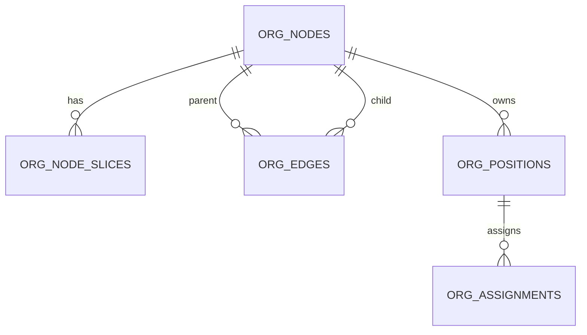

# DEV-PLAN-021：Org 核心表与约束

**状态**: 已批准（2025-12-15 12:47 UTC）
**对齐更新**：
- 2025-12-17：对齐 DEV-PLAN-017/019A 工具链约束（`pgcrypto`/`gen_random_uuid()`、RLS fail-closed、系统队列表 RLS 边界），并与 DEV-PLAN-020 最新口径一致。

> 目标：按 `docs/dev-plans/001-technical-design-template.md` 的“可直接编码、无猜测”标准，把 Org M1 的 DB 合同（schema/约束/迁移工具链）写清楚。

## 0. 进度速记
- ✅ 范围/核心约束口径已定稿（单租户单树、ltree 路径、EXCLUDE 防重叠/双亲、唯一根）。
- ✅ Org 的迁移工具链已落地（`atlas.hcl` 的 `org_dev/org_ci`、`migrations/org`、`make org plan/lint/migrate up/down`）。
- 🆕 文档补齐：表命名冲突决策、ltree label 编码规则、Atlas/Goose 命令口径与 Readiness 记录要求。

## 1. 背景与上下文 (Context)
- **需求来源**：`docs/dev-plans/020-organization-lifecycle.md` 的步骤 1（Schema 与约束），为 024/025/026 的写路径、审计与 outbox 链路提供 DB 合同。
- **当前痛点**：
  - Org 模块尚无可迁移/可 lint/可回滚的 schema 产物，导致后续计划无法进入实现阶段。
  - 时态数据（有效期）如果缺少 DB 强约束，导入/并发写入易引入 overlap/gap、双亲/成环，后续修复成本高。
- **业务价值**：先把“组织主数据 SOR 的底座”钉住：稳定表结构 + 约束口径 + 工具链闭环，避免 M1 后出现破坏性迁移与契约漂移。

## 2. 目标与非目标 (Goals & Non-Goals)
### 2.1 核心目标
- [x] **Schema 合同**：落地 Org M1 核心表（`org_nodes`、`org_node_slices`、`org_edges`、`org_positions`、`org_assignments`）的字段/类型/约束/索引（精确到 DB 级别）。
- [x] **时态强约束**：用 `check + EXCLUDE USING gist` 兜底“同键区间不重叠”（slice、双亲、主属唯一等），有效期语义统一为 UTC 半开区间 `[effective_date, end_date)`。
- [x] **层级强约束**：用 `ltree` 存储路径，写入时拒绝成环；禁止直接 `UPDATE parent_node_id/child_node_id`（移动必须走“失效旧边 + 创建新边”）。
- [x] **迁移闭环**：Org 专用 migrations 目录可生成、可 lint、可执行 up/down。
- [x] **Readiness 可追溯**：将 lint/上下行验证/关键 SQL 校验命令与结果记录到 `docs/dev-records/DEV-PLAN-021-READINESS.md`（本计划只定义格式与要求；文件在落地时创建）。

### 2.2 非目标 (Out of Scope)
- 不实现业务写语义（Insert/Correct/Rescind/ShiftBoundary 的 Service 算法见 `docs/dev-plans/025-org-time-and-audit.md`）。
- 不实现占位表与事件契约（见 `docs/dev-plans/022-org-placeholders-and-event-contracts.md`）。
- 不实现 API/Authz/outbox/缓存（见 `docs/dev-plans/026-org-api-authz-and-events.md`）。
- 不引入闭包表/物化视图（见 `docs/dev-plans/029-org-closure-and-deep-read-optimization.md`）。

## 3. 架构与关键决策 (Architecture & Decisions)
### 3.1 表关系图 (Mermaid)

### 3.2 关键设计决策（ADR 摘要）
1. **稳定标识 + 时间片拆表（选定）**
   - `org_nodes`：只承载稳定标识（`code/is_root/type`），供外键引用。
   - `org_node_slices`：承载可演进属性（`name/i18n/status/parent_hint/... + effective_date/end_date`）。
2. **ltree 路径存储（选定）**
   - `org_edges.path` 存储根到节点的 materialized path，服务于环检测与后续深读优化（029 之前的可用基线）。
3. **ltree label 编码（选定）**
   - **禁止**直接把 UUID（含 `-`）写入 ltree label；统一编码为 32 位 hex（仅 `[0-9a-f]`）。
   - 规则：`node_key = replace(lower(node_id::text), '-', '')`。
4. **表命名冲突修正（选定）**
   - 由于 HRM 已存在 `positions` 表（`migrations/hrm/00001_hrm_baseline.sql`），Org 的岗位表命名为 **`org_positions`**（避免同库冲突）。
   - 其它 Org 核心表均以 `org_*` 前缀命名，与 022 的“统一前缀”决策一致。
   - 本系列早期文档若出现 `positions`，统一按 `org_positions` 理解（以本计划为准）。
5. **DB 兜底“无重叠”，无空档由 Service 保证（选定）**
   - DB 层只强制 **no-overlap**（EXCLUDE），避免复杂约束导致写放大。
   - “无空档 / end_date 自动衔接”由 Service Insert 算法实现（025 规定）。

## 4. 数据模型与约束 (Data Model & Constraints)
> **标准**：必须精确到字段类型、空值约束、索引策略及数据库级约束（check/exclude/fk）。

### 4.0 通用约定
- Postgres：17
- 时间语义：Valid Time；统一 UTC；半开区间 `[effective_date, end_date)`；约束表达用 `tstzrange(effective_date, end_date, '[)')`（不额外存储 range 列）。
- `tenant_id` 外键：`tenant_id references tenants (id) on delete cascade`（与现有模块一致；tenant 清理时连带删除 Org 数据）。
- 依赖扩展：
  - `ltree`：路径存储与 `@>`/`<@` 查询
  - `btree_gist`：支持在 EXCLUDE 中对 `uuid/text` 使用 `=` 运算符
  - `pgcrypto`：提供 `gen_random_uuid()`（对齐 017 outbox 与本计划 uuid 主键默认值）
- 软删：业务层使用 `status='rescinded'|'retired'`；Org 模块内部 FK 默认 `on delete restrict`（禁止硬删被引用记录）。

### 4.1 `org_nodes`（稳定标识）
| 列 | 类型 | 约束 | 默认 | 说明 |
| --- | --- | --- | --- | --- |
| `tenant_id` | `uuid` | `not null` |  | 租户 |
| `id` | `uuid` | `pk` | `gen_random_uuid()` | 稳定 ID（默认随机；导入/外部对齐场景允许服务端显式指定） |
| `type` | `text` | `not null` + check | `'OrgUnit'` | M1 固定 |
| `code` | `varchar(64)` | `not null` |  | 租户内唯一编码 |
| `is_root` | `boolean` | `not null` | `false` | 单租户唯一根（M1 不支持根迁移） |
| `created_at` | `timestamptz` | `not null` | `now()` |  |
| `updated_at` | `timestamptz` | `not null` | `now()` |  |

**约束/索引**：
- `unique (tenant_id, id)`：用于支撑其它表使用 `(tenant_id, *_id)` 的 FK（tenant 隔离兜底）。
- `unique (tenant_id, code)`
- `unique (tenant_id) where is_root`
- 索引建议：
  - `btree (tenant_id, code)`

### 4.2 `org_node_slices`（节点属性时间片）
| 列 | 类型 | 约束 | 默认 | 说明 |
| --- | --- | --- | --- | --- |
| `tenant_id` | `uuid` | `not null` |  | 租户 |
| `id` | `uuid` | `pk` | `gen_random_uuid()` | slice 主键 |
| `org_node_id` | `uuid` | `not null` |  | FK → `org_nodes` |
| `name` | `varchar(255)` | `not null` |  | 展示名（默认 locale） |
| `i18n_names` | `jsonb` | `not null` | `'{}'` | 多语言名称 |
| `status` | `text` | `not null` + check | `'active'` | `active/retired/rescinded` |
| `legal_entity_id` | `uuid` | `null` |  | M1 属性（可选） |
| `company_code` | `text` | `null` |  | M1 属性（可选） |
| `location_id` | `uuid` | `null` |  | M1 属性（可选） |
| `display_order` | `int` | `not null` | `0` | 同层排序 |
| `parent_hint` | `uuid` | `null` |  | 冗余父节点（与 `org_edges` 同步，Service 校验一致性） |
| `manager_user_id` | `bigint` | `null` |  | 负责人 user id（FK 是否强制见下） |
| `effective_date` | `timestamptz` | `not null` |  |  |
| `end_date` | `timestamptz` | `not null` | `'9999-12-31'` |  |
| `created_at` | `timestamptz` | `not null` | `now()` |  |
| `updated_at` | `timestamptz` | `not null` | `now()` |  |

**约束/索引**：
- `check (effective_date < end_date)`
- FK（tenant 隔离）：
  - `fk (tenant_id, org_node_id) -> org_nodes (tenant_id, id) on delete restrict`
  - `fk (tenant_id, parent_hint) -> org_nodes (tenant_id, id) on delete restrict`（允许 `null`）
- slice 不重叠（同节点同窗不重叠）：
  - `exclude using gist (tenant_id with =, org_node_id with =, tstzrange(effective_date, end_date, '[)') with &&)`
- 同父同窗重名（最小版；i18n 口径后续可扩展）：
  - `exclude using gist (tenant_id with =, parent_hint with =, lower(name) with =, tstzrange(effective_date, end_date, '[)') with &&)`
- 自环保护（只约束 hint，不替代 edge 校验）：
  - `check (parent_hint is null or parent_hint <> org_node_id)`
- `manager_user_id` 外键策略（M1 选定）：
  - **不在 DB 层做 `(tenant_id, manager_user_id)` 复合 FK**（现有 `users` 表未提供 `(tenant_id, id)` 唯一键；跨模块改动不在本计划范围）。
  - 可选：`fk (manager_user_id) -> users (id)`（是否启用由实现评估；租户一致性由 Service 校验）。
- 索引建议：
  - `btree (tenant_id, org_node_id, effective_date)`
  - `btree (tenant_id, parent_hint, effective_date)`
  - `gin (i18n_names)`（如确实有 JSONB 查询需求）

### 4.3 `org_edges`（父子关系时间片 + materialized path）
| 列 | 类型 | 约束 | 默认 | 说明 |
| --- | --- | --- | --- | --- |
| `tenant_id` | `uuid` | `not null` |  | 租户 |
| `id` | `uuid` | `pk` | `gen_random_uuid()` | edge slice 主键 |
| `hierarchy_type` | `text` | `not null` + check | `'OrgUnit'` | M1 固定 |
| `parent_node_id` | `uuid` | `null` |  | root slice 允许 `null` |
| `child_node_id` | `uuid` | `not null` |  | FK → `org_nodes` |
| `path` | `ltree` | `not null` |  | root 到 child 的路径 |
| `depth` | `int` | `not null` |  | `nlevel(path)-1` |
| `effective_date` | `timestamptz` | `not null` |  |  |
| `end_date` | `timestamptz` | `not null` | `'9999-12-31'` |  |
| `created_at` | `timestamptz` | `not null` | `now()` |  |
| `updated_at` | `timestamptz` | `not null` | `now()` |  |

**约束/索引**：
- `check (effective_date < end_date)`
- FK（tenant 隔离）：
  - `fk (tenant_id, child_node_id) -> org_nodes (tenant_id, id) on delete restrict`
  - `fk (tenant_id, parent_node_id) -> org_nodes (tenant_id, id) on delete restrict`（允许 `null`）
- 防双亲（同 child 同窗仅一个 parent；root 也被包含在内）：
  - `exclude using gist (tenant_id with =, child_node_id with =, tstzrange(effective_date, end_date, '[)') with &&)`
- 直接自环（parent=child）：
  - `check (parent_node_id is null or parent_node_id <> child_node_id)`
- 索引建议：
  - `gist (tenant_id, path)`
  - `btree (tenant_id, parent_node_id, effective_date)`
  - `btree (tenant_id, child_node_id, effective_date)`

### 4.4 `org_positions`（岗位时间片）
| 列 | 类型 | 约束 | 默认 | 说明 |
| --- | --- | --- | --- | --- |
| `tenant_id` | `uuid` | `not null` |  | 租户 |
| `id` | `uuid` | `pk` | `gen_random_uuid()` | Position ID |
| `org_node_id` | `uuid` | `not null` |  | FK → `org_nodes` |
| `code` | `varchar(64)` | `not null` |  | Position code（可含 `AUTO-` 前缀） |
| `title` | `text` | `null` |  | 展示名（可空） |
| `status` | `text` | `not null` + check | `'active'` | `active/retired/rescinded` |
| `is_auto_created` | `boolean` | `not null` | `false` | 是否自动生成空壳 |
| `effective_date` | `timestamptz` | `not null` |  |  |
| `end_date` | `timestamptz` | `not null` | `'9999-12-31'` |  |
| `created_at` | `timestamptz` | `not null` | `now()` |  |
| `updated_at` | `timestamptz` | `not null` | `now()` |  |

**约束/索引**：
- `check (effective_date < end_date)`
- FK（tenant 隔离）：
  - `fk (tenant_id, org_node_id) -> org_nodes (tenant_id, id) on delete restrict`
- Position code 带时效唯一（允许历史复用）：
  - `exclude using gist (tenant_id with =, code with =, tstzrange(effective_date, end_date, '[)') with &&)`
- 索引建议：
  - `btree (tenant_id, org_node_id, effective_date)`
  - `btree (tenant_id, code, effective_date)`

### 4.5 `org_assignments`（分配时间片）
| 列 | 类型 | 约束 | 默认 | 说明 |
| --- | --- | --- | --- | --- |
| `tenant_id` | `uuid` | `not null` |  | 租户 |
| `id` | `uuid` | `pk` | `gen_random_uuid()` | Assignment ID |
| `position_id` | `uuid` | `not null` |  | FK → `org_positions` |
| `subject_type` | `text` | `not null` + check | `'person'` | M1 固定 |
| `subject_id` | `uuid` | `not null` |  | 由服务端确定性映射（见 035/023） |
| `pernr` | `text` | `not null` |  | 可读人员编号（M1：允许用 HRM employees.id 字符串） |
| `assignment_type` | `text` | `not null` + check | `'primary'` | `primary/matrix/dotted`（M1 仅写 primary） |
| `is_primary` | `boolean` | `not null` | `true` | M1 与 `assignment_type` 一致 |
| `effective_date` | `timestamptz` | `not null` |  |  |
| `end_date` | `timestamptz` | `not null` | `'9999-12-31'` |  |
| `created_at` | `timestamptz` | `not null` | `now()` |  |
| `updated_at` | `timestamptz` | `not null` | `now()` |  |

**约束/索引**：
- `check (effective_date < end_date)`
- `check (subject_type in ('person'))`
- `check (assignment_type in ('primary','matrix','dotted'))`
- `check ((assignment_type = 'primary') = is_primary)`（或用触发器保持一致；二选一但需落盘）
- FK（tenant 隔离）：
  - `fk (tenant_id, position_id) -> org_positions (tenant_id, id) on delete restrict`
- primary 唯一（同主体同窗仅一个 primary）：
  - `exclude using gist (tenant_id with =, subject_type with =, subject_id with =, assignment_type with =, tstzrange(effective_date, end_date, '[)') with &&) where assignment_type = 'primary'`
- Position 同窗仅一个占用（M1 保守；未来矩阵可放宽为 feature flag）：
  - `exclude using gist (tenant_id with =, position_id with =, tstzrange(effective_date, end_date, '[)') with &&)`
- 索引建议：
  - `btree (tenant_id, subject_id, effective_date)`
  - `btree (tenant_id, position_id, effective_date)`
  - `btree (tenant_id, pernr, effective_date)`

## 5. 迁移与工具链 (Migrations & Tooling)
> 目标：给出“无需猜测即可执行”的命令口径（对齐 011A 的 Atlas/Goose 约束）。

### 5.1 目录结构（约定）
- Schema 源（SSOT）：`modules/org/infrastructure/persistence/schema/org-schema.sql`
- Core stub（用于 Atlas 在干净库上 diff/lint）：`modules/org/infrastructure/atlas/core_deps.sql`
- 迁移目录（Goose）：`migrations/org/`
  - baseline：`00001_org_baseline.sql`
  - smoke（可选但推荐）：`00002_org_migration_smoke.sql`
  - （后续 026）`org_outbox`：在同目录追加序号递增迁移，结构对齐 `docs/dev-plans/017-transactional-outbox.md`，并按 019A 的系统表约束 **不启用 RLS**
  - Atlas state：`migrations/org/atlas.sum`

### 5.2 Atlas 配置（必须明确）
> 现状：仓库根 `atlas.hcl` 的 `dev/test/ci` env 仅覆盖 HRM（`migrations/hrm`）。Org 迁移需要独立 env（避免与 HRM 漂移）。

**选定方案（本计划）**：在根 `atlas.hcl` 新增 Org env（示例命名）：
- `env "org_dev"`：`migration.dir=file://migrations/org`，`src` 指向 `modules/org/.../core_deps.sql + org-schema.sql`
- `env "org_ci"`：供 `atlas migrate lint` 使用（同上）
- 复用环境变量：
  - `DB_URL`：目标库（例如 `.../iota_erp`）
  - `ATLAS_DEV_URL`：隔离 dev 库（例如 `.../org_dev`；禁止与 `DB_URL` 同库）

### 5.3 必须可执行的命令（最终口径）
> 说明：Makefile 目前仅提供 HRM 的 `make db plan/lint`；Org 落地时需新增对应入口（或在记录中直接使用 `atlas` CLI），本计划先明确命令形态。

- 生成迁移（示例）：
  - `atlas migrate diff --env org_dev --dir file://migrations/org --to file://modules/org/infrastructure/persistence/schema/org-schema.sql`
- lint（示例）：
  - `DB_URL="$DB_URL" ATLAS_DEV_URL="$ATLAS_DEV_URL" atlas migrate lint --env org_ci --git-base origin/main`
- 应用/回滚（Goose；示例 DSN）：
  - `DSN="postgres://${DB_USER}:${DB_PASSWORD}@${DB_HOST}:${DB_PORT}/${DB_NAME}?sslmode=disable"`
  - `goose -dir migrations/org postgres "$DSN" up`
  - `GOOSE_STEPS=1 goose -dir migrations/org postgres "$DSN" down`

## 6. 核心逻辑与算法 (Business Logic & Algorithms)
### 6.1 有效期与 end_date 管理（M1 口径）
- DB 兜底：`check (effective_date < end_date)` + EXCLUDE 防重叠。
- Service 口径（必须遵守）：Update（Insert）**仅接受 `effective_date`**，`end_date` 由系统自动计算为“下一片段的 `effective_date`（若存在）否则 `9999-12-31`”；算法与锁顺序见 `docs/dev-plans/025-org-time-and-audit.md`。

### 6.2 `org_edges.path/depth` 维护与环路拒绝（DB 触发器）
> 目标：在 DB 层把 `path/depth` 计算与“禁止成环”兜底锁死；MoveNode 的“子树级联 time-slice”属于 Service（024/025），不在触发器内做大范围写放大。

**ltree label 规则（必须一致）**：
- `node_key = replace(lower(node_id::text), '-', '')`（32 位 hex）
- root path：`node_key::ltree`
- child path：`parent_path || node_key::ltree`
- `depth = nlevel(path) - 1`

**插入/更新规则（建议实现形态）**：
1. `BEFORE INSERT`：
   - 若 `parent_node_id is null`：视为 root slice，`path = child_key::ltree`，`depth=0`。
   - 若 `parent_node_id is not null`：
     - 读取 `parent_path`：查询 `org_edges` 中 parent 在 `NEW.effective_date` 的 as-of slice。
     - 读取 `child_path`（若存在）：查询 child 在 `NEW.effective_date` 的 as-of slice。
     - 环路拒绝：若 `parent_path <@ child_path` 则 `RAISE EXCEPTION`（parent 在 child 子树内）。
     - 写入 `NEW.path = parent_path || child_key::ltree`，`NEW.depth = nlevel(NEW.path)-1`。
2. `BEFORE UPDATE`：
   - 禁止修改 `parent_node_id/child_node_id/hierarchy_type/effective_date`（只允许更新 `end_date/status/updated_at` 等非结构字段）；违者拒绝并提示走“失效旧边+新边”。

## 7. 安全与鉴权 (Security & Authz)
- **租户隔离**：所有表均含 `tenant_id`，所有查询必须包含 `WHERE tenant_id = $1`；DB 层通过 `(tenant_id, *_id)` 外键/约束对 Org 内部表提供兜底隔离。
- **RLS（对齐 DEV-PLAN-019A，兼容性要求）**：
  - 本计划的 baseline 迁移 **不默认启用 RLS**（避免在 024/026 尚未全面完成“事务内注入 `app.current_tenant`”前引入读写失败/偶发报错）。
  - 若后续对 Org 业务表启用 RLS：policy 必须使用 `tenant_id = current_setting('app.current_tenant')::uuid`（fail-closed），并要求所有访问路径在事务内注入 `app.current_tenant`；细节以 `docs/dev-plans/019A-rls-tenant-isolation.md` 为准。
  - 系统队列表（例如 026 将引入的 `org_outbox`）PoC 阶段不得启用 RLS，以保证 relay 可跨租户 claim；如未来确需启用，必须走专用 DB role/连接池与审计，禁止通过放宽 policy 绕过隔离（见 019A 的系统级决策）。
- **PII 最小化**：本计划 schema 不落 email/phone 等敏感字段；`pernr` 仅作为业务编号，真实 PII 由 HRM/核心用户模块管理。

## 8. 依赖与里程碑 (Dependencies & Milestones)
- **依赖**：
  - 011A：Atlas/Goose 工具链口径（`DB_URL/ATLAS_DEV_URL`、隔离 dev-db、lint 规则）。
  - 017：Transactional Outbox SSOT（后续 026 的 `org_outbox` 结构与 `pgcrypto` 依赖来源）。
  - 019A：RLS 强租户隔离契约（fail-closed 的 `app.current_tenant` 注入与系统表边界）。
  - 020/024/025：有效期写语义与 MoveNode 的服务侧实现（本计划只定义 DB 合同）。
- **里程碑**：
  1. [x] 落地 `modules/org/infrastructure/persistence/schema/org-schema.sql`（包含扩展/表/索引/约束）。
  2. [x] 落地 `modules/org/infrastructure/atlas/core_deps.sql`（最小依赖表 stub）。
  3. [x] 新增 `migrations/org/00001_org_baseline.sql` 与 `migrations/org/atlas.sum`，并能被 goose 执行。
  4. [x] `atlas migrate lint` 对 Org 迁移通过（CI 可重复执行）。

## 9. 测试与验收标准 (Acceptance Criteria)
### 9.1 DB 约束验收（必须可重复执行）
- **扩展与默认值**：
  - `SELECT gen_random_uuid();` 可执行（`pgcrypto` 已启用）。
  - 不显式传 `id` 插入 `org_nodes/org_node_slices/org_edges/org_positions/org_assignments` 时，应由默认值生成主键。
- **有效期**：对同一 `org_node_id` 插入重叠 slice，应被 EXCLUDE 拒绝。
- **双亲**：对同一 `child_node_id` 插入重叠 edge slice，应被 EXCLUDE 拒绝。
- **重名**：同父同窗插入 `lower(name)` 相同的 slice，应被 EXCLUDE 拒绝。
- **唯一根**：同租户创建第二个 `org_nodes.is_root=true` 应失败（unique partial）。

### 9.2 ltree 触发器验收（必须）
- `path/depth` 正确：
  - root edge：`depth=0`，`path` 仅 1 段 label。
  - child edge：`path = parent_path + child_key`，`depth = parent.depth+1`。
- 环路拒绝：尝试把某节点挂到其子孙节点下（move/new edge），触发器拒绝。
- 更新限制：直接 `UPDATE org_edges SET parent_node_id=...` 被拒绝。

### 9.3 Readiness 记录（执行后落盘）
- [x] `atlas migrate diff ...` / `atlas migrate lint ...` 输出摘要
- [x] `goose -dir migrations/org ... up/down` 输出摘要
- [x] `git status --short` 干净确认

## 10. 运维、回滚与降级 (Ops / Rollback)
- 回滚最近一次迁移：`GOOSE_STEPS=1 goose -dir migrations/org postgres "$DSN" down`
- 扩展回滚：迁移 `down` **不得删除扩展**（`pgcrypto/ltree/btree_gist` 保持幂等）；避免影响其它模块。
- 失败处置：任何迁移失败先 `down` 回滚到上一个可用版本，再修正 schema/迁移，禁止在目标库上手工修补导致 drift。
