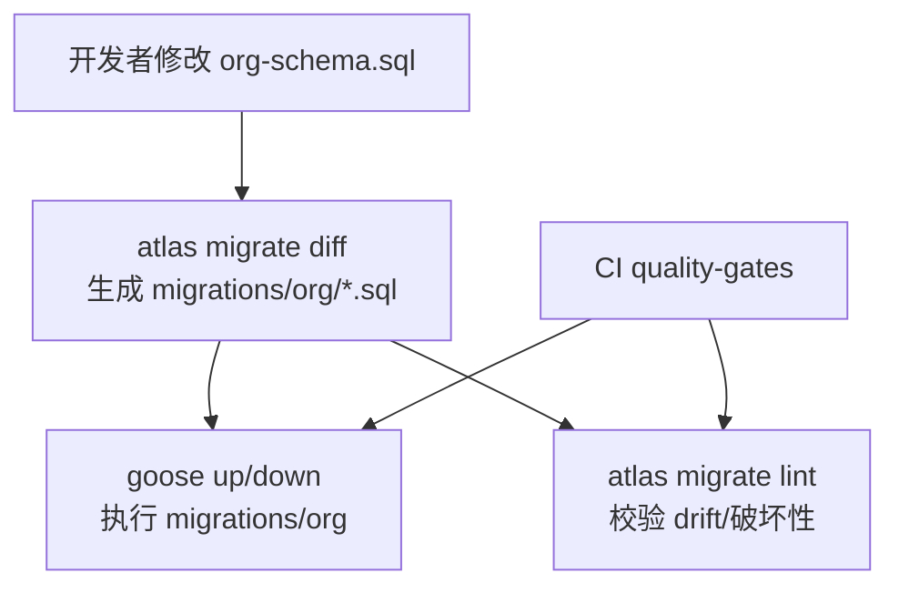

# DEV-PLAN-021A：Org Atlas+Goose 工具链与 CI 门禁落地

**状态**: 草拟中（2025-12-17 10:00 UTC）

## 1. 背景与上下文 (Context)
- **需求来源**：
  - `docs/dev-plans/021-org-schema-and-constraints.md`：要求 Org 具备可生成迁移、可 lint、可 up/down 的迁移闭环。
  - `docs/dev-plans/011A-atlas-goose-baseline-gapfix.md`：已为 HRM 落地 Atlas+Goose 基线与 CI 门禁，是本计划的“可复用实现样板”。
- **当前痛点**：
  - 仓库当前的 Atlas+Goose 门禁仅覆盖 HRM（`atlas.hcl` 的 env、`make db plan/lint`、CI `hrm-atlas` filter）。
  - Org 尚无对应的 `atlas` env、`migrations/org`、以及 CI 上的 plan/lint/goose smoke 门禁；即便 021 完成 schema 文件，也无法在 CI 层证明“迁移闭环真实可用”。
- **业务价值**：
  - 将 Org 的 DB 合同（021）转化为可重复执行、可回滚、可被 CI 拦截 drift 的工程化流水线，避免后续 022/023/024/025/026 进入实现后才暴露迁移链路缺口。

## 2. 目标与非目标 (Goals & Non-Goals)
### 2.1 核心目标
- [ ] **Org 受控目录落地**：新增 `migrations/org/**`（goose 格式）与 `migrations/org/atlas.sum`。
- [ ] **Atlas env 落地**：在根 `atlas.hcl` 新增 `org_dev/org_ci`（或等价命名），并明确 `src` 与 `migration.dir`。
- [ ] **Makefile 入口落地**：提供可复用、无需猜测的命令入口（plan/lint/migrate up/down/status/redo），并与 CI 口径一致。
- [ ] **CI 门禁落地**：在 `.github/workflows/quality-gates.yml` 新增 `org-atlas` filter；命中时运行 Org 的 Atlas plan/lint 与 goose smoke，并确保生成物已提交。
- [ ] **Readiness 可追溯**：创建并填写 `docs/dev-records/DEV-PLAN-021A-READINESS.md`（按“时间→命令→预期→实际→结论/回滚”）。

### 2.2 非目标 (Out of Scope)
- 不在本计划内实现 Org 的业务写路径/API/Authz/outbox（见 022/024/025/026）。
- 不在本计划内改变现有全仓库迁移系统（`migrations/changes-*.sql` + `rubenv/sql-migrate`）的机制；Org 迁移仅作为“模块级鹅迁移（goose）”的新增闭环。
- 不在本计划内引入全新 CI 工作流；仅扩展现有 `quality-gates.yml`。

## 3. 架构与关键决策 (Architecture & Decisions)
### 3.1 架构图 (Mermaid)

### 3.2 关键设计决策（ADR 摘要）
1. **沿用 011A 的“模块级受控目录”模式（选定）**
   - HRM：`atlas.hcl` env + `migrations/hrm` + CI `hrm-atlas`。
   - Org：对称新增 `org_*` env + `migrations/org` + CI `org-atlas`，避免把所有模块强行塞进同一个 env 导致漂移与门禁误触发。
2. **Atlas `src` 继续采用 SQL 文件而非 HCL（选定）**
   - 与当前仓库 `atlas.hcl`/Makefile 实现一致（HRM 也是以 SQL 作为 `src`）。
   - Org 的 SSOT 由 021 定义：`modules/org/infrastructure/persistence/schema/org-schema.sql`。
3. **不改动现有 `make db plan/lint` 的语义（选定）**
   - 目前 `make db plan/lint` 是 HRM 专用（拼接 HRM `core_deps.sql + hrm-schema.sql`）。
   - Org 将新增独立入口（例如 `make org plan/lint`），避免 HRM/Org 相互影响与破坏既有 CI 行为。
4. **goose runner 复用、避免脚本复制（选定）**
   - 将 `scripts/db/run_goose.sh` 抽象为“可指定迁移目录”的通用 runner（保持对 HRM 的默认兼容），供 Org/后续模块复用。

## 4. 数据模型与约束 (Data Model & Constraints)
> **标准**：本计划不重复 021 的表结构定义，仅定义“工具链所需的 SSOT 文件与依赖 stub”。

### 4.1 Schema SSOT
- Org schema 源（SSOT，来自 021）：`modules/org/infrastructure/persistence/schema/org-schema.sql`
- Atlas 依赖 stub（用于在干净库上 plan/lint）：`modules/org/infrastructure/atlas/core_deps.sql`
  - 最小要求：包含 `tenants(id uuid primary key)`（满足 021 的 `tenant_id references tenants(id)`）。

## 5. 迁移与工具链 (Migrations & Tooling)
### 5.1 目录结构（约定）
- `modules/org/infrastructure/atlas/`
  - `core_deps.sql`
- `modules/org/infrastructure/persistence/schema/`
  - `org-schema.sql`
- `migrations/org/`（goose 格式）
  - `00001_org_baseline.sql`（Up/Down）
  - `00002_org_migration_smoke.sql`（可选但推荐，用于 up/down/redo 的链路验证）
  - `atlas.sum`

### 5.2 `atlas.hcl` 变更（必须明确）
在根 `atlas.hcl` 增加 Org 的 `src` 与 env（命名可按下述口径实现）：
- `locals`：
  - `org_src = ["file://modules/org/infrastructure/atlas/core_deps.sql", "file://modules/org/infrastructure/persistence/schema/org-schema.sql"]`
- `env "org_dev"`：
  - `url = var.db_url`
  - `dev = var.atlas_dev_url`
  - `src = local.org_src`
  - `migration.dir = "file://migrations/org"`，`format = "goose"`
- `env "org_ci"`：
  - 同上，用于 `atlas migrate lint --env org_ci`

### 5.3 Makefile 入口（最终口径）
新增 `make org ...` 子命令（推荐形态；保持与 CI env 一致）：
- `make org plan`
  - 行为：创建/确保 `DB_NAME` 与 `ATLAS_DEV_DB_NAME` 对应数据库存在，然后执行 `atlas schema diff` dry-run（输出 SQL，不落盘）。
  - 实现提示（建议优先级）：
    1. **优先**：直接使用 `atlas.hcl` 的 env 读取 `src`（例如 `atlas schema diff --env org_dev ...`），以保证 plan 与 lint 看到同一份 Schema 视图。
    2. **回退**：若 Atlas CLI 版本/参数形态不支持上述用法，则使用与 `atlas.hcl local.org_src` 完全一致的 `src` 列表（可通过 Makefile 变量集中定义），必要时再拼接临时文件（参考现有 `make db plan` 的实现形态）。
- `make org lint`
  - 行为：执行 `DB_URL/ATLAS_DEV_URL` + `atlas migrate lint --env org_ci --git-base origin/main`。
- `make org migrate up|down|redo|status`
  - 行为：通过通用 runner 执行 `goose -dir migrations/org ...`（Down/Redo 支持 `GOOSE_STEPS`）。

### 5.4 通用 goose runner（实现约束）
对 `scripts/db/run_goose.sh` 做最小兼容增强：
- 默认行为保持不变（无显式参数时仍指向 `migrations/hrm`）。
- 新增可选环境变量：
  - `GOOSE_MIGRATIONS_DIR`：默认 `migrations/hrm`；Org 设为 `migrations/org`。
  - `GOOSE_TABLE`：默认 `goose_db_version`（保持与 HRM 一致）；**Org 必须显式使用独立表名**（例如 `goose_db_version_org`）。
    - 风险说明：若 Org 与 HRM 在同一数据库共享同一个 version 表（例如都用 `goose_db_version`），即使迁移目录不同，goose 也可能因为只按 `version_id` 记录状态而混淆迁移链路（版本号冲突/误回滚/漏执行）。

## 6. 核心逻辑与算法 (Business Logic & Algorithms)
本计划不包含业务算法；仅定义工具链闭环与门禁。

## 7. 安全与鉴权 (Security & Authz)
- 本计划只涉及 DB 迁移工具链，不引入 Casbin 策略变更。
- `atlas migrate lint`/`goose` 使用的连接串来自 CI 环境变量与本地 `.env/.env.local`，不新增明文密钥落盘。

## 8. 依赖与里程碑 (Dependencies & Milestones)
### 8.1 依赖
- 011A：HRM Atlas+Goose 基线作为样板（工具/CI 结构已存在）。
- 021：Org schema/约束合同（本计划只落地其工具链执行面）。
- 011B（可选）：多 worktree 本地 DB 隔离，降低本地验证互相污染风险。

### 8.2 里程碑
1. [ ] 新增 Org 目录与最小 stub（`modules/org/.../core_deps.sql`、`.../org-schema.sql`）。
2. [ ] `atlas.hcl` 增加 `org_dev/org_ci`，本地 `atlas` 可对 Org plan/lint。
3. [ ] 新增 `migrations/org` baseline + `atlas.sum`（可重复生成且提交干净）。
4. [ ] Makefile 新增 `make org plan/lint/migrate` 入口（与 CI 命令口径一致）。
5. [ ] CI 新增 `org-atlas` filter，并跑通 plan/lint/goose smoke + `git status --porcelain` 门禁。
6. [ ] 写入 `docs/dev-records/DEV-PLAN-021A-READINESS.md`（包含命令输出摘要）。

## 9. 测试与验收标准 (Acceptance Criteria)
### 9.1 CI 门禁（必须）
- 当变更命中 `org-atlas` filter 时：
  - [ ] `make org plan` 可连接 CI Postgres 并输出 plan（不落盘）。
  - [ ] `make org lint` 通过（`atlas migrate lint --env org_ci`）。
  - [ ] `make org migrate up` 通过（baseline + smoke），且使用独立 goose 版本表（例如 `GOOSE_TABLE=goose_db_version_org`）。
  - [ ] `git status --porcelain` 为空（确保 `atlas.sum` 等生成物已提交）。

### 9.2 本地可复现（必须）
- 在干净 Postgres 17 上可按如下顺序跑通且无 diff：
  - [ ] `make atlas-install && make goose-install`
  - [ ] `make org plan && make org lint`
  - [ ] `GOOSE_TABLE=goose_db_version_org make org migrate up && GOOSE_TABLE=goose_db_version_org GOOSE_STEPS=1 make org migrate down`
  - [ ] `git status --short` 为空

### 9.3 Readiness 落盘（必须）
- [ ] `docs/dev-records/DEV-PLAN-021A-READINESS.md` 存在且包含时间戳、命令、预期/实际、结论/回滚。

## 10. 运维、回滚与降级 (Ops / Rollback)
- 回滚最近一次 Org 迁移：`GOOSE_STEPS=1 make org migrate down`
- 迁移 `down` **不得删除扩展**（`pgcrypto/ltree/btree_gist` 保持幂等），避免影响其它模块（对齐 021）。
- 若 CI 门禁不稳定导致阻塞：
  - 优先修复 `atlas.hcl` env 与 Makefile 的 DB 创建/隔离逻辑；
  - 禁止通过放宽 filter 或跳过 lint 来“绿灯化”，避免 drift 进入主干。
