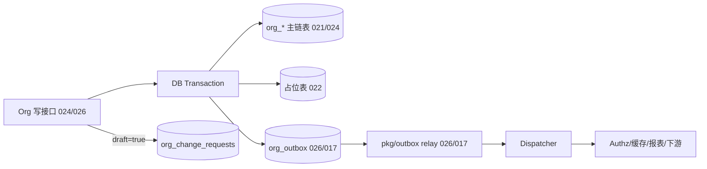

# DEV-PLAN-022：Org 占位表与事件契约

**状态**: 规划中（2025-12-13 更新）

## 1. 背景与上下文 (Context)
- **需求来源**：`docs/dev-plans/020-organization-lifecycle.md` 的「步骤 2：建立占位表与事件契约」。
- **当前痛点**：
  - 020/024/025/026 明确依赖“继承/角色/change_requests”的结构与“OrgChanged/OrgAssignmentChanged”稳定契约，但若先写代码再补结构，很容易在 M1 之后产生破坏性迁移与契约漂移。
  - 事件字段若在下游（Authz/缓存/报表）消费后再改名/改语义，会导致跨模块回放与纠偏成本急剧上升。
- **业务价值**：
  - 通过“占位表先行 + 契约冻结（v1 Topic）”，为后续 024/025/026 的实现提供可直接编码的落点，降低返工与漂移风险。
  - 为 026 的 outbox/relay 与 `/org/snapshot` 纠偏链路提供一致的事件语义（valid time vs transaction time）。

## 2. 目标与非目标 (Goals & Non-Goals)
### 2.1 核心目标
- [ ] 追加 Org 领域占位表：继承规则、角色、角色分配、变更草稿（change requests），并满足租户隔离与最小约束（不重叠/合法时间窗/必要索引）。
- [ ] 冻结 `org.changed.v1` 与 `org.assignment.changed.v1` 事件契约（字段名/类型/语义），覆盖：
  - `assignment_type`、继承相关预留字段；
  - `change_type/initiator_id/request_id/transaction_time/effective_window`；
  - 幂等（`event_id`）与可演进（Topic 版本）。
- [ ] 生成与校验路径可重复：涉及 atlas/sqlc 的生成命令执行后 `git status --short` 干净。

### 2.2 非目标（Out of Scope）
- 不实现继承解析/角色生效算法/草稿审批流（030 承接；workflow 不在 M1）。
- 不实现 outbox relay 与对外投递闭环（026 承接；017 提供通用 outbox 工具链）。
- 不引入 Org UI 体验变更（035 承接）；本计划仅定义契约与表结构。

## 3. 架构与关键决策 (Architecture & Decisions)
### 3.1 架构图 (Mermaid)


### 3.2 关键设计决策（ADR 摘要）
1. **命名风格（选定）**
   - JSON 字段统一使用 `snake_case`（与现有 API DTO 对齐）。
   - DB 表统一使用 `org_*` 前缀；本计划将 020 文档中提到的 `change_requests` 物理表名选定为 `org_change_requests`（避免与其它模块的 change request 概念冲突，如 `policy_change_requests`）。
2. **时间语义（选定）**
   - `transaction_time`：事务提交/事件记录时间（Transaction Time）。
   - `effective_window`：变更生效的有效期窗（Valid Time），语义为半开区间 `[effective_date, end_date)`。
   - 消费者必须以 `effective_window` 处理“未来生效”变更，禁止将 `transaction_time` 当作生效时间。
3. **版本与演进（选定）**
   - Topic 采用版本后缀（`*.v1`）；任何破坏性变更（字段改名/删字段/改语义）必须发布 `v2` Topic，不允许在 `v1` 上热改。
   - `event_version` 固定为 `1`（配合 Topic 版本，便于调试与校验）。
4. **幂等与去重（选定）**
   - `event_id` 为幂等键：outbox/relay 允许重复投递（at-least-once），消费者必须按 `event_id` 幂等处理（对齐 017）。
   - `request_id` 用于跨日志/审计/事件的链路串联（来自 `X-Request-Id`；无则生成）。

## 4. 数据模型与约束 (Data Model & Constraints)
> 约定：PostgreSQL 17；所有表必须包含 `tenant_id uuid not null`；时间窗使用 `effective_date/end_date`（UTC，半开区间）；新增 EXCLUDE 约束需依赖 `btree_gist` 扩展（由 021 统一启用）。

### 4.1 `org_attribute_inheritance_rules`（属性继承规则，占位）
**用途**：为后续“属性继承/覆盖”提供可演进的配置表；M1 不启用业务逻辑，仅落地结构与基本约束。

**字段（建议）**：
| 列 | 类型 | 约束 | 默认 | 说明 |
| --- | --- | --- | --- | --- |
| `tenant_id` | `uuid` | `not null` |  | 租户 |
| `id` | `uuid` | `pk` | `gen_random_uuid()` | 主键 |
| `hierarchy_type` | `text` | `not null` |  | 例如 `OrgUnit`（M1） |
| `attribute_name` | `text` | `not null` |  | 例如 `location_id/manager_user_id` |
| `can_override` | `boolean` | `not null` | `false` | 子节点是否允许显式覆盖 |
| `inheritance_break_node_type` | `text` | `null` |  | 遇到该 `node_type` 时断开继承（占位） |
| `effective_date` | `timestamptz` | `not null` |  | 生效时间 |
| `end_date` | `timestamptz` | `not null` | `9999-12-31` | 失效时间 |
| `created_at` | `timestamptz` | `not null` | `now()` |  |
| `updated_at` | `timestamptz` | `not null` | `now()` |  |

**约束与索引（建议）**：
- `check (effective_date < end_date)`
- 防重叠（同租户/层级/属性同窗不重叠）：
  - `exclude using gist (tenant_id with =, hierarchy_type with =, attribute_name with =, tstzrange(effective_date, end_date) with &&)`
- 索引：
  - `btree (tenant_id, hierarchy_type, attribute_name, effective_date)`

### 4.2 `org_roles`（角色字典，占位）
**用途**：为后续“组织角色（Manager/HRBP/FinanceController 等）”提供字典表；M1 不启用业务逻辑。

| 列 | 类型 | 约束 | 默认 | 说明 |
| --- | --- | --- | --- | --- |
| `tenant_id` | `uuid` | `not null` |  | 租户 |
| `id` | `uuid` | `pk` | `gen_random_uuid()` | 主键 |
| `code` | `varchar(64)` | `not null` |  | 租户内唯一编码 |
| `name` | `varchar(255)` | `not null` |  | 展示名 |
| `description` | `text` | `null` |  | 描述 |
| `is_system` | `boolean` | `not null` | `true` | 是否系统预置（占位） |
| `created_at` | `timestamptz` | `not null` | `now()` |  |
| `updated_at` | `timestamptz` | `not null` | `now()` |  |

**约束与索引（建议）**：
- `unique (tenant_id, code)`
- 索引：`btree (tenant_id, name)`

### 4.3 `org_role_assignments`（角色分配，占位）
**用途**：将 org role 分配到用户/组，并限定到某个组织节点与有效期窗；M1 不作为 `manager_user_id` 的事实来源。

| 列 | 类型 | 约束 | 默认 | 说明 |
| --- | --- | --- | --- | --- |
| `tenant_id` | `uuid` | `not null` |  | 租户 |
| `id` | `uuid` | `pk` | `gen_random_uuid()` | 主键 |
| `role_id` | `uuid` | `not null` |  | FK → `org_roles.id` |
| `subject_type` | `text` | `not null` | `user` | `user` / `group`（占位） |
| `subject_id` | `uuid` | `not null` |  | user_id / group_id |
| `org_node_id` | `uuid` | `not null` |  | FK → `org_nodes.id` |
| `effective_date` | `timestamptz` | `not null` |  |  |
| `end_date` | `timestamptz` | `not null` | `9999-12-31` |  |
| `created_at` | `timestamptz` | `not null` | `now()` |  |
| `updated_at` | `timestamptz` | `not null` | `now()` |  |

**约束与索引（建议）**：
- `check (effective_date < end_date)`
- `check (subject_type in ('user','group'))`
- 防重叠（同租户/同 role/同 subject/同节点同窗不重叠）：
  - `exclude using gist (tenant_id with =, role_id with =, subject_type with =, subject_id with =, org_node_id with =, tstzrange(effective_date, end_date) with &&)`
- 索引：
  - `btree (tenant_id, org_node_id, effective_date)`
  - `btree (tenant_id, subject_type, subject_id, effective_date)`

**与 `org_node_slices.manager_user_id` 的关系（约定）**：
- M1 以 `manager_user_id` 为准（读性能/写链路最短）。
- `org_role_assignments` 仅结构占位；当后续启用 `org_roles` 的 Manager 等角色时，再在专门 DEV-PLAN 中定义一致性策略（单向映射/双写/读合并）。

### 4.4 `org_change_requests`（变更草稿/提交，占位）
**用途**：为 030 的“草稿/提交/预检”提供结构基线；M1 可仅存草稿。

| 列 | 类型 | 约束 | 默认 | 说明 |
| --- | --- | --- | --- | --- |
| `tenant_id` | `uuid` | `not null` |  | 租户 |
| `id` | `uuid` | `pk` | `gen_random_uuid()` | 主键 |
| `request_id` | `text` | `not null` |  | 与 `X-Request-Id` 对齐（默认是 UUID 字符串），用于链路串联 |
| `requester_id` | `uuid` | `not null` |  | FK → `users.id` |
| `status` | `text` | `not null` | `draft` | `draft/submitted/approved/rejected/cancelled`（预留） |
| `payload_schema_version` | `int` | `not null` | `1` | 向后兼容 |
| `payload` | `jsonb` | `not null` |  | 建议复用 026 的 `/org/batch` body 结构 |
| `notes` | `text` | `null` |  | 备注 |
| `created_at` | `timestamptz` | `not null` | `now()` |  |
| `updated_at` | `timestamptz` | `not null` | `now()` |  |

**约束与索引（建议）**：
- `check (status in ('draft','submitted','approved','rejected','cancelled'))`
- `unique (tenant_id, request_id)`（便于“同 request_id 重试”幂等化）
- 索引：
  - `btree (tenant_id, requester_id, status, updated_at desc)`

**`payload` 结构（v1，选定）**：
- 复用 026 的 batch 命令结构，避免“草稿 payload 与执行 API payload 漂移”：
  - `effective_date`（可选）
  - `commands[]`（每条包含 `type` + `payload`）
  - `dry_run`（可选，仅用于预检；落地由 030/026 承接）

## 5. 接口契约 (Event Contracts)
> 本节定义跨模块的“事件 API”（integration events），通过 026/017 的 outbox/relay 投递；与 `pkg/eventbus` 的进程内事件是两条不同链路。
> 所有字段名必须使用 `snake_case`，并在 `v1` Topic 上冻结语义。

### 5.1 Topic 命名与版本
- `org.changed.v1`
- `org.assignment.changed.v1`

### 5.2 通用字段（v1，选定）
| 字段 | 类型 | 必填 | 说明 |
| --- | --- | --- | --- |
| `event_id` | `uuid` | 是 | 幂等键（对齐 017；消费者按此去重） |
| `event_version` | `int` | 是 | 固定为 `1` |
| `request_id` | `string` | 是 | 来自 `X-Request-Id`（无则生成）；用于链路串联 |
| `tenant_id` | `uuid` | 是 | 租户 |
| `transaction_time` | `rfc3339` | 是 | 事务提交时间（transaction time） |
| `initiator_id` | `uuid` | 是 | 发起人用户 id（脚本/系统任务需指定 system user） |
| `change_type` | `string` | 是 | 见 5.4 |
| `entity_type` | `string` | 是 | 见 5.5/5.6（`org_node/org_edge/org_assignment`） |
| `entity_id` | `uuid` | 是 | 变更实体 id（与 `entity_type` 搭配） |
| `entity_version` | `int64` | 是 | 占位；M1 可恒为 `0`，后续如引入强版本需发布 v2 |
| `effective_window` | `object` | 是 | 见 5.3 |
| `sequence` | `int64` | 否 | outbox 有序游标（若投递链路可提供则带上；消费者不得假设全局顺序） |
| `old_values` | `object` | 否 | 可省略（Create 场景默认省略）；其余建议提供 |
| `new_values` | `object` | 是 | 变更后快照（as-of `effective_window.effective_date`） |

### 5.3 `effective_window`（v1，选定）
```json
{
  "effective_date": "2025-01-01T00:00:00Z",
  "end_date": "9999-12-31T00:00:00Z"
}
```
- 语义：半开区间 `[effective_date, end_date)`。
- `effective_date < end_date` 必须成立。

### 5.4 `change_type` 枚举（v1，选定）
- 对 `org.changed.v1`：
  - `node.created`
  - `node.updated`（Insert 语义新增时间片）
  - `node.corrected`
  - `node.rescinded`
  - `edge.created`
  - `edge.updated`（Move/ShiftBoundary 等导致边有效期变化）
  - `edge.rescinded`
- 对 `org.assignment.changed.v1`：
  - `assignment.created`
  - `assignment.updated`
  - `assignment.corrected`
  - `assignment.rescinded`

### 5.5 `org.changed.v1` 的 `new_values` 结构（选定）
> v1 以“最小可用快照”为准：下游若需要完整时间线与路径，走 026 的 `/org/snapshot` 纠偏。

`entity_type` 取值必须为 `org_node` 或 `org_edge`。

当 `entity_type=org_node` 时，`new_values` 必须包含：
- `org_node_id`（同 `entity_id`）
- `code`（string）
- `name`（string）
- `status`（`active/retired/rescinded`）
- `effective_date/end_date`（与 `effective_window` 一致）
- `parent_node_id`（uuid|null，用于下游快速重建；若依赖边为真相，可为 null）

当 `entity_type=org_edge` 时，`new_values` 必须包含：
- `parent_node_id`（uuid）
- `child_node_id`（uuid）
- `effective_date/end_date`（与 `effective_window` 一致）
可选但推荐：
- `path`（string，ltree）
- `depth`（int）

### 5.6 `org.assignment.changed.v1` 的 `new_values` 结构（选定）
`entity_type` 固定为 `org_assignment`。

`new_values` 必须包含：
- `assignment_id`（uuid，同 `entity_id`）
- `position_id`（uuid）
- `subject_type`（M1 固定为 `person`；如需扩展必须发布 v2）
- `subject_id`（uuid）
- `assignment_type`（`primary/matrix/dotted`）
- `is_primary`（bool）
- `effective_date/end_date`（与 `effective_window` 一致）

### 5.7 示例（仅示意，字段必须 snake_case）
**节点新增（`org.changed.v1`）**
```json
{
  "event_id": "8de0a734-15cf-4c86-8acb-2b06a57c4b6b",
  "event_version": 1,
  "request_id": "b6f2dfb6-6ec4-4e97-8cd6-5a5f3db4c6f7",
  "tenant_id": "0fbe3f62-93f3-4ef4-8b3a-bc8a9f7d1f1a",
  "transaction_time": "2025-01-15T12:00:00Z",
  "initiator_id": "f2cbd8b0-01c5-4c9a-8a0a-8b3bf2a0c7b4",
  "change_type": "node.created",
  "entity_type": "org_node",
  "entity_id": "b8f2a4c4-6bd7-4c02-9b9f-4d4a0f65a8b3",
  "entity_version": 0,
  "effective_window": { "effective_date": "2025-01-01T00:00:00Z", "end_date": "9999-12-31T00:00:00Z" },
  "new_values": {
    "org_node_id": "b8f2a4c4-6bd7-4c02-9b9f-4d4a0f65a8b3",
    "code": "HR-001",
    "name": "HR Department",
    "status": "active",
    "parent_node_id": null,
    "effective_date": "2025-01-01T00:00:00Z",
    "end_date": "9999-12-31T00:00:00Z"
  }
}
```

## 6. 核心逻辑与算法 (Business Logic & Algorithms)
### 6.1 草稿写入（`draft=true`，占位约定）
- 入口：写 API 支持 `?draft=true`（或等价开关，最终口径以 030/026 为准）。
- 行为：仅写入 `org_change_requests`（`status=draft`），不改主数据表，不写 outbox，不发布任何事件。
- 幂等：以 `(tenant_id, request_id)` 唯一约束作为“重复提交草稿”的幂等基础；重复请求可选择覆盖 `payload/notes` 并更新 `updated_at`。

### 6.2 事件快照（Old/New Values）口径（选定）
- `new_values`：以 `effective_window.effective_date` 为查询点（as-of），返回“提交后”的实体快照。
- `old_values`：同一查询点下，“提交前”的实体快照（Create 场景无 old）。
- 目的：确保消费者能用 `effective_window` 的同一时点做差异回放，避免“截断/插入时间片”导致的语义混乱。

### 6.3 outbox 原子性约束（对齐 017/026）
- 事件必须通过 Transactional Outbox 保证原子性：业务写入与 outbox enqueue 在同一数据库事务内提交。
- relay 重放语义为 at-least-once：消费者必须按 `event_id` 幂等。

## 7. 安全与鉴权 (Security & Authz)
- **租户隔离**：所有占位表查询/写入必须包含 `tenant_id` 条件；repository 层不得暴露无 tenant filter 的接口。
- **PII 最小化**：事件 payload 禁止包含用户邮箱/手机号等敏感信息；仅传递 ID 与必要的业务字段（如 code/name）。
- **鉴权边界**：
  - 草稿写入与读取的权限口径由 030/026 决定；本计划仅保证表结构能承载审计与权限扩展字段。

## 8. 依赖与里程碑 (Dependencies & Milestones)
- 依赖：
  - 021：Org 主链 schema/约束可用（并已具备 `btree_gist` 等扩展）。
  - 017：outbox 工具链（语义与字段口径）。
  - 026：outbox 落地与对外事件发布闭环、snapshot/batch 纠偏链路。
- 里程碑（建议）：
  1. [ ] 占位表 schema/迁移可生成并 lint 通过
  2. [ ] 事件契约 v1 文档冻结（含示例）
  3. [ ] sqlc 查询生成与占位 service/repo 对齐
  4. [ ] Readiness 记录完成

## 9. 测试与验收标准 (Acceptance Criteria)
- Schema：
  - 占位表全部创建完成，约束/索引满足本计划定义；与 021 的核心表不冲突。
  - `atlas migrate diff` 生成迁移后，`atlas migrate lint` 通过（按 021/011A 的工具链口径执行）。
- 生成物：
  - 运行 `make sqlc-generate`（或等价命令）后 `git status --short` 干净。
- 契约：
  - `org.changed.v1` / `org.assignment.changed.v1` 字段名与语义冻结；任何破坏性变更必须新增 v2 Topic。
- 记录：
  - `docs/dev-records/DEV-PLAN-022-READINESS.md` 包含迁移生成/上下行/生成物校验命令与输出摘要。

## 10. 运维、回滚与降级 (Ops / Rollback)
- 迁移回滚：新表/索引若导致冲突，按 021 的迁移目录回滚最新步（`GOOSE_STEPS=1 ... down` 或等价机制；最终口径以仓库迁移工具链为准）。
- 契约演进：若事件字段需调整，只允许通过发布新 Topic 版本（`v2`）演进；旧版保留一段兼容期并提供 `/org/snapshot` 纠偏。

## 11. 任务清单（落地追踪）
1. [ ] **Schema 与迁移**：在 `modules/org/infrastructure/atlas/schema.hcl` 补充 4.1~4.4 的表/索引/约束，生成迁移并通过 lint。
2. [ ] **事件契约定义**：在 `modules/org/domain/events`（或等价目录）定义 v1 事件结构体（字段对齐第 5 节），并记录 Topic/版本演进规则。
3. [ ] **sqlc 查询与服务占位**：新增 SQL 并运行 `make sqlc-generate`；服务层添加草稿保存占位（可空实现），保持 `git status --short` 干净。
4. [ ] **Readiness 记录**：记录命令与结果到 `docs/dev-records/DEV-PLAN-022-READINESS.md`（迁移生成/上下行/生成物校验）。
