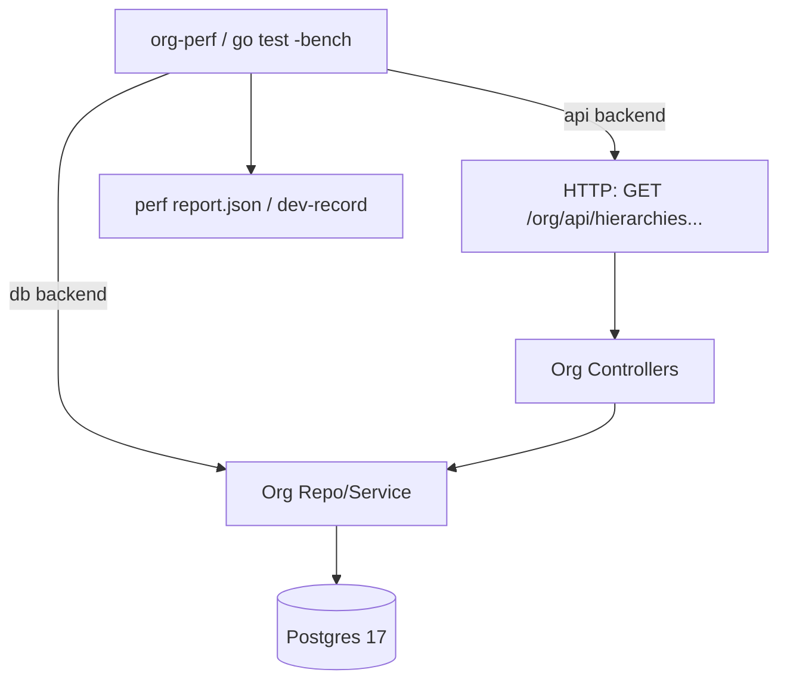

# DEV-PLAN-027：Org 性能基准与灰度发布（Step 7）

**状态**: 规划中（2025-12-14 08:22 UTC）

## 1. 背景与上下文 (Context)
- **需求来源**: `docs/dev-plans/020-organization-lifecycle.md` 的 **步骤 7：性能与上线准备**（M1 上线验收门槛）。
- **当前痛点**:
  - M1 的树读取（OrgUnit 1k 节点）目前缺少“固定数据集 + 固定环境 + 固定命令参数”的可重复基准，无法稳定判断是否达标或是否发生性能回退。
  - 导入/灰度/回滚流程在多个子计划间分散（023/026/027），需要把“工具能力”收敛为可执行的上线剧本，并明确降级与回滚开关。
- **业务价值**:
  - 在不引入闭包表（029）前提下，为 M1 提供可量化的性能预算与回退路径，降低上线风险，避免因读性能不达标阻塞 HRM/Authz 等下游联调。

## 2. 目标与非目标 (Goals & Non-Goals)
- **核心目标**:
  - [ ] 提供可重复执行的性能基准（PG17、固定数据集、固定参数），覆盖 M1 关键读路径。
  - [ ] 达成并记录性能预算：**OrgUnit 1k 节点树读取 P99 < 200ms**（以本地基准环境为准，见 6.1）。
  - [ ] 输出“灰度发布/回滚剧本”（可在无猜测前提下执行），并明确 feature flag/降级路径与触发条件。
  - [ ] 将基准与剧本纳入 repo 的可复用入口（`make`/`cmd`/`scripts`），便于后续 CI/Readiness 复用。
- **非目标 (Out of Scope)**:
  - 不引入闭包表/物化视图/深层读取重构（归属 `docs/dev-plans/029-org-closure-and-deep-read-optimization.md`）。
  - 不建设长期压测体系、告警与值班流程（归属 `docs/dev-plans/034-org-ops-monitoring-and-load.md`）。
  - 不实现数据导入工具本体（归属 `docs/dev-plans/023-org-import-rollback-and-readiness.md`），本计划只负责把工具编排为上线剧本并补齐灰度开关。
  - 不重新定义 API/Authz/事件契约（归属 `docs/dev-plans/026-org-api-authz-and-events.md` 与 `docs/dev-plans/022-org-placeholders-and-event-contracts.md`）。

### 2.1 与其他子计划的边界（必须保持清晰）
- 021：负责 schema/约束/迁移；027 仅提出“为达标所需的索引/查询调整建议”，落地仍需走 021 的迁移工作流与评审口径。
- 023：负责导入/回滚工具实现；027 负责把 023 的能力编排为“灰度发布/回滚剧本”，并给出触发条件与演练步骤。
- 024：负责主链 CRUD 与树读入口；027 负责对 024 的读路径做基准与预算约束，不改业务语义。
- 025：负责有效期算法、冻结窗口与审计；027 仅在基准/灰度中复用其行为，不改变写语义与错误码。
- 026：负责 API/Authz/outbox/缓存失效与对账接口；027 只定义“性能预算 + 灰度开关 + 降级路径”的运维/执行面，不改 026 的事件契约。
- 029：负责闭包表/深层读优化；027 不引入闭包表，只保留预留开关口径（如需）。
- 034：负责长期监控/压测与运维治理；027 只覆盖 M1 灰度前置与最小化观测项。
- 035：负责 M1 UI 体验与交互；027 不在 UI 层引入性能逻辑，仅给出灰度/回滚时的可见性策略建议。

## 3. 架构与关键决策 (Architecture & Decisions)
### 3.1 架构图 (Mermaid)

### 3.2 关键设计决策 (ADR 摘要)
- **决策 1：基准以“固定数据集 + 双层测量”落地**
  - **选项 A**：只测 API（端到端）。优点：更贴近真实；缺点：受 Authz/Session/网络/模板影响更大，难定位瓶颈。
  - **选项 B**：只测 repo/service（微基准）。优点：稳定、可定位；缺点：忽略 HTTP 与控制器开销。
  - **选项 C（选定）**：**双层测量**：以 repo/service 的 DB 基准作为“性能预算的硬门槛”，API 基准作为“回归与体验参考”。
- **决策 2：CI 侧避免“强 timing gate”导致抖动**
  - CI 机器抖动可能导致纯时间阈值误报；因此 CI 默认做 **可重复执行** 与 **确定性守卫**：
    - **查询计数（Query Count）硬指标**：对树读取基准场景做 query budget（常数级，不随节点数线性增长），用于捕获最常见的性能回退（N+1）。
    - **计划/索引回归检查（可选）**：必要时用 `EXPLAIN (ANALYZE, FORMAT JSON)` 排查明显退化特征（不作为唯一 gate）。
  - 严格 timing gate 作为 **Readiness/灰度前置** 在受控环境执行并记录。
- **决策 3：灰度开关按“租户 allowlist + 模式”控制**
  - 以租户为最小灰度单元，避免全局开关导致一次性风险；开关口径与 Authz 独立，Authz 负责“谁能访问”，灰度负责“哪些租户启用新链路/缓存/新读路径”。

## 4. 数据模型与约束 (Data Model & Constraints)
> 本计划原则上不引入新表；如因性能达标需要补索引/调整查询，应通过 021/迁移工作流落地并记录原因与回滚方式。

- **基准数据**：复用 021 的 org 核心表（`org_nodes/org_node_slices/org_edges/positions/org_assignments`），由 023 的 `cmd/org-data` 或本计划的 dataset 生成器写入（见 5.1）。
- **允许的 schema 变更范围（仅限性能达标所需）**：
  - 仅新增/调整索引、统计信息或查询形态；禁止引入闭包表/物化视图（029 负责）。
  - 任一 schema 变更必须：
    - 走 `migrations/**` 或 `modules/**/infrastructure/persistence/schema/**` 正规路径；
    - 附带 `EXPLAIN (ANALYZE, BUFFERS)` 对比记录（写入 dev-record）；
    - 给出 `down` 或可逆方案（至少说明回滚步骤与风险）。

## 5. 接口契约 (API Contracts)
### 5.1 性能基准入口（CLI / Make）
> 目标是给出“无需猜测即可执行”的命令与参数口径；具体实现可选 `cmd/org-perf` 或 `go test -bench`，但对外入口必须稳定。

- **推荐入口 A：Go CLI `cmd/org-perf`（端到端可复用）**
  - `org-perf dataset apply --tenant <uuid> --scale 1k --seed 42 --profile balanced [--backend db|api] [--apply]`
  - `org-perf bench tree --tenant <uuid> --effective-date <rfc3339|yyyy-mm-dd> --profile balanced --iterations 200 --warmup 50 --concurrency 1 --backend db|api [--base-url http://localhost:3200] --output <path>`
  - 输出（JSON）最小字段口径：
    - `scenario`（如 `org_tree`）、`scale`（如 `1k`）、`profile`（如 `balanced`）、`backend`（`db|api`）
    - `p50_ms/p95_ms/p99_ms`、`count`、`started_at/finished_at`、`git_rev`、`db_version`
- **推荐入口 B：`go test -bench`（稳定预算门槛）**
  - `go test ./modules/org/... -run '^$' -bench '^BenchmarkOrgTree1K$' -benchmem`
  - 基准必须支持从 env/flag 读取：`DB_*`、`TENANT_ID`、`EFFECTIVE_DATE`、`SEED`、`SCALE`、`PROFILE`。
- **Makefile 入口（对齐 AGENTS “入口优先”）**
  - `make org-perf-dataset`：生成/导入固定 1k 数据集（默认 dry-run，`APPLY=1` 才落库）。
  - `make org-perf-bench`：运行基准并输出 `./tmp/org-perf/report.json`（路径可配置）。

### 5.2 API 基准目标（对齐 024/026）
- `GET /org/api/hierarchies?type=OrgUnit&effective_date=`（024 定义，M1 树概览）
- `GET /org/api/snapshot?effective_date=&include=`（026 定义，全量对账/纠偏；基准仅作为参考，不作为 M1 200ms 硬门槛）

## 6. 核心逻辑与算法 (Business Logic & Algorithms)
### 6.1 基准执行算法（统一口径）
1. **准备环境**：
   - Postgres 17，迁移已完成（021）；
   - 使用固定 `TENANT_ID`（基准专用租户）与固定 `effective_date`（默认 `now()` 或固定日期，推荐固定）。
2. **准备数据集（Scale=1k）**：
   - root 1 个 + 子树合计 1000 个节点（结构固定，至少提供以下 profile）：
     - `balanced`（默认）：深度约 6（允许范围 5-8），按 BFS 填充到 1000 节点，尽量贴近真实组织结构。
     - `wide`：深度 2-3（尽量扁平），用于压测“同层节点数很大”的排序/聚合路径。
     - `deep`：深度接近 1000（近链式），用于压测递归/路径计算边界（仅作为极端回归用例，不作为 M1 默认验收口径）。
   - Position/Assignment：按 M1 最小集生成（建议 1 Position/Node，少量 Assignment 用于覆盖 join 但避免把分配读掩盖树读）。
3. **Warmup**：先执行 50 次读请求（不计入统计），让连接池、缓存、JIT/plan warming 稳定。
4. **Measure**：按 `iterations` 执行读请求，采集每次耗时（毫秒），输出 P50/P95/P99。
5. **Budget Check（Readiness 用）**：
   - 断言 `p99_ms < 200`（repo/service DB 基准）。
   - 若失败：进入 6.2 的“降级/优化决策树”，并在 dev-record 记录每次尝试与结果。

### 6.2 性能不达标时的决策树（M1）
> 顺序从“低风险、可逆、范围小”到“高风险、范围大”；任何变更都必须能回滚。

1. **确认测量口径**：确保是同一数据集、同一 effective_date、同一并发与机器环境；排除 debug 日志/pprof 开销。
2. **DB 侧优先（不改业务语义）**：
   - 补齐/调整索引（限定在 4 节允许范围），并记录 `EXPLAIN (ANALYZE, BUFFERS)`。
   - 调整查询形态（例如先取边/节点主键集合再分批取 slices，避免大宽表 join）。
3. **应用侧可逆优化**：
   - 引入缓存（026 已有基线：tenant+hierarchy_type+effective_date 作为 key），先粗粒度失效；缓存策略细化留给 027 的实现任务。
4. **降级查询路径（feature flag）**：
   - 提供 `ORG_READ_STRATEGY=path|recursive`（示例命名，最终以实现为准），默认使用性能更优者；当发现 path 策略在某些数据分布退化时可回切 recursive（正确性优先）。
5. **架构兜底：转入 DEV-PLAN-029**：
   - 当索引/查询形态/缓存/读策略切换仍无法达成 `P99 < 200ms`，必须显式转入 `docs/dev-plans/029-org-closure-and-deep-read-optimization.md` 的闭包表/物化视图方案作为唯一架构级救生圈，并据此重新评估里程碑与上线窗口。
6. **停止上线并回滚（当达不到 200ms 门槛）**：
   - 在 029 的方案具备可上线形态前，禁止进入灰度扩大；保持 Org 功能仅对基准租户/内部租户可用，或临时下线（见 10.3）。

## 7. 安全与鉴权 (Security & Authz)
- **租户隔离**：所有基准与灰度脚本必须显式传入 `tenant_id`，禁止对“全库/跨租户”做扫描式压测。
- **Authz**：
  - API 基准默认走正常 Authz（026 口径），避免绕过导致与真实行为不一致。
  - 如需无交互压测，可在本地使用 `ENABLE_TEST_ENDPOINTS=true` 的测试入口获取 session/种子（仅限开发/CI 环境，禁止生产）。
- **数据安全**：灰度导入数据必须来自受控 CSV/模板（023），禁止用生产数据快照在开发环境回放。

## 8. 依赖与里程碑 (Dependencies & Milestones)
- **依赖**：
  - `docs/dev-plans/021-org-schema-and-constraints.md`：表/索引/约束可用（PG17）。
  - `docs/dev-plans/023-org-import-rollback-and-readiness.md`：数据导入/回滚工具可用（用于灰度剧本的执行面）。
  - `docs/dev-plans/024-org-crud-mainline.md`：树读入口与最小主链可运行（`GET /org/api/hierarchies...`）。
  - `docs/dev-plans/026-org-api-authz-and-events.md`：Authz/缓存基线/outbox 闭环（灰度期间便于纠偏与缓存失效）。
- **里程碑**：
  1. [ ] 基准数据集生成/导入入口落地（固定 1k profile）。
  2. [ ] DB 基准（repo/service）可运行并产出 JSON 报告。
  3. [ ] API 基准（`/org/api/hierarchies`）可运行并产出报告（参考指标）。
  4. [ ] 性能预算达标或形成明确降级方案（含 feature flag 与回滚命令）。
  5. [ ] 灰度发布/回滚剧本定稿并演练（dry-run + apply）。
  6. [ ] Readiness 记录补齐（命令/耗时/结果/环境）。

## 9. 测试与验收标准 (Acceptance Criteria)
- **性能预算（硬门槛）**：
  - 数据集：OrgUnit 1k 节点固定 profile；
  - DB 基准（repo/service）：`P99 < 200ms`；
  - 失败必须给出“可执行的降级/回滚方案”，且剧本可演练通过。
- **可重复性**：
  - 同一 commit、同一数据集、同一环境下重复执行 3 次，P99 波动不超过约定阈值（建议 ≤ 20%，以 Readiness 记录为准）。
- **CI 硬指标（Query Count，防 N+1）**：
  - 对“树读取基准场景（repo/service 层）”设置 query budget，要求常数级且不随节点数线性增长（例如 10 节点与 1k 节点的查询次数差异 ≤ 1）。
  - 预算值先以 baseline 固化（写入测试常量与 Readiness 记录）；若确需上调，必须附带原因与 `EXPLAIN`/基准数据支持。
- **工程门禁**：
  - 文档/脚本落地后，相关门禁（至少 `make check doc`；如新增 Go 代码则按 AGENTS 跑 `go fmt ./... && go vet ./... && make check lint && make test`）必须通过。
- **交付记录**：
  - 新增/更新 `docs/dev-records/DEV-PLAN-027-READINESS.md`，记录：
    - 基准环境（CPU/内存/DB 版本、关键 env）
    - 数据集生成命令与 scale/seed
    - 基准执行命令、输出报告摘要（P50/P95/P99）
    - 灰度/回滚剧本演练日志与结论
  - 更新 020 约定的 Workday parity checklist（性能/灰度结果至少要有一条可追溯记录）。

## 10. 运维与监控 (Ops & Monitoring)
### 10.1 Feature Flag（灰度开关口径）
- **目标**：允许按租户逐步启用 Org 读路径/缓存/（未来）闭包表读路径，且能一键回滚。
- **建议开关（示意，最终以实现为准）**：
  - `ORG_ROLLOUT_MODE=disabled|enabled`（默认 `disabled`）
  - `ORG_ROLLOUT_TENANTS=<uuid,uuid,...>`（enabled 时生效；空表示不启用任何租户）
  - `ORG_READ_STRATEGY=path|recursive`（仅影响读实现选择）
  - `ORG_CACHE_ENABLED=true|false`（缓存总开关）

### 10.2 灰度发布剧本（M1）
1. **前置检查**：确认 021/024/025/026 已部署且健康，outbox relay 正常，Authz 策略已合并并生效。
2. **灰度导入（dry-run）**：使用 023 工具对目标租户执行 `import` dry-run，修正数据后再 `--apply`。
3. **启用灰度租户**：将目标租户加入 `ORG_ROLLOUT_TENANTS`，并保持仅内部角色可见（Authz）。
4. **验收**：运行 5.1 的基准（至少 DB 基准），并对关键页面/API 做冒烟验证；若失败按 6.2 决策树处理。
5. **扩大范围**：按租户逐步扩容；每次扩容都必须留存基准与验证记录。

### 10.3 回滚策略
- **快速回滚（优先）**：从 `ORG_ROLLOUT_TENANTS` 移除租户或将 `ORG_ROLLOUT_MODE=disabled`，恢复“不可用/仅内部不可见”状态。
- **数据回滚（按需）**：使用 023 的 `rollback --manifest`（优先）或 `--since`（仅 seed 兜底）清理本次灰度导入数据，并记录影响范围。
- **降级回滚**：若是读策略/缓存导致问题，先切换 `ORG_READ_STRATEGY` 或关闭 `ORG_CACHE_ENABLED`，再评估是否需要数据回滚。
