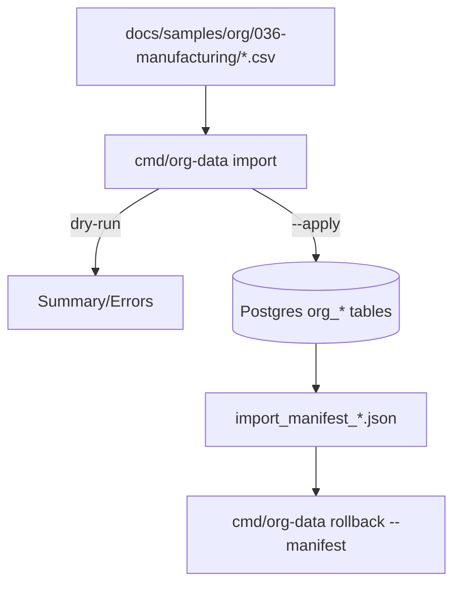

# DEV-PLAN-036：制造示例组织树数据集（200+ 部门，最深 17 级）

**状态**: 已完成（2025-12-18 12:44 UTC）

## 1. 背景与上下文 (Context)
- **需求来源**：
  - `docs/dev-plans/020-organization-lifecycle.md`：上线与迁移（导入/回滚/对账）与验收门槛。
  - `docs/dev-plans/035-org-ui.md`：组织树 UI 联调需要可控但真实的数据集。
  - `docs/dev-plans/027-org-performance-and-rollout.md`：基准/灰度需要固定 profile 数据集（deep chain + wide tree）。
- **当前状态**：已完成 026 及之前子计划，正在同步实施 035 与 027。
- **业务价值**：提供统一可重复的“制造型集团组织树”示例，用于演示、联调、排障与（可选）性能基准输入，减少“临时手工造数”导致的数据漂移与不可回滚风险。

## 2. 目标与非目标 (Goals & Non-Goals)
### 2.1 核心目标
- [ ] 提供一个可重复导入的 OrgUnit 单树示例数据集（用于本地/测试环境演示与联调）。
- [ ] 数据集满足以下硬性约束：
  - root 的展示名称为：`飞虫与鲜花`
  - 部门（OrgUnit）节点数不少于 `200`（不含 Position/Assignment）
  - 最大层级达到 `17` 级（口径见 4.3）
  - root 下至少包含以下一级业务单元：
    - `房地产`
    - `物业管理`
    - `互联网行业`
- [ ] 数据集可通过 023 seed 工具完成：dry-run 成功、apply 成功、manifest 回滚成功，并输出对账摘要（对齐 020 的导入/对账要求）。

### 2.2 非目标 (Out of Scope)
- 不要求通过 026 的 `/org/api/batch` 写路径触发 outbox 事件（本计划默认用于演示/本地造数；事件闭环需另行立项，或在 023 后续增强中实现 `--backend api`）。
- 不在本计划内定义多层级树（Company/Cost/Custom）或矩阵关系写入（保持 M1：OrgUnit 单树）。
- 不要求补齐 020 的 “1k 节点 <200ms” 性能门槛（归属 027；036 仅提供 profile 数据输入）。

## 2.3 工具链与门禁（SSOT 引用）
> 本计划主要新增/调整文档与示例 CSV，不在本文复制命令清单；门禁与命令以 SSOT 为准。

- **命中触发器（勾选本计划涉及项）**：
  - [X] 文档新增/整理：`make check doc`
  - [ ] Go 代码（若后续新增生成器/封装脚本才命中）
  - [ ] DB 迁移 / Schema（不涉及）
  - [ ] Authz / 路由治理 / sqlc / `.templ` / 多语言 JSON（不涉及）

- **SSOT 链接**：
  - 触发器矩阵与本地必跑：`AGENTS.md`
  - 导入/回滚工具契约：`docs/dev-plans/023-org-import-rollback-and-readiness.md`
  - Org schema/约束：`docs/dev-plans/021-org-schema-and-constraints.md`
  - Org UI：`docs/dev-plans/035-org-ui.md`
  - 性能/灰度：`docs/dev-plans/027-org-performance-and-rollout.md`

## 3. 架构与关键决策 (Architecture & Decisions)
### 3.1 数据流（导入/回滚）

### 3.2 关键决策（ADR 摘要）
- **决策 1（选定）：用 023 的 DB seed 作为造数入口**
  - 理由：可重复执行、可回滚；对齐 020 的“租户初始化导入”路径；避免绕过 025/026 的审计/outbox 口径造成线上语义误判。
- **决策 2（选定）：采用 deep chain + wide tree 组合 profile**
  - 理由：deep chain 易暴露 UI 渲染与查询边界；wide tree 易暴露排序/分页/折叠交互与（潜在）N+1 风险；组合更贴近真实集团组织。

## 4. 数据契约与约束 (Data Contracts & Constraints)
### 4.1 SSOT 对齐（不复制细节）
- 数据模型与约束：以 `docs/dev-plans/021-org-schema-and-constraints.md` 为准（`org_nodes/org_node_slices/org_edges`，`ltree path/depth` 触发器、无重叠约束等）。
- 导入/回滚入口：以 `docs/dev-plans/023-org-import-rollback-and-readiness.md` 为准（`cmd/org-data import --backend db --mode seed`，默认 dry-run，`--apply` 才落库，manifest 回滚）。
- UI 行为与路由：以 `docs/dev-plans/035-org-ui.md` 为准（树视图、`effective_date` 切换）。
- 性能/基准与灰度：以 `docs/dev-plans/027-org-performance-and-rollout.md` 为准（数据 profile、基准与回滚剧本）。

### 4.2 输入目录与文件
- 交付目录：`docs/samples/org/036-manufacturing/`
- 文件：
  - `nodes.csv`（必选）：部门树（OrgUnit）节点与时间片。
  - `positions.csv`（可选）：用于演示分配/负责人。
  - `assignments.csv`（可选）：用于演示人员分配时间线。
- CSV 字段合同与解析规则以 023 为准（避免在本文复制字段定义导致漂移）。

### 4.3 “17 级”口径（本计划固化）
- **口径（选定）**：root 视为第 1 级（Level=1）。
- **DB 校验口径**：对应 `org_edges.depth` 的最大值为 `16`（因为 root edge `depth=0`）。
- **UI 展示口径**：若 UI 使用 0-based depth（常见），则 UI 最深节点 `Depth=16`；如 UI 后续改为 1-based 展示，仅影响展示，不影响 DB 数据。

### 4.4 层级结构（Profile，必须覆盖）
- **Root（必须）**：展示名 `飞虫与鲜花`。
- **一级业务单元（必须）**：root 下至少包含：`房地产`、`物业管理`、`互联网行业`。
- **Deep chain（必选）**：从 root 开始构造一条连续链路，使 `max_depth=16` 可达（用于验证最深路径渲染与查询边界）。
- **Wide tree（必选）**：在三大业务单元下分别构造多分支子树，确保总节点数 ≥ 200，并包含：
  - 多个二级/三级部门（常见：事业部/大区/城市公司/项目组/职能线）
  - `display_order` 有序（便于 UI 对照）
- **命名规则（避免导入失败）**：
  - `code`：ASCII/数字/短横线组合（满足 `varchar(64)` 与唯一性；避免空格与中文用于 code）。
  - `name`：中文展示名为主，可选 `i18n_names` 补充英文（JSON object）。
  - 同一父节点下、同一时间窗口内避免同名（对齐 021 的 sibling name 不重叠约束）。

### 4.5 时间片（有效期）
- M1 最小集：所有节点与边使用统一 `effective_date=2025-01-01`，`end_date` 为空（默认 9999-12-31），保证导入与展示简单可控。
- 预留（可选）：增加少量 future-dated slice（用于验证 035 的 `effective_date` 切换），但必须保持数据集可理解、可诊断。

## 5. 导入校验与对账 (Validation & Reconciliation)
> 目标：对齐 020 的“导入前校验 + 导入后对账报告”特征（不复制工具实现细节，仅固化应输出的对账内容）。

### 5.1 导入前校验（dry-run）
- 使用 023 工具执行 dry-run，确保：
  - CSV 格式、必填字段、日期范围合法。
  - 无环路、无同一实体时间片重叠。
  - seed 模式满足“空租户”安全网（避免污染非空租户）。

### 5.2 导入后对账摘要（必须产出并记录）
- 对账摘要应至少包含：
  - `dataset_id`（固定）：`org-036-manufacturing`
  - `tenant_id`
  - `as_of_date`（本计划默认为 `2025-01-01`）
  - `nodes_total`（应 ≥ 200）
  - `max_depth`（应 = 16，见 4.3）
  - `root_name`（应为 `飞虫与鲜花`）
  - `root_children`（至少包含：`房地产`、`物业管理`、`互联网行业`）
  - `manifest_path`（用于回滚）
- 该摘要以“工具输出（stdout JSON）+ Readiness 记录文件”两种形态留存，避免仅口头确认。

## 6. 实施步骤 (Milestones)
1. [X] 固化数据集目录与口径（2025-12-18 12:30 UTC）
   - 目录：`docs/samples/org/036-manufacturing/`
   - 口径：按 4.3（root=Level1，`max_depth=16`）。
2. [X] 生成 CSV（至少 `nodes.csv`）（2025-12-18 12:30 UTC）
   - `飞虫与鲜花` 为 root 展示名；root 下包含 `房地产/物业管理/互联网行业` 一级业务单元。
   - 部门节点数：`254`（≥200）；深链最深节点：`IT-DEEP-16`（目标 `max_depth=16`）。
3. [X] 导入验证（dry-run + apply）并产出对账摘要（2025-12-18 12:44 UTC）
   - 先 dry-run，再 apply（导入到“空租户”）。
   - 留存对账摘要与 manifest 路径（见 5.2）。
4. [X] 回滚演练（manifest）（2025-12-18 12:44 UTC）
   - 使用 manifest 回滚并确认无 FK 残留（对齐 023 的验收口径）。
5. UI 冒烟（可选）
   - 035：树可展开至最深节点；`effective_date` 切换不崩溃；三大业务单元可定位。

## 7. 验收标准（Definition of Done）
- 目录 `docs/samples/org/036-manufacturing/` 存在且包含可导入 CSV（至少 `nodes.csv`）。
- root 节点展示名为 `飞虫与鲜花`，并包含 `房地产/物业管理/互联网行业` 三个一级子节点。
- 部门节点数 ≥ 200，且 `max_depth=16`（对应“17 级，root=第 1 级”口径）。
- 可通过 023 工具完成：dry-run 成功、apply 成功、manifest 回滚成功（不留 FK 残留）。
- 产出并留存“导入后对账摘要”（见 5.2），可追溯 `tenant_id/as_of_date/manifest_path`。

## 8. 风险与缓解 (Risks & Mitigations)
- **约束触发导致导入失败**（同父同名/时间片重叠/缺失父节点）：在生成 CSV 时遵循 021/023 约束，并以 dry-run 作为强前置。
- **17 级深链导致 UI 渲染/交互退化**：将 deep chain 作为“必测”路径；若 UI 递归渲染存在风险，优先在 035 中调整树组件实现（例如分层渲染/折叠）。
- **数据漂移（手工修改导致不可追溯）**：数据集以 CSV + Readiness 记录为准；任何调整必须更新对账摘要并回链到本计划。

## 9. 运维与回滚 (Ops & Rollback)
- 回滚以 023 的 manifest 为唯一入口；回滚演练为本计划 DoD 的一部分（见 6.4）。
- 若需要在灰度租户演示：优先按 027 的灰度开关口径进行“可见性控制”，避免误将 demo 数据暴露给非目标租户。

## 交付物
- `docs/samples/org/036-manufacturing/nodes.csv`
- （可选）`docs/samples/org/036-manufacturing/positions.csv`
- （可选）`docs/samples/org/036-manufacturing/assignments.csv`
- `docs/dev-records/DEV-PLAN-036-READINESS.md`（必须：记录导入/对账/回滚的时间戳、环境要素与结果摘要）
