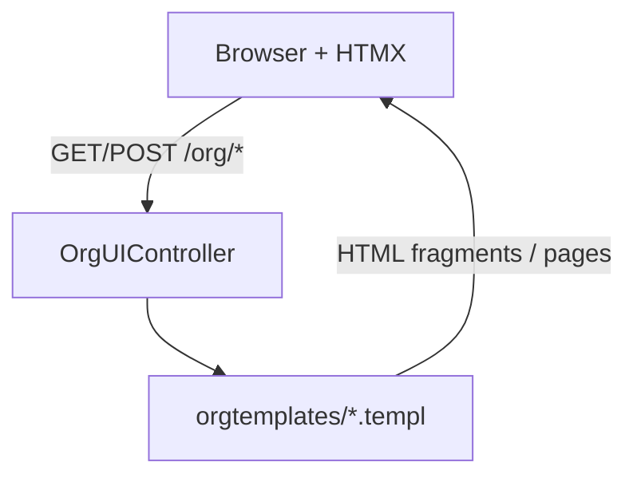

# DEV-PLAN-037：Org 模块页面交互问题调查与改进建议

**状态**: 已完成（2025-12-24 13:16 UTC）

> 本文档定位：对当前 Org UI（`/org/nodes`、`/org/positions`、`/org/assignments`）的可用性问题做调查与根因分析，并给出可执行的改进建议与验收标准。
>
> SSOT：Org UI 的既有可编码契约以 `docs/dev-plans/035-org-ui.md` 为准；IA/侧栏集成参考 `docs/dev-plans/035A-org-ui-ia-and-sidebar-integration.md`。

## 1. 背景与上下文 (Context)
- 当前 Org UI 已交付 M1/M2/M3 主链（见 `DEV-PLAN-035`），但在实际使用中出现多处影响操作的 UX 问题，导致 HR/组织管理员无法顺畅完成“组织结构维护 + 任职分配”。
- 用户反馈的主要问题集中在两类：
  1) **有效期（effective dating）输入/切换体验**：创建时无法输入生效日期；切换生效日期会错误嵌套渲染整页。
  2) **表单可用性与视觉对比**：i18n 字段要求手写 JSON；Tab 与日期框在浅色主题下不可读。

## 2. 目标与非目标 (Goals & Non-Goals)
### 2.1 核心目标
- [X] 明确每个问题的**现象 → 根因 → 影响面**（以代码证据为准，避免“猜 UI”）。
- [X] 给出**可落地的修复路径**（优先最小改动、可渐进发布）。
- [X] 明确“人员分配”页面在 Org vs Person 的归属与关系，减少信息架构混乱。

### 2.2 非目标
- 不在本计划内直接引入新的 Org 业务能力/数据契约（例如新增复杂审批流、批量调整等）。
- 不强制做大规模 UI 重构；优先修复阻塞性可用性问题（能操作、能看清、不会嵌套错乱）。

### 2.3 工具链与门禁（SSOT 引用）
> 目的：只声明“本计划命中哪些触发器/工具链”，避免在文档里复制命令细节导致漂移（SSOT：`AGENTS.md`、`Makefile`、`.github/workflows/quality-gates.yml`）。

- 触发器清单（勾选本计划命中的项）：
  - [X] Go 代码（controller/handlers：HTMX 边界兜底、提交成功后导航等）
  - [X] `.templ` / Tailwind（页面与组件：`hx-select`、样式 token 调整等）
  - [X] 多语言 JSON（新增/调整 i18n keys：文案/提示/互链）
  - [ ] Authz（仅 UI gating/互链，不涉及政策/聚合文件变更）
  - [ ] DB 迁移 / Schema
  - [ ] sqlc
- SSOT 链接：
  - 触发器矩阵与本地必跑：`AGENTS.md`
  - 命令入口：`Makefile`
  - CI 门禁定义：`.github/workflows/quality-gates.yml`

## 3. 架构与关键决策 (Architecture & Decisions)
### 3.1 架构图（交互链路）

### 3.2 关键设计决策（ADR 摘要）
- 决策 1：修复 `effective_date` 切换“壳套壳”
  - 选项 A：前端 `hx-select` 从整页响应中抽取 `#org-*-page`（选定，先止血）
  - 选项 B：后端对 `HX-Request` 返回 page partial（作为回退/收敛方案）
  - 选定原因：A 改动小、风险低、可快速上线；但需用“边界条件与回退策略”兜底，避免错误/权限页缺少 fragment。
- 决策 2：拆分“浏览 as-of 日期”与“写入生效日期”
  - 选项 A：表单内提供可编辑 `effective_date`（选定）
  - 选项 B：继续依赖页面右上角全局日期（不选，语义隐式、易误操作）
  - 选定原因：符合 HR 心智（“本次变更从哪天起生效”），且可与提交成功后的导航策略配套，避免“创建成功但看不到”。
- 决策 3：`i18n_names` 输入形态
  - 选项 A：复用 `components/multilang/form_input.templ`（选定）
  - 选项 B：继续手写 JSON textarea（不选）
  - 选定原因：降低业务用户错误率，保持后端仍接收同一 JSON 字符串契约（兼容 `parseI18nNames`）。
- 决策 4：浅色主题对比问题处理方式
  - 选项 A：局部替换 Org 主内容区的 `surface` token 使用（选定）
  - 选项 B：全局修改 `--clr-surface-200`（不选，影响面不可控）

## 4. 调查范围 (Scope)
### 4.1 页面/入口
- Org：
  - `/org/nodes`（组织结构）
  - `/org/positions`（职位）
  - `/org/assignments`（人员分配/任职）
- Person：
  - `modules/person/presentation/templates/pages/persons/detail.templ` 中嵌入的“任职时间线/创建任职”区域（调用 Org 的 `/org/assignments*` UI endpoints）

### 4.2 关键概念（对齐 035）
- `effective_date`：as-of 查询点（以及写入 insert slice 的生效日期）；当前 UI 通过 query 参数 `effective_date=YYYY-MM-DD` 传递。
- `i18n_names`：节点多语言名称（当前 UI 让用户输入 JSON 字符串）。

## 5. 问题发现与根因分析

### 5.1 创建新部门时没有地方填写生效日期
**现象**
- “新建部门/OrgNode”表单没有可编辑的生效日期字段，用户无法指定该部门从哪一天开始生效。

**代码证据**
- `modules/org/presentation/templates/components/orgui/node_forms.templ`：表单仅包含隐藏字段 `<input type="hidden" name="effective_date" value={ props.EffectiveDate }/>`，没有可编辑的 date 控件。

**当前行为推断**
- 创建/编辑的生效日期默认使用“页面右上角 effective_date”作为写入生效日期；用户若要创建 future-dated slice，必须先切换页面 effective_date（但该切换目前存在嵌套渲染问题，见 5.3）。

**不合理点**
- “查询 as-of 日期” 与 “写入生效日期”被耦合到同一个全局输入，且缺少显式提示，用户心智模型容易误解（尤其是 HR 场景需要明确“本次变更从哪天生效”）。

### 5.2 i18n 名称要求手写 JSON，格式对用户不友好
**现象**
- 节点表单要求填写“多语言名称（JSON）”，普通业务用户难以理解 JSON 格式、容易输错（引号/逗号/花括号等）。

**代码证据**
- `modules/org/presentation/templates/components/orgui/node_forms.templ`：`i18n_names` 使用 `textarea` + JSON placeholder（`"{\"en\":\"Name\"}"`）。

**不合理点**
- UX 不符合“表单输入应可视化”的常识；且该字段往往是“可选增强”，不应阻塞主要流程。

### 5.3 切换右上角“生效日期”会嵌套生成重复页面（含左右导航栏）
**现象**
- 在 Org 页面点击右上角 `effective_date` 选择新日期后，页面内容被重复嵌套渲染（包括左右导航栏/布局壳），越点越深。

**根因（代码级）**
- Org 页面 `effective_date` 输入使用 HTMX 把 **整页响应** swap 到页面内某个 div 中：
  - `modules/org/presentation/templates/pages/org/nodes.templ`：
    - `hx-get="/org/nodes"`
    - `hx-target="#org-nodes-page"`
    - `hx-swap="outerHTML"`
  - `modules/org/presentation/templates/pages/org/assignments.templ` / `positions.templ` 同模式。
- 但后端 handler 始终渲染“带 Authenticated layout 的整页模板”：
  - `modules/org/presentation/controllers/org_ui_controller.go`：
    - `NodesPage` → `orgtemplates.NodesPage(...)`
    - `AssignmentsPage` → `orgtemplates.AssignmentsPage(...)`
    - `PositionsPage` → `orgtemplates.PositionsPage(...)`

因此：HTMX 将包含 `layouts.Authenticated(...)` 的完整页面 HTML 注入到 `#org-*-page` div 中，造成“壳套壳”的嵌套。

**不合理点**
- 该问题属于“交互阻断级 bug”：一旦用户频繁切换日期，DOM 结构失控，后续交互/样式/性能都会异常。

### 5.4 非活动 Tab 背景黑色导致看不见内容
**现象**
- Org 页面的二级 Tab（结构/分配/职位）中，非活动 Tab 背景为黑色且文字对比不足，导致不可读。

**代码证据**
- `modules/org/presentation/templates/components/orgui/subnav.templ`：非 active 使用 `bg-surface-200 text-200`。
- `modules/core/presentation/assets/css/main.css`（浅色主题 `:root`）：
  - `--clr-surface-200: var(--black);`
  - `--clr-text-200: var(--gray-600);`（深色文本）

**根因（设计令牌误用）**
- `surface-200` 在浅色主题里等于黑色（似乎用于侧栏/暗面板），但 Org Tab 在主内容区仍复用该 token，且文字使用深色 token → 对比失败。

### 5.5 生效日期输入框背景黑色导致看不见内容
**现象**
- Org 页面的右上角 `effective_date` date input 背景黑色，且文字/placeholder 对比不足，导致不可读。

**代码证据**
- `modules/org/presentation/templates/pages/org/nodes.templ` / `assignments.templ` / `positions.templ`：
  - `class="... bg-surface-200 ... text-100"`
- `modules/core/presentation/assets/css/main.css`（浅色主题 `:root`）：
  - `--clr-surface-200: var(--black);`
  - `--clr-text-100: var(--black);`

=> 直接造成“黑底黑字”。

### 5.6 “人员分配”页面出现在 Org 是否合理？与 Person 模块的分配是什么关系？
**现状（代码事实）**
- Org 模块存在独立页面：`/org/assignments`（`modules/org/presentation/controllers/org_ui_controller.go: AssignmentsPage` + `modules/org/presentation/templates/pages/org/assignments.templ`）。
- Person 模块的人员详情页中，已嵌入“任职时间线/创建任职”区域：
  - `modules/person/presentation/templates/pages/persons/detail.templ` 会通过 HTMX 调用 Org 的 UI endpoints：
    - `GET /org/assignments/form?...&include_summary=1`
    - `GET /org/assignments?...&include_summary=1`

**关系结论**
- Person 模块并没有实现一套“独立的分配领域”；当前“分配/任职”本质上属于 Org 域（Assignment 连接 person ↔ org_node/position）。
- Person 详情页只是“以人作为上下文”的入口，把 Org Assignment 的 UI 以组件/partial 的方式嵌入（更贴近 HR 的日常操作：从人出发做任职管理）。
- `/org/assignments` 则是“以组织/岗位作为工作台”的入口，适合：
  - 快速按 `pernr` 查询并维护任职
  - 进行组织侧联调/回归（与 Org 节点/职位同处一个模块）

**潜在不合理点（信息架构）**
- 两个入口并存但缺少“明确的导航语义/互链”，容易让用户困惑：
  - “我应该在 Org 里分配，还是在 Person 里分配？”
  - 两边是否同一数据？是否会出现不一致？

### 5.7 职位详情页“汇报给（ReportsTo）”显示为 UUID
**现象**
- 在职位详情（PositionDetails）中，“汇报给”直接展示 `reports_to_position_id` 的 UUID，业务用户无法理解或用于核对关系。

**代码证据**
- `modules/org/presentation/templates/components/orgui/positions.templ`：`PositionDetails` 渲染 `props.Position.ReportsToPositionID.String()`。
- `modules/org/presentation/controllers/org_ui_controller.go`：
  - `EditPositionForm` 初始化时 `reportsToLabel = reportsToID`（即 UUID）。
  - `UpdatePosition` 失败回显表单时 `ReportsToLabel` 也直接使用 `reports_to_position_id` 原始字符串。

**不合理点**
- “汇报给”是一个业务语义字段，应至少展示可辨识的 label（如 `PositionCode`、`PositionCode — Title`），必要时提供跳转到被汇报职位的入口；UUID 仅应作为内部标识存在。

## 6. 改进建议（详细设计 / 可执行方案）

### 6.1 生效日期：拆分“查询 as-of”与“写入生效”
建议方案（择一或组合）：
- 方案 A（最小改动）：在“新建/编辑节点”表单内新增可编辑 `effective_date` 字段，默认值为页面 effective_date，并在字段旁提示其语义（“本次变更从该日期起生效”）。
- 方案 B（次优但成本低）：保持表单不新增字段，但在表单顶部显式说明“本次创建/编辑将使用页面右上角生效日期”，并提供“修改生效日期”锚点跳转/聚焦到右上角日期控件。

推荐：方案 A（HR 心智更清晰；避免“全局日期”隐式耦合导致误操作）。

**行为约定（补充，避免“创建成功但看不到”）**
- 当表单提交的 `effective_date` 与页面当前 as-of `effective_date` 不一致时：
  - 提交成功后应 **push-url/redirect** 到 `effective_date=<表单值>` 的列表页（或给出显式提示 + 一键切换链接），保证用户能立即看到新 slice。
  - 表单 UI 文案需明确区分：“页面右上角日期 = 当前浏览 as-of” vs “表单内日期 = 本次写入生效”。

### 6.2 i18n_names：从 JSON 文本改为可视化多语言输入
建议方案：
- 复用现有 `components/multilang/form_input.templ` 的交互模型（多行 locale/value + hidden JSON），为 Org Node 的 `i18n_names` 提供可视化输入。
- 约定：`name` 仍为主显示名；`i18n_names` 可选补充，若为空则不阻塞创建。

### 6.3 修复 effective_date 切换导致“壳套壳”的 HTMX 行为
建议方案（优先最小改动）：
- 方案 A（推荐）：在 Org 页面的 date input 上加 `hx-select`，只从整页响应中抽取 `#org-*-page` 片段进行 swap。
  - 例如在 `nodes.templ` 上追加：`hx-select="#org-nodes-page"`
- 方案 B：后端检测 HTMX 请求（`HX-Request`）时改为渲染“无 layout 的 page partial”（新建 `NodesPagePartial` 等模板），避免返回整页。

推荐：方案 A（无需改 controller/render 结构，风险低；后续可再做方案 B 收敛架构）。

**边界条件与回退策略（补充）**
- 需要保证：无论正常页、校验错误态、权限不足态，HTMX 的响应里都包含对应的 `#org-*-page` 节点；否则 `hx-select` 可能导致 swap 为空/不可预期。
- 若存在“错误页/重定向/权限页不包含 `#org-*-page`”的场景：
  - 优先落到方案 B：对 `HX-Request` 返回 page partial（保持 `#org-*-page` 为根），并把错误/权限提示渲染在该 partial 内。
  - 或在前端为 date input 增加“检测到异常响应则全页跳转”的兜底策略（仅作为临时方案，不作为长期契约）。

### 6.4 修复 Tab 与日期输入在浅色主题的可读性
建议方案：
- 方案 A（推荐）：Org 主内容区避免使用 `bg-surface-200`（该 token 在浅色主题里是黑色，偏向侧栏/暗面板）；改用 `bg-surface-300` 或 `bg-surface-100`（白/浅灰底），并匹配 `text-100/text-200`。
  - 目标文件：`modules/org/presentation/templates/components/orgui/subnav.templ`、`modules/org/presentation/templates/pages/org/*.templ`
- 方案 B：调整设计 token：把浅色主题的 `--clr-surface-200` 改为浅色（例如 `--gray-50/100`），并检查对侧栏/Spotlight 等既有暗面板的影响。

推荐：方案 A（改动面更可控；避免全局 token 改动引发连锁 UI 变化）。

**最小回归清单（补充）**
- 浅色主题：非 active tab、date input、placeholder、hover 状态均可读，且焦点态不“丢失”。
- 深色主题：不引入反向对比问题（尤其是边框/hover/active）。
- 侧栏/暗面板：仍可继续使用 `surface-200`（避免误把全局 token 语义改乱）。

### 6.5 “人员分配”在 Org vs Person：澄清定位 + 增加互链
建议：
- 明确定位（文案/导航）：`/org/assignments` 属于“组织侧工作台”，Person 详情页为“人员侧入口”。
- 在 Person 详情的任职区域增加“打开完整分配页”的链接（携带 `pernr` + `effective_date`），在 Org 分配页也提供“打开人员详情”的链接（携带 `pernr`），形成双向可达。
- 如未来要做侧栏二级导航（见 035A §6.2/§6.3），可将“人员分配”作为 Org 的子项展示，避免入口隐藏导致用户只能靠偶然发现。

**权限与术语（补充）**
- 互链必须遵守权限 gating（无权则隐藏/禁用，并提供可理解的提示），避免“点进去才 403/空白”。
- 页面与文案统一术语：优先使用“任职（Assignment）/分配”其一作为主称呼，并在次要位置给出英文或别名，减少入口与概念漂移。

### 6.6 职位详情页“汇报给（ReportsTo）”展示业务可读 label
建议方案：
- PositionDetails：
  - 把“汇报给”的展示从 UUID 改为 label（如 `PositionCode` 或 `PositionCode — Title`）。
  - 可选：将 label 渲染为可点击链接（带 `effective_date`），允许一键打开被汇报职位详情。
- PositionForm（新建/编辑 + 错误回显）：
  - 选中项的 `<option>` 文案必须为 label，而非 UUID（否则 combobox 初始态不可用）。

实现建议（不改变数据契约）：
- 在 Org UI controller 渲染 PositionDetails / PositionForm props 时，使用现有 helper `positionLabelFor(...)` 解析 `reports_to_position_id` 的 label；若解析失败再回退到 UUID（仅作为兜底）。

## 7. 接口契约（HTMX / UI Contracts）
> 目的：把 UI 行为约束成可编码的契约，避免“实现靠猜测”。若后续切换实现（如从 `hx-select` 迁到 HX-Request partial），也应保持契约一致。

### 7.1 as-of 日期切换（以 `/org/nodes` 为例）
- Action：用户在右上角 date input 选择新日期。
- Request：
  - `GET /org/nodes?effective_date=YYYY-MM-DD`（HTMX `hx-get` + `hx-include` 形成 query 参数）
  - Headers：`HX-Request: true`（由 HTMX 自动附带）
- Response（方案 A：整页响应 + `hx-select` 抽取）：
  - `200 OK`：返回完整页面 HTML，且**必须包含** `#org-nodes-page`，其中包含更新后的列表/面板。
  - `400 Bad Request`：无效 `effective_date` 时返回可理解的错误反馈；并确保响应仍包含 `#org-nodes-page`（否则前端无法稳定 swap）。
- Response（方案 B：HX-Request partial）：
  - `200 OK`：仅返回以 `#org-nodes-page` 为根的 HTML 片段（不包含 layout）。
  - `400/403/...`：返回同样以 `#org-nodes-page` 为根的错误态 partial（展示错误/无权限提示）。

### 7.2 “写入生效日期”表单提交（以 Org Node 为例）
- Request：`POST/PATCH /org/nodes...`（Form Data），包含 `effective_date=YYYY-MM-DD`。
- Success：
  - 必须 push-url/redirect 到 `effective_date=<表单值>` 的页面（并携带必要的定位信息，如 `node_id`），避免“创建成功但看不到”。
- Error（422/409 等）：
  - 返回带 field/general error 的表单片段，且保持页面结构稳定（不引入 layout 嵌套）。

## 8. 安全与鉴权 (Security & Authz)
- UI 与互链必须遵守现有权限 gating：无权则隐藏/禁用并给出可理解的提示。
- 不引入新的权限对象或政策文件变更（若后续需要调整 `config/access/**`，必须另起契约/计划并跑对应门禁）。
- 多租户隔离与后端鉴权逻辑保持不变：本计划仅调整渲染/交互与信息架构文案。

## 9. 依赖与里程碑 (Dependencies & Milestones)
- 依赖：
  - Org UI 既有契约与页面结构：`docs/dev-plans/035-org-ui.md`
  - IA/侧栏集成口径：`docs/dev-plans/035A-org-ui-ia-and-sidebar-integration.md`
  - 多语言表单组件：`components/multilang/form_input.templ`
- 建议实施顺序（由高风险阻断 → 低风险体验优化）：
  1. 修复 date 切换嵌套（`hx-select` + 边界兜底）
  2. 修复浅色主题可读性（Tab + date input）
  3. 表单内引入写入生效日期 + 成功后导航策略
  4. `i18n_names` 可视化输入（并对齐后端 JSON 契约）
  5. Org ↔ Person 互链与术语收敛（含 i18n keys）

## 10. 测试与验收标准 (Acceptance Criteria)
- 生效日期：
  - [X] 新建/编辑节点时，用户可明确输入/确认“本次变更生效日期”，且不会被隐藏的全局状态误导。
  - [X] 当写入生效日期 ≠ 当前浏览 as-of 日期时，提交成功后用户不会出现“创建成功但列表看不到”的困惑（自动切换或明确引导）。
- i18n：
  - [X] `i18n_names` 不再要求手写 JSON；普通用户可通过多语言输入控件完成填写，且输入错误不会破坏整页提交体验。
- HTMX：
  - [X] 切换 Org 页面的 `effective_date` 不会产生 layout 嵌套；多次切换后 DOM 结构保持稳定。
  - [X] date 切换在错误/权限不足等边界响应下仍能稳定呈现可理解的反馈（不会 swap 成空白/碎片化 DOM）。
- 样式：
  - [X] 浅色主题下，非活动 Tab 与 `effective_date` 输入框可读（对比度足够），不出现黑底黑字。
- IA：
  - [X] 文档/页面上明确 “Org 分配页” 与 “Person 详情分配区”是同一套数据/能力的不同入口，并提供互链。
- 职位详情：
  - [X] “汇报给（ReportsTo）”在职位详情与表单中展示为业务可读 label（非 UUID），且在解析失败时有可理解的兜底。

## 11. 运维与发布（灰度 / 回滚 / 观测）
- Feature Flag：默认不引入；若线上风险评估需要灰度开关，应单独补充契约与实现计划。
- 发布策略：
  - 优先单独上线 `effective_date` 嵌套修复（影响面大、收益最高），再逐步叠加表单与样式优化。
- 回滚策略：
  - 纯 UI/渲染改动：以代码回滚为主；不涉及 DB 迁移与数据回滚。
- 观测与排障要点：
  - 关注 `effective_date` 相关 400/422/403 的错误率；确保错误态仍能渲染在目标 fragment 内（避免用户看到空白）。

## 12. 待办清单（实施任务草案）
1. [X] 为 Org 三个页面的 date input 增加 `hx-select`（或切到 partial 渲染），并补充回归用例。
2. [X] 调整 Org subnav 与 effective_date 输入的背景/文字 token 使用（浅色主题可读）。
3. [X] 为 Org Node 表单增加可编辑的“生效日期”字段（并明确语义文案）。
4. [X] 将 `i18n_names` 替换为可视化多语言输入（复用/抽取组件）。
5. [X] 补充 Person ↔ Org 分配页互链与定位说明（文案/i18n keys）。
6. [X] 明确并实现“写入生效日期 ≠ as-of”时的成功后导航策略（push-url/提示 + 一键切换）。
7. [X] 为 date 切换补齐边界响应策略：确保响应包含 `#org-*-page` 或落到 `HX-Request` partial 渲染。
8. [X] 职位详情与表单的 “ReportsTo” 显示改为业务 label（复用 `positionLabelFor`），并在必要处增加跳转互链。

## 14. 验证记录（可复现）
> 说明：此处记录的是可自动化/可复现的门禁验证。交互式“登录后点 UI”无法在无浏览器/无人工操作的环境中逐项截图复核，但已通过 E2E 与门禁覆盖核心回归面。

- [X] `make generate && make css` —— 2025-12-24 13:16 UTC
- [X] `make check tr` —— 2025-12-24 13:16 UTC
- [X] `go fmt ./... && go vet ./...` —— 2025-12-24 13:16 UTC
- [X] `make check lint && make test` —— 2025-12-24 13:16 UTC
- [X] `make check doc` —— 2025-12-24 13:16 UTC

### 14.1 本次复核执行记录（系统内自动化）
- [X] `make generate && make css` —— 2025-12-24 21:18 UTC
- [X] `make check tr` —— 2025-12-24 21:18 UTC
- [X] `go fmt ./... && go vet ./...` —— 2025-12-24 21:18 UTC
- [X] `make check lint && make test` —— 2025-12-24 21:18 UTC
- [X] `make check doc` —— 2025-12-24 21:18 UTC

### 14.2 交互式验证说明（登录/点击路径）
- 受限于当前执行环境（无 GUI/无法打开浏览器），无法逐一完成“人工点选 + 截图”的验收。
- 替代验证（方案 B）：使用 `curl` 进行 HTTP smoke，并**模拟 HTMX 请求头**（`HX-Request`/`HX-Target`）来复现关键交互路径与 swap 行为；详见 14.3。
- 如需人工复核，建议按 037 的验收标准逐项在 `/org/nodes`、`/org/positions`、`/org/assignments` 以及 Person 详情页点击验证。

### 14.3 HTTP smoke 验证记录（curl）
> 目标：在无浏览器环境下，验证“壳套壳”修复、边界响应兜底、互链与关键字段展示（含 ReportsTo label）。

- [X] 登录会话：`POST /login` 获取 `sid` cookie（不在日志中记录凭据）。—— 2025-12-24 21:56 UTC
- [X] Org 三页正常渲染（`id` 唯一、无嵌套）：
  - `GET /org/nodes?effective_date=2025-12-24` → `200` 且 `id="org-nodes-page"` 仅出现一次
  - `GET /org/assignments?effective_date=2025-12-24` → `200` 且 `id="org-assignments-page"` 仅出现一次
  - `GET /org/positions?effective_date=2025-12-24` → `200` 且 `id="org-positions-page"` 仅出现一次
- [X] 无效 `effective_date` 边界兜底（仍能渲染 fragment，便于 HTMX `hx-select` 抽取）：
  - `GET /org/{nodes|assignments|positions}?effective_date=bad` → `400` 且对应 `id="org-*-page"` 仍存在
- [X] Node 新建表单：`GET /org/nodes/new?effective_date=2025-12-24` → `200` 且包含可编辑 `type="date" name="effective_date"` 与 multilang `i18n_names` 输入
- [X] Person ↔ Org 分配互链：
  - `GET /person/persons/{uuid}` 页面“任职经历”区可见“打开完整页面”（指向 `/org/assignments?effective_date=...&pernr=...`）与“创建”按钮（具备 `org.assignments.assign`）
  - `GET /org/assignments?effective_date=...&pernr=...` 顶部可见“打开人员详情”链接（指向 `/person/persons:by-pernr?pernr=...`）
- [X] 职位详情 ReportsTo：选择 `reports_to_position_id` 非空的职位样本，请求 `/org/positions/{id}?effective_date=...&node_id=...`，确认“汇报给”显示业务 label（例如 `01 — 总经理`），不以 `font-mono` 形式直接渲染 UUID。

## 13. 附录：关键证据索引
- Org 页面 effective date（HTMX swap 全页）：  
  - `modules/org/presentation/templates/pages/org/nodes.templ`  
  - `modules/org/presentation/templates/pages/org/assignments.templ`  
  - `modules/org/presentation/templates/pages/org/positions.templ`
- Org 页面 handler（始终渲染带 layout 的整页）：  
  - `modules/org/presentation/controllers/org_ui_controller.go`（`NodesPage` / `AssignmentsPage` / `PositionsPage`）
- Org Node 表单（无可编辑 effective date + i18n JSON textarea）：  
  - `modules/org/presentation/templates/components/orgui/node_forms.templ`
- Org Subnav（非 active tab 使用 `bg-surface-200 text-200`）：  
  - `modules/org/presentation/templates/components/orgui/subnav.templ`
- 设计 token（浅色主题 surface/text 定义）：  
  - `modules/core/presentation/assets/css/main.css`
- Person 详情页嵌入 Org 分配 UI：  
  - `modules/person/presentation/templates/pages/persons/detail.templ`
