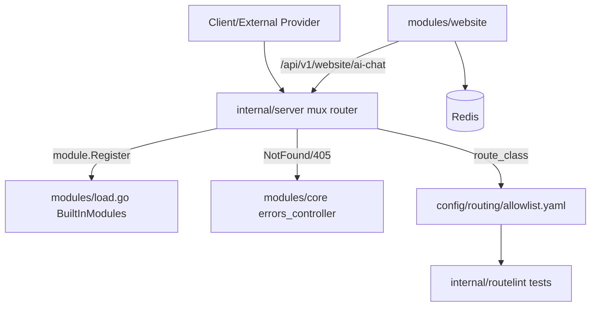

# DEV-PLAN-040：彻底移除 finance / billing / crm / projects 模块（Hard Delete）

**状态**: 已合并（PR #51，merge commit `2cd0218f`，2025-12-16 02:30 UTC；Quality Gates run `20254463551` ✅）。8.1 Readiness 待外部确认

## 1. 背景与上下文 (Context)
- 仓库此前存在冻结模块：`modules/finance`、`modules/billing`、`modules/crm`（见仓库根 `AGENTS.md` 的“模块冻结政策”）。
- 同时，`modules/projects`（以下简称 projects 模块）在当前主干目标中被判定为“应彻底移除”的范围（不受冻结政策约束，但同样会带来路由/测试/维护面成本）。
- 这些模块会导致以下长期成本与误用风险：
  - `go test ./...` 会包含这些模块，导致本地/CI 的“全量测试”在资源竞争下出现超时与不确定性；
  - 路由/allowlist/门禁需要持续维护 legacy 顶层前缀（如 `/billing/*`、`/twilio`、`/project-stages`）并在 review 中反复解释“为什么存在但不应新增”；
  - 冻结模块相关的 lint/CI 豁免逻辑持续存在，形成“默认允许破窗”的心理账户。
- 目标：将上述模块从仓库主干彻底移除，消除代码与路由入口，使 `go test ./...` 的语义回归“仓库当前有效代码的全量测试”，并收敛 CI/工具链对冻结模块的特殊处理。

## 2. 目标与非目标 (Goals & Non-Goals)
### 2.1 核心目标
- [x] 仓库内不再存在 `modules/finance`、`modules/billing`、`modules/crm`、`modules/projects` 目录及其源码/模板/资源文件。
- [x] 不再注册/暴露上述模块的服务、controller、路由入口、导航入口、locale、模块 schema（`RegisterSchema`）。
- [x] `config/routing/allowlist.yaml` 不再包含与被移除模块绑定的 legacy 顶层前缀：`/twilio`、`/billing`、`/project-stages`。
- [x] `go test ./...`（在 CI 的 PG17+Redis 环境）可稳定通过；不得因“被移除模块的残留引用/门禁例外”导致失败。
- [x] CI/工具链/脚本口径更新：不再假定冻结模块存在，也不再为其保留排除/豁免逻辑（除非仍有必要，且需给出理由）。
- [x] `modules/website` 不再依赖 `modules/crm`（否则无法删除 `modules/crm`）。

### 2.2 非目标（Out of Scope）
- 不在本计划内删除生产数据库中的历史表/数据（仅移除代码与入口）。若需要清理 schema，将另立计划定义数据归档/回滚策略。
- 不在本计划内提供与第三方平台（支付/短信等）兼容的“替代 webhook 实现”。本计划只定义“旧路径最终行为”，不负责业务迁移与对外协调的执行细节。

## 3. 架构与关键决策 (Architecture & Decisions)
### 3.1 架构图 (Mermaid)


### 3.2 决策清单（本计划内固定，开发可直接按此执行）
- [X] ADR-040-01（删除策略）：Hard Delete（目录删除 + 清理所有引用：Go import/模块注册/allowlist/CI/文档）。
- [X] ADR-040-02（legacy 顶层前缀处置）：不保留 tombstone handler；移除路由注册与 allowlist，最终行为为全局 NotFound（HTTP 404，UI 默认 HTML）。
  - 约束：上线/部署前必须确认外部 webhook 已解绑/停用（见 8.1）。
- [X] ADR-040-03（Website 与 CRM 解耦）：Website AI Chat 不再复用 CRM 的 chat/client 持久化；Thread 数据完全落在 Website 自身（Redis ThreadRepository v2），以便删除 `modules/crm`。
- [X] ADR-040-04（支付/短信配置处置）：移除 `pkg/configuration` 中 Twilio/Click/Payme/Octo/Stripe 配置结构及 `.env.example` 对应 env（未知 env var 会被忽略，因此对部署侧是“可删可不删”，但仓库口径必须收敛）。
- [X] ADR-040-05（DB 与迁移）：不在本计划内删除现有 DB 表；`migrations/` 历史文件暂不清理（另立计划做 schema 收敛/重基线）。

## 4. 数据模型与约束 (Data Model & Constraints)
### 4.1 DB：不删表、不做 schema 清理
- 该计划不触碰生产表；但由于代码移除，以下表将成为“历史遗留但不再有代码入口”：
  - `billing_transactions`（`migrations/changes-1747574914.sql`、`migrations/changes-1761729594.sql`）
  - `payment_attachments`、`expense_attachments`（`migrations/changes-1757781521.sql`）
- 约束：`make db migrate up` 在既有环境仍应可执行；如将来要删除上述表/迁移文件，需单独 dev-plan 定义迁移与回滚策略。
- 注意：`make db plan`/`make db lint` 是 HRM Atlas 的 dry-run 对比（仅覆盖 HRM schema；见 `atlas.hcl` 与 CI 的 `DB_NAME=iota_erp_hrm_atlas`）。对比目标库应使用 HRM 专用库；若对着主库运行会出现大量 `DROP TABLE`（仅表示“把主库变成 HRM schema”的差异），不要据此清理 legacy 表。

### 4.2 Website AI Chat：Redis ThreadRepository v2（替代 CRM 存储）
> 目标：删除 `modules/crm` 的同时，保留 Website AI Chat API 的基本功能（创建 thread、写入/读取消息、AI reply）。

- Redis Key 策略：
  - hash key：`website:ai_chat:threads:v2:{tenant_id}`
  - field：`{thread_id}`
- Thread JSON（建议形态，最终以代码为准）：
  ```json
  {
    "id": "uuid",
    "tenant_id": "uuid",
    "phone": "+12126647665",
    "created_at": "2025-12-15T14:48:00Z",
    "updated_at": "2025-12-15T14:48:00Z",
    "messages": [
      { "role": "user", "message": "hi", "timestamp": "2025-12-15T14:48:00Z" },
      { "role": "assistant", "message": "hello", "timestamp": "2025-12-15T14:48:01Z" }
    ]
  }
  ```
- 约束：
  - `phone` 可为空（仅用于兼容现有请求 DTO；后续可迁移为匿名 thread）。
  - 单条 message 最大长度：`<= 4096` 字符（超出则返回 400）。
  - thread 最大 message 数：`<= 200`；追加时超出则丢弃最旧消息，仅保留最新 200 条。
- 迁移策略：
  - v1（旧）thread 记录只保存 CRM `ChatID`，与 v2 不兼容；实现必须切换到新 prefix（v2）以避免读取旧数据导致反序列化/语义错误。

## 5. 接口契约 (API Contracts)
### 5.1 移除/失效的路由前缀（Breaking Changes）
| 路由前缀 | 旧用途 | 新行为 | 备注 |
| --- | --- | --- | --- |
| `/finance/*` | UI/内部逻辑 | 404 | 模块目录被删除 |
| `/crm/*` | UI/内部逻辑 | 404 | 模块目录被删除（但 Website 需先解耦） |
| `/projects/*` | UI | 404 | 模块目录被删除 |
| `/project-stages/*` | legacy UI | 404 | 同时从 allowlist 移除 |
| `/billing/*` | legacy webhook | 404 | 同时从 allowlist 移除 |
| `/twilio` | legacy webhook（POST） | 404 | 同时从 allowlist 移除 |

### 5.2 Website AI Chat API（路径保持，存储实现替换）
- `POST /api/v1/website/ai-chat/messages`
  - Request:
    ```json
    { "phone": "+12126647665", "message": "" }
    ```
    - 说明：该端点只创建 thread，不写入消息历史；消息写入发生在 `POST /api/v1/website/ai-chat/messages/{thread_id}`。
  - Response:
    ```json
    { "thread_id": "uuid" }
    ```
- `GET /api/v1/website/ai-chat/messages/{thread_id}`
  - Response:
    ```json
    { "messages": [ { "role": "user|assistant", "message": "text", "timestamp": "RFC3339" } ] }
    ```
- `POST /api/v1/website/ai-chat/messages/{thread_id}`
  - Request:
    ```json
    { "message": "follow up" }
    ```
  - Response:
    ```json
    { "thread_id": "uuid" }
    ```
- 兼容 alias（存量）：`/api/website/ai-chat`（由 Website 模块注册）。

## 6. 核心逻辑与算法 (Business Logic & Algorithms)
### 6.1 CreateThread（Website）
1. 校验 `phone`（若提供则沿用现有 `phone.Parse` 做格式校验）；`message` 字段仅为兼容现有 DTO，本步骤不写入消息。
2. 从 ctx 提取 `tenant_id`；若不存在则返回 400（建议错误码：`TENANT_REQUIRED`），避免隐式落到默认租户造成数据混淆。
3. 生成 `thread_id`，创建 thread（`messages` 初始为空）。
4. 写入 Redis（v2 prefix）。

### 6.2 AddMessageToThread（Website）
1. 读取 thread；不存在 -> 404（JSON）。
2. 追加 user message（带 timestamp）。
3. 调用 `ReplyWithAI` 生成 assistant message（写回同一 thread）。

### 6.3 ReplyWithAI（Website）
1. 从 thread messages 构建 prompt（system prompt + history）。
2. 调用 OpenAI client（已有实现保持不变）。
3. 将 assistant message 追加到 thread 并持久化。

## 7. 安全与鉴权 (Security & Authz)
- 移除 `/billing/*`、`/twilio` 等 webhook 入口后：
  - allowlist 中对应前缀必须删除，避免被误分类为 `webhook`；
  - WebhookReplayProtection 对这些前缀不再生效（因为不存在路由）。
- Website AI Chat API 位于 `/api/v1/*`（public API），必须保持 JSON-only 错误返回契约（参见 DEV-PLAN-018 5.5）。

## 8. 依赖与里程碑 (Dependencies & Milestones)
### 8.1 Readiness（上线/部署前必须完成，并在本计划内记录证据/输出摘要）
> 说明：该部分需要业务/运维协作确认，代码层面无法自证；但必须在生产部署前完成。
- [ ] 外部依赖确认：明确没有系统仍依赖以下入口（或已完成解绑/替换/停用）：
  - [ ] `/billing/*`（支付网关回调）
  - [ ] `/twilio`（短信回调）
- [ ] Website AI Chat v1 数据断层确认：业务方已知晓 v1（CRM 存储）不迁移；切换 v2 后旧对话将不可见（但 DB 历史数据仍保留，代码入口移除）
  - [ ] （可选，推荐）在删除 `modules/crm` 前留存“无 PII”的统计快照（不要导出 message 文本/手机号），并将结果写入 PR 描述或 dev-record：
    ```sql
    -- Website transport chats/messages stats (no PII)
    SELECT count(DISTINCT cm.chat_id) AS website_chats
    FROM chat_members cm
    WHERE cm.transport = 'website';

    SELECT count(*) AS website_messages
    FROM messages m
    JOIN chat_members cm ON cm.id = m.sender_id
    WHERE cm.transport = 'website';

    SELECT max(m.created_at) AS last_website_message_at
    FROM messages m
    JOIN chat_members cm ON cm.id = m.sender_id
    WHERE cm.transport = 'website';
    ```
- [X] 代码引用盘点（2025-12-15 14:48 UTC）
  - 命令（示例）：
    - `rg --files-with-matches "github.com/iota-uz/iota-sdk/modules/(billing|crm|finance|projects)" -g '!modules/{billing,crm,finance,projects}/**' -g '!**/*_templ.go' .`
    - `rg -n "\\b(twilio|project-stages)\\b" -S .`
    - `rg -n "modules/(billing|crm|finance)" -S .github .golangci.yml .gocleanarch.yml scripts`
  - 关键发现（需要在实现中逐一清除）：
    - `modules/website/*` 依赖 `modules/crm/*`（见 `modules/website/module.go`、`modules/website/services/website_chat_service.go` 等）。
    - `modules/core/presentation/controllers/settings_controller_test.go` 依赖 `modules/finance`。
    - allowlist 存在：`/twilio`、`/billing`、`/project-stages`（`config/routing/allowlist.yaml`）。
    - CI/工具链存在冻结模块排除：`.github/workflows/quality-gates.yml`、`.golangci.yml`、`.gocleanarch.yml`、`scripts/go-active-packages.sh`。
    - `.env.example` 含支付/短信 env（`TWILIO_*`、`CLICK_*`、`PAYME_*`、`OCTO_*`、`STRIPE_*`）。
- [X] 实施分支与 PR
  - 分支：`feature/dev-plan-040-impl`
  - PR：`https://github.com/jacksonlee411/Bugs-Blossoms/pull/51`
  - 合并：2025-12-16 02:30 UTC（merge commit `2cd0218f`）
  - CI：`Quality Gates`（main push）run `20254463551` ✅
- [X] 本地/CI 对齐验证（摘要）
  - `make check lint`：通过
  - `make test`：通过
  - `make check doc`：通过
  - `make check tr`：通过
  - （可选）`DB_NAME=iota_erp_hrm_atlas ATLAS_DEV_DB_NAME=hrm_dev make db plan`：输出为 HRM schema create plan，未见与被移除模块相关的意外 `DROP`

### 8.2 里程碑与执行清单（每个里程碑合并前必须保持可编译、可通过 lint 与测试）
1. [x] M1：Website 解耦 CRM（否则无法删除 `modules/crm`）
   - [x] 将 `modules/website/domain/entities/chatthread/*` 从 CRM `chat.Message` 解耦（引入 Website 自有 message 结构）。
   - [x] 修改 `modules/website/infrastructure/persistence/*`：ThreadRepository v2 存储 thread+messages（不再存 CRM ChatID）。
   - [x] 修改 `modules/website/services/website_chat_service.go`：移除对 `modules/crm/*` 的 import 与 repo 依赖。
   - [x] 修改 `modules/website/module.go`：不再构造 CRM repo（chat/client）。
   - [x] 更新 `modules/website/services/website_chat_service_test.go`：移除对 `modules/crm/*` 的依赖。
2. [x] M2：移除权限/模块加载引用
   - [x] `pkg/defaults/schema.go`：移除 billing/crm/finance/projects permission sets 与 imports。
   - [x] `modules/load.go`：移除 finance/billing/crm/projects 的模块注册与 NavLinks concat。
3. [x] M3：收敛路由 SSOT 与门禁
   - [x] `config/routing/allowlist.yaml`：删除 `/twilio`、`/billing`、`/project-stages`。
   - [x] 确认 route-lint 与全局 NotFound/405 契约不被破坏（参见 DEV-PLAN-018）。
4. [x] M4：删除模块目录（Hard Delete）
   - [x] 删除 `modules/finance`、`modules/billing`、`modules/crm`、`modules/projects`。
   - [x] 立刻执行 `go mod tidy`（预期移除 Twilio/支付 SDK 等依赖），并确认仅修改 `go.mod`/`go.sum`。
5. [x] M5：收敛配置/CI/脚本/文档口径
   - [x] `pkg/configuration/environment.go`：移除 Twilio/Click/Payme/Octo/Stripe options 与对应 Configuration 字段。
   - [x] `.env.example`：移除上述 env。
   - [x] `.golangci.yml`、`.gocleanarch.yml`、`.github/workflows/quality-gates.yml`、`scripts/go-active-packages.sh`：移除冻结模块专用豁免/排除。
   - [x] 更新 `AGENTS.md`：移除冻结政策条目或改为“已移除模块”说明（Doc Map 中已包含本计划链接，无需重复添加）。
   - [x] 更新文档引用（至少覆盖：`docs/ARCHITECTURE.md`、`docs/CONTRIBUTING.MD`、`docs/SUPERADMIN.md`、`docs/dev-plans/005-quality-gates.md`、`docs/js-runtime/js-runtime-integration-spec.md`、`docs/js-runtime/tasks/phase-02-domain-entities.md`）。
6. [x] M6：依赖清理与门禁验证
   - [x] （可选，推荐）按 CI 同口径验证 HRM Atlas 不受影响：`DB_NAME=iota_erp_hrm_atlas ATLAS_DEV_DB_NAME=hrm_dev make db plan`（输出未见与被移除模块相关的意外 `DROP`）。
   - [x] `go fmt ./... && go vet ./... && make check lint && make test`
   - [x] `make check doc`

## 9. 测试与验收标准 (Acceptance Criteria)
- [x] `modules/finance`、`modules/billing`、`modules/crm`、`modules/projects` 目录不存在。
- [x] `rg -n "github.com/iota-uz/iota-sdk/modules/(finance|billing|crm|projects)" -S .` 无匹配（允许历史文档/Archived 另行豁免，但必须有明确说明）。
- [x] `config/routing/allowlist.yaml` 不再出现 `/twilio`、`/billing`、`/project-stages`。
- [x] `docs/ARCHITECTURE.md` 已新增“已废弃/遗留表（归档保留）”章节，列出本计划移除模块对应的关键表清单，并链接回本计划。
- [x] `go test ./...`（在 CI 的 PG17+Redis 环境）可通过。
- [x] `make check lint` 与 `make check doc` 通过。

## 10. 运维与回滚 (Ops & Rollback)
### 10.1 运维影响
- 删除 `/billing/*`、`/twilio` 等入口后，下游系统调用将收到 404；必须提前协调停用。
- 移除 Twilio/支付相关 env 的仓库口径后，部署侧即便仍保留这些 env 也不会影响启动（未知 env var 会被忽略），但建议同步清理避免误用。

### 10.2 回滚策略
- Hard Delete 不提供细粒度回滚；需要回滚时使用 Git revert，或回退到删除前 tag。
- 如需保留历史快照，实施前创建 tag：`pre-dev-plan-040-remove-modules`（建议）。
