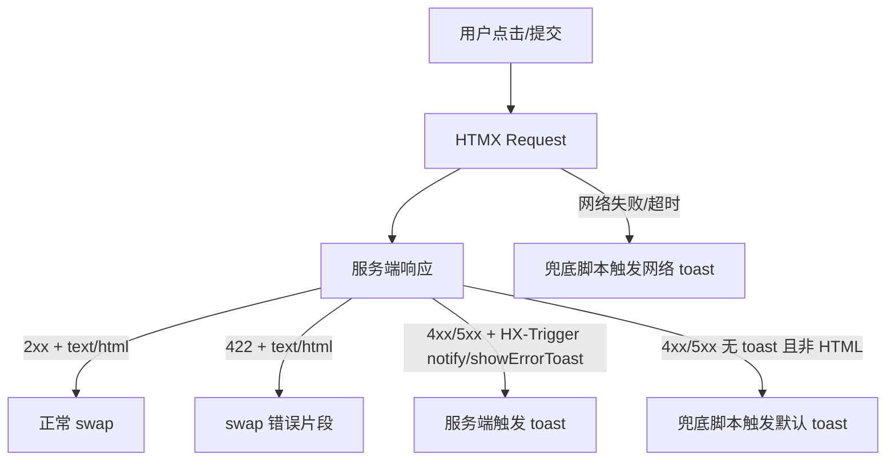

# DEV-PLAN-043：HTMX 操作异常统一反馈

**状态**: 已完成（2025-12-24 04:20 UTC）

## 1. 背景与上下文 (Context)
- **需求来源**：来自 UI/QA 反馈：HTMX 操作失败时缺少用户可见反馈。
- **当前痛点**
  - 多处 UI 交互通过 HTMX 发起请求，但后端返回 4xx/5xx（例如 `409 Conflict`）时，前端默认不 swap 且缺少 toast/错误片段，导致用户“点了按钮但不知道发生了什么”。
  - 典型：`/org/assignments` 将 `effective_date` 选到 freeze cutoff 之前时后端返回 `409 Conflict`，页面无反馈。
- **根因拆解**
  - HTMX 默认只对 2xx/3xx 执行 swap；4xx/5xx 触发 `htmx:responseError`，但页面/全局未统一处理。
  - 历史端点常见返回：
    - `http.Error(..., status)` 的 `text/plain` 响应
    - JSON 错误但无 `HX-Trigger` toast
- **已存在的可复用资产**
  - Toast 组件：`components/base/toast`（监听 `notify` 事件），服务端入口：`pkg/htmx`，参考：`components/base/toast/README.md`
  - Authz 先例：`showErrorToast` + `notify`（`docs/dev-plans/015B4-ui-integration-feedback.md`；实现：`modules/core/presentation/controllers/authz_api_controller.go`）
  - Core 全局兜底脚本：`modules/core/presentation/assets/js/lib/htmx-error-ux.js`
  - Base 布局注入 toast i18n：`modules/core/presentation/templates/layouts/base.templ`

## 2. 目标与非目标 (Goals & Non-Goals)
### 2.1 核心目标
- [X] 所有“用户主动触发”的操作（按钮/表单提交/确认执行等）在失败时必须有可见反馈：toast 或页面内错误片段。
- [X] 可纠正错误优先 `422 + text/html` 错误片段 swap（字段/表单错误可直接修复）。
- [X] 不破坏 `HX-Trigger: notify/showErrorToast`：若响应已包含其中之一，兜底脚本不重复弹 toast。
- [X] 最低可用文案：默认错误与网络错误具备 i18n；业务错误允许逐步补齐。

### 2.2 非目标
- 不在本计划内统一所有业务错误码与全局 i18n 表。
- 不在本计划内强制重构所有控制器错误封装；以“统一契约 + 渐进治理”为主。

### 2.3 工具链与门禁（SSOT 引用）
> 本节只声明触发器与入口；命令细节以 `AGENTS.md` / `Makefile` / CI 为 SSOT。
- **触发器清单（本计划命中）**
  - [X] Go 代码（见 `AGENTS.md`）
  - [X] `.templ` / Tailwind（见 `AGENTS.md`）
  - [X] 多语言 JSON（见 `AGENTS.md`）
  - [X] 文档（`make check doc`）
- **SSOT 链接**
  - 触发器矩阵：`AGENTS.md`
  - 命令入口：`Makefile`
  - CI 门禁：`.github/workflows/quality-gates.yml`
- **复用/先例**
  - `docs/dev-plans/015B4-ui-integration-feedback.md`
  - `components/base/toast/README.md`
- **本地验证记录**
  - [X] 已执行 `make generate && make css && make check tr && go fmt ./... && go vet ./... && make check lint && make test && make check doc`（2025-12-24 03:30 UTC）
  - [X] 已执行 e2e 验收（`cd e2e && npx playwright test tests/htmx-error-ux.spec.ts --workers=1 --reporter=list`）（2025-12-24 04:17 UTC）

### 2.4 门禁（UI 操作错误反馈门禁）
> 目的：杜绝静默失败；所有交互遵循统一模式，便于复用与审查。
- **范围**：所有与用户“操作/提交/保存/删除/确认执行”相关的按钮、表单提交（含 HTMX 与非 HTMX）。
- **硬性要求**：每个操作必须具备错误反馈路径设计，禁止静默失败。
- **统一模式（优先级）**
  1. **可纠正错误**：`422` + `text/html` 错误片段（允许 swap）。
  2. **业务冲突/不可纠正错误**：优先返回 toast 触发头：
     - 通用页面：`HX-Trigger: notify`（推荐用 `pkg/htmx.ToastError`）。
     - 仅 Authz：允许 `HX-Trigger: showErrorToast`（并可同时附带 `notify`）。
     - toast 触发头使用 `HX-Trigger`，避免 `HX-Trigger-After-*`（便于去重）。
  3. **历史兜底**：未提供 toast/错误片段时，由全局脚本弹默认 toast。
- **禁止项**：用户主动触发请求不得使用 `data-hx-silent-errors="true"`；仅限后台轮询/自动刷新等降噪场景。
- **PR 审查清单**
  - [ ] 新增/修改的用户操作点已选择并实现一种（或组合）反馈模式。
  - [ ] HTMX 场景不会静默失败（至少兜底 toast）。
  - [ ] 例外必须在 PR 描述写明，并给出替代反馈。

## 3. 架构与关键决策 (Architecture & Decisions)
### 3.1 事件流（HTMX + 错误反馈）

### 3.2 决策
1. **Base 级全局兜底**：通过 `modules/core/presentation/assets/js/lib/htmx-error-ux.js` 统一处理 `htmx:*` 错误事件（已落地）。
2. **通用 toast 通道统一为 `notify`**：服务端统一用 `pkg/htmx.Toast*` 输出 `HX-Trigger: notify`；Authz 保留 `showErrorToast`（兼容先例）。
3. **HTML 错误片段优先**：对 `text/html` 的 4xx/5xx 允许 swap，适配表单校验/未授权页面内提示。
4. **降噪机制**：对后台请求允许 `data-hx-silent-errors="true"` 静默（但禁止用于用户操作）。

### 3.3 去重规则（兜底脚本必须遵守）
- 当响应头 `HX-Trigger` 包含 `notify` 或 `showErrorToast` 时，不触发默认 toast。
- 当响应为可 swap 的 HTML 错误片段（`Content-Type: text/html` 且 body 非空）时，不触发默认 toast。
- 当请求位于 `data-hx-silent-errors="true"` 范围内时，不触发任何兜底 toast。

## 4. 数据模型与约束 (Data Model & Constraints)
- 本计划不引入 DB/迁移/Schema 变更。
- 不新增持久化/缓存；仅涉及 UI 行为与响应头约定。

## 5. 接口契约 (API Contracts)
> 本计划是跨端点治理，契约以“统一响应模式”定义。

### 5.1 通用 HTMX 交互契约
- **适用对象**：任何 `hx-post/hx-put/hx-delete/hx-patch` 等用户操作。
- **成功响应 (2xx)**
  - Body：`text/html`（片段或整页）
  - 可选：`HX-Trigger: {"notify": {...}}`（成功 toast）
- **可纠正错误 (422)**
  - Status：`422`
  - Content-Type：`text/html`
  - Body：表单/字段错误片段（可 swap 到目标容器）
- **不可纠正错误（403/409/500 等）**
  - Status：对应 HTTP 状态码
  - 推荐 Header：`HX-Trigger: {"notify": {"variant":"error","title":"<code>","message":"<safe message>"}}`
  - Body：可为空；如返回文本/JSON，必须是“可对用户展示”的安全文案（兜底脚本会截断且不展示 HTML）
- **历史兜底**
  - 若 4xx/5xx 既无 toast 触发头也非 HTML 片段，则兜底脚本显示默认 toast。

### 5.2 `HX-Trigger: notify`（通用 toast）格式
- Header 示例：`HX-Trigger: {"notify": {"variant":"error","title":"ORG_FROZEN_WINDOW","message":"..."} }`
- 推荐实现：`pkg/htmx` 的 `htmx.ToastError(w, title, message)` / `htmx.TriggerToast(...)`
- 约束：
  - `title/message` 必须是用户可见文案，不包含敏感信息；避免引号/换行等可能破坏 header JSON 的字符。
  - 对错误响应使用 `HX-Trigger`（避免 `HX-Trigger-After-*`），确保去重逻辑生效。

### 5.3 `HX-Trigger: showErrorToast`（Authz 专用）
- Header 示例：`HX-Trigger: {"showErrorToast": {"message":"<key>","code":"AUTHZ_FORBIDDEN","meta": {...}}, "notify": {...}}`
- 先例实现：`modules/core/presentation/controllers/authz_api_controller.go` 的 `triggerErrorToast(...)`

### 5.4 `/org/assignments` freeze cutoff（最小验收契约）
- 触发：`effective_date` 早于 cutoff
- 服务端：`modules/org/services/freeze.go` 返回 `409`（code：`ORG_FROZEN_WINDOW`），消息形如 `affected_at=... is before cutoff=...`
- 期望 UX：
  - 未改造 toast 的情况下：兜底脚本解析该文本并生成中/英文提示，避免静默失败。
  - 后续若改造：优先按 §5.2 返回 toast（替代文本解析）。

## 6. 核心逻辑与算法 (Business Logic & Algorithms)
### 6.1 前端：全局 HTMX 错误兜底脚本
- 代码：`modules/core/presentation/assets/js/lib/htmx-error-ux.js`
- 加载：`modules/core/presentation/templates/layouts/base.templ`
- 算法（事件级别）
  1. `htmx:beforeSwap`：若 `xhr.status >= 400` 且 `Content-Type` 为 `text/html` 且 body 非空，则 `evt.detail.shouldSwap = true`
  2. `htmx:responseError`：若满足“降噪/去重/HTML 片段”任一跳过条件则 return；否则生成 message 并 dispatch `notify`
  3. `htmx:sendError`/`htmx:timeout`：dispatch 网络错误 toast
- message 生成顺序
  1. JSON（`{code,message}`）-> title=code, message=message
  2. freeze 文本匹配 `affected_at=... is before cutoff=...` -> 格式化中/英文提示
  3. 纯文本 -> trim 后使用（最长 300 字符）
  4. 兜底 -> `Toast.DefaultError` / `Toast.NetworkError`（来自 `document.body.dataset`）

### 6.2 后端：布局注入与控制器返回模式
- Base 布局（已落地）：`modules/core/presentation/templates/layouts/base.templ`
  - 注入 `data-toast-error-title` / `data-toast-default-error` / `data-toast-network-error`
  - 引入 `htmx-error-ux.js`
- Toast 容器（必须存在且仅一次）
  - 已有：`modules/core/presentation/templates/layouts/authenticated.templ` 包含 `@toast.Container()`
  - 需补齐（选定方案）：在 `modules/superadmin/presentation/templates/layouts/superadmin_authenticated.templ` 增加 `@toast.Container()`（避免把容器下沉到 Base 导致重复）
- 控制器返回模式（伪代码）
  - 校验失败：`w.WriteHeader(422)` + render HTML 表单片段（`text/html`）
  - 业务冲突/不可纠正错误：
    - HTMX：`htmx.ToastError(w, code, safeMessage)` + `w.WriteHeader(status)`（body 可空）
    - 非 HTMX：redirect + flash/alert 或标准错误页（必须可见）

## 7. 安全与鉴权 (Security & Authz)
- **敏感信息防泄露**：兜底脚本可能展示 `text/plain`/JSON 的响应体；因此控制器禁止把内部错误（SQL/堆栈/PII）直接写入响应体。
- **权限与租户隔离**：本计划不改变鉴权逻辑；仅要求在 `403/401` 时也提供可见反馈（HTML 片段或 toast），不得因为兜底而绕过鉴权。
- **降噪属性限制**：`data-hx-silent-errors="true"` 仅用于非用户触发请求，避免攻击者通过“静默”隐藏关键失败（如保存失败）。

## 8. 依赖与里程碑 (Dependencies & Milestones)
- 依赖：
  - HTMX + Alpine 已在 Base 布局加载（`modules/core/presentation/templates/layouts/base.templ`）
  - Toast 组件（`components/base/toast`）
- 里程碑：
  1. [X] 全局 HTMX 错误反馈脚本落地：`modules/core/presentation/assets/js/lib/htmx-error-ux.js`
  2. [X] Base 布局注入与脚本加载：`modules/core/presentation/templates/layouts/base.templ`
  3. [X] SuperAdmin 布局补齐 toast 容器：`modules/superadmin/presentation/templates/layouts/superadmin_authenticated.templ` —— 已添加 `@toast.Container()` 并执行 `templ generate`（2025-12-24 02:37 UTC）
  4. [X] 示例验收：复现 `/org/assignments` freeze cutoff 409（已通过 e2e：`e2e/tests/htmx-error-ux.spec.ts`）
  5. [X] 扩展验收：已覆盖 422/403/500（已通过 e2e：`e2e/tests/htmx-error-ux.spec.ts`；500 使用 `GET /__test__/http_error`）
  6. [X] 更新状态为 `已完成`（附执行记录）

## 9. 测试与验收标准 (Testing & Acceptance)
### 9.1 手工验收矩阵（最低必测）
| 场景 | 响应 | 期望 UI |
| --- | --- | --- |
| 表单校验失败 | `422` + `text/html` | swap 表单片段；不弹默认 toast |
| 权限不足（HTML partial） | `403` + `text/html` | swap 错误片段；不弹默认 toast |
| 业务冲突（有 toast trigger） | `409` + `HX-Trigger: notify` | 显示 toast；不弹默认 toast（去重） |
| 业务冲突（无 toast trigger） | `409` + `text/plain`/JSON | 显示默认 toast（可含格式化提示） |
| 网络失败/超时 | `htmx:sendError/timeout` | 显示网络 toast |
| 后台轮询降噪 | `data-hx-silent-errors="true"` | 不显示兜底 toast |

### 9.2 本计划验收标准（必须满足）
- `/org/assignments` freeze cutoff 的 `409` 不再静默失败（toast 或页面内提示至少一种）。
- 422/403 HTML 片段在 4xx/5xx 下仍可 swap 并正确展示。
- 响应含 `HX-Trigger notify/showErrorToast` 时不重复弹默认 toast。
- SuperAdmin 页面具备 toast 容器（满足 409/500 兜底 toast 可见）。

## 10. 运维与回滚 (Ops & Rollback)
- 监控：本计划不新增 metrics；如需统计建议复用现有日志/指标体系，避免高基数标签。
- 回滚：
  - 前端：移除 `htmx-error-ux.js` 引入可关闭兜底（会退回到历史“可能静默失败”行为）。
  - 后端：不涉及 DB 变更，无迁移回滚需求。
