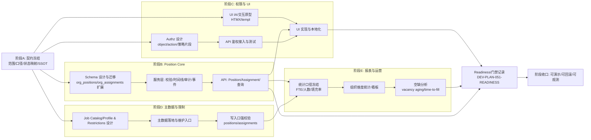

# DEV-PLAN-051：职位管理（Position）实施蓝图（对标 Workday）

**状态**: 草拟中（2025-12-20 01:46 UTC）

## 0. 进度速记
- 本计划把 [DEV-PLAN-050](050-position-management-business-requirements.md) 的业务需求拆成可并行交付的实施阶段，并对齐仓库既有的 Org/HRM 工具链与门禁。
- 实施主干建议落在 `modules/org`：复用已落地的有效期（valid-time / effective dating）、审计、批处理/预检、事件契约与租户隔离能力；避免在 HRM 侧另起一套“时间线/治理”导致漂移。
- Job Catalog、Position Restrictions 等“主数据/规则”作为并行轨道推进：先保证 Position/Assignment 核心闭环可写可查可审计，再逐步加严校验与治理。
- 执行层面已按 000 规范将本蓝图拆分为 052-059 子计划：051 保留路线图与可追溯矩阵，各阶段的可执行步骤与 DoD 以子计划为准，避免漂移。

## 1. 背景（Context）
- 业务侧希望对标 Workday 的 Position Management：effective dating、生命周期治理（Update/Correct/Rescind/冻结窗口/reason code）、编制（FTE/人数）、组织归属与转移、汇报关系、职位限制，以及可追溯审计与基础报表。
- 仓库现状（已具备基线能力）：
  - Org 已存在 `org_positions/org_assignments` 的 valid-time 表结构与 no-overlap 约束（见 [DEV-PLAN-021](021-org-schema-and-constraints.md)）。
  - Org 已落地“时间/审计/冻结窗口/Correct/Rescind/ShiftBoundary”体系（见 [DEV-PLAN-025](025-org-time-and-audit.md)），并在 API 层落地 Authz/outbox 等门禁（见 [DEV-PLAN-026](026-org-api-authz-and-events.md)）。
  - 现有 Position 能力仍偏“空壳/自动创建”，字段与治理未覆盖 050 的完整范围。

### 1.1 Position 与 Org 的关系（从属还是独立）
> 结论：Position 在业务上**从属**于 Org（必须归属组织单元），但在模型上应作为 Org BC 内的**独立聚合根**（Staffing 子域），避免“嵌在 org_node 里”或“在 HRM 另起一套 SSOT”。

- **业务从属（Placement）**：Position 必须归属 OrgUnit（`org_node_id`），并受 OrgUnit 有效期约束；跨组织转移体现为 Position 的新版本（保留历史），而不是移动 OrgNode。
- **模型独立（Aggregate）**：Position 有独立的生命周期/时间线/汇报链/编制容量与占用口径；不能被实现为 OrgNode 的附属属性集合（否则会把 Org 的结构变更与 Staffing 变更强耦合，放大写入影响面）。
- **SSOT（单一事实源）**：Position/Assignment 的有效期语义、审计与强治理能力复用 Org 的工具链；HRM 侧仅消费只读视图/映射（例如 `pernr`/subject），避免出现第二套 Position 时间线。
- **边界不变量（示例）**：创建/变更需校验 OrgUnit 在 as-of 视角存在且可用；Position 转移不应隐式改 Org 结构；Org 结构变更不应隐式改 Position 的业务属性（除非显式“组织转移/批处理”命令）。

## 2. 目标与非目标（Goals & Non-Goals）
### 2.1 核心目标
- [ ] 分阶段交付 050 的能力：先核心闭环（Position/Assignment/FTE/时间线/审计/权限），再主数据（Job Catalog/Restrictions），最后报表与运营能力。
- [ ] 对齐既有契约与工具链：路由治理、Authz（Casbin）、Org Atlas+Goose、Outbox/事件契约、多租户隔离与测试门禁。
- [ ] 尽量并行：在“契约与关键决策”冻结后，将 schema、Authz、UI、测试、数据质量与运维项拆成可并行的工作包。

### 2.2 非目标（本计划明确不做）
- [ ] 不实现完整招聘流程（Job Requisition/Offer/Hire）与外部 ATS 对接，仅预留 vacancy/招聘联动的扩展点。
- [ ] 不实现薪酬/预算/成本核算的全链路闭环（仅在 Position 上保留 cost center 等字段与审计口径）。
- [ ] 不在本计划内引入新的“跨模块强耦合”依赖（例如 Org 直接依赖 HRM domain types）；跨域通过 ID/事件/读模型对齐。

## 3. 工具链与门禁（SSOT 引用）
> 本计划会命中：Go 代码、Org migrations/schema、Authz、（可选）`.templ`/Tailwind、（可选）多语言 JSON、文档。命令与门禁的单一事实源（SSOT）请以这些为准：
- `AGENTS.md`（触发器矩阵与本地必跑）
- `Makefile`（命令入口）
- `.github/workflows/quality-gates.yml`（CI 门禁）
- Org 工具链：`docs/dev-plans/021A-org-atlas-goose-toolchain-and-gates.md`
- 路由治理：`docs/dev-plans/018-routing-strategy.md`
- Org 事件契约（SSOT）：`docs/dev-plans/022-org-placeholders-and-event-contracts.md`
- Org API/Authz/Outbox 门禁（SSOT）：`docs/dev-plans/026-org-api-authz-and-events.md`
- Authz（015C）：`docs/runbooks/authz-policy-apply-api.md`（流程）与 015/016 系列计划（体验/契约）
- Outbox：`docs/dev-plans/017-transactional-outbox.md`

## 4. 实施拆分（阶段/里程碑）
> 里程碑以“可验证的业务闭环”为原则；每阶段结束应具备可测可演示的最小产出。

### 4.1 阶段概览
- **阶段 A（契约冻结）**：明确“Position SSOT 在哪里、状态/口径如何映射、哪些字段进入 v1”。
- **阶段 B（Position Core）**：补齐 Position/Assignment 的核心字段、占编口径、时间线治理入口与最小 API。
- **阶段 C（权限与 UI）**：把核心能力通过 Authz 与 UI 交付给业务用户（可先内测灰度）。
- **阶段 D（主数据与限制）**：落地 Job Catalog/Job Profile 与 Position Restrictions，并在写入口强制校验。
- **阶段 E（报表与运营）**：编制统计、空缺分析与组织维度看板；补齐性能与运维守护。
- **阶段 F（任职管理增强，后续）**：对齐 050 的“任职管理后续能力清单”，以独立里程碑排期（可另立 dev-plan 拆解）。

### 4.2 050 需求覆盖矩阵（Traceability）
> 目的：让 051 的每个实施阶段/步骤都能追溯到 050 的业务需求条目；避免“计划看似覆盖，实际遗漏关键规则/口径”。

| 050 章节 | 需求摘要 | 051 对应阶段/步骤 | 验收要点（DoD 摘要） |
|---|---|---|---|
| §4.1/§4.2 | Position 必填/可选字段 | 阶段A-3、阶段B-5 | v1 字段清单冻结，核心字段可写可查可审计 |
| §5 | 生命周期状态 + 填充状态口径 | 阶段A-2、阶段B-7 | 状态口径一致；支持 as-of 计算与列表过滤 |
| §6.1-§6.3 | 时间线、as-of、无重叠/无断档、撤销可追溯 | 阶段B-7、阶段B-8 | 时间线可查；非法时间线被阻断；撤销后历史可追溯 |
| §6.4-§6.5 | Update/Correct/Rescind/ShiftBoundary + 冻结窗口 | 阶段B-7、阶段D-14 | 强治理入口存在；冻结窗口策略可配置且可审计 |
| §7.1 | 创建校验（组织有效期、分类启用、冲突拒绝） | 阶段B-7、阶段D-12/13 | 创建/变更时校验明确；拒绝原因可观测 |
| §7.2 | 填充/释放与 VACANT 标签 | 阶段B-7、阶段E-16 | 占用/释放影响派生状态；支持 vacancy 分析口径 |
| §7.3 | FTE/人数容量、占用、超编阻断 | 阶段B-5/6/7、阶段E-15 | 支持一岗多人与部分填充；阻止超编并提示原因 |
| §7.4 | 组织转移（保留历史） | 阶段B-7 | 转移可按生效日执行；历史可追溯 |
| §7.5 | reports-to、防环 | 阶段B-5/6/7 | 防环校验可靠；变更可审计 |
| §7.6/§7.6.1 | 停用/撤销、撤销前置检查、停用在任策略 | 阶段A-2、阶段B-7 | 策略落地且一致；撤销前置检查可复现 |
| §7.7 | Position Restrictions | 阶段D-13 | 限制条件可配置；写入口强校验 |
| §7.8 | 字段可变性矩阵 | 阶段A-2、阶段B-7 | 在任/满编等约束明确并 enforced；错误码稳定 |
| §8 | 查询/时间线/统计/空缺分析 | 阶段B-8、阶段E-15/16 | 过滤维度齐全；包含下级组织口径；统计口径稳定 |
| §9 | 权限与可见性 | 阶段C-9/11、阶段D-14 | object/action 覆盖 050 能力清单；越权用例有测试 |
| §10 | 任职管理后续扩展 | 阶段F | 另立排期或在 051 追加里程碑；不影响核心闭环上线 |

### 4.3 子计划（执行入口，编号从 052 开始）
- 阶段 A：契约冻结（Contract First）→ [DEV-PLAN-052](052-position-contract-freeze-and-decisions.md)
- 阶段 B：Position Core（Schema + Service + API）→ [DEV-PLAN-053](053-position-core-schema-service-api.md)
- 阶段 C：权限（Authz）→ [DEV-PLAN-054](054-position-authz-policy-and-gates.md)
- 阶段 C：UI（Org UI 集成）→ [DEV-PLAN-055](055-position-ui-org-integration.md)
- 阶段 D：主数据与限制（Job Catalog/Profile + Restrictions）→ [DEV-PLAN-056](056-job-catalog-profile-and-position-restrictions.md)
- 阶段 E：报表与运营（统计/空缺分析/质量守护）→ [DEV-PLAN-057](057-position-reporting-and-operations.md)
- 阶段 F：任职管理增强（后续）→ [DEV-PLAN-058](058-assignment-management-enhancements.md)
- 收口：Readiness / 回滚 / 可观测性 → [DEV-PLAN-059](059-position-rollout-readiness-and-observability.md)

## 5. 实施路线图（并行/串行关系）

## 6. 子计划执行入口（按阶段，尽量并行）
> 说明：可执行的步骤、DoD 与门禁记录请以各子计划为准；051 保留路线图与可追溯矩阵作为“总蓝图”。

- 阶段 A：契约冻结（Contract First）→ `docs/dev-plans/052-position-contract-freeze-and-decisions.md`
- 阶段 B：Position Core（Schema + Service + API）→ `docs/dev-plans/053-position-core-schema-service-api.md`
- 阶段 C：权限（Authz）→ `docs/dev-plans/054-position-authz-policy-and-gates.md`
- 阶段 C：UI（Org UI 集成）→ `docs/dev-plans/055-position-ui-org-integration.md`
- 阶段 D：主数据与限制（Job Catalog/Profile + Restrictions）→ `docs/dev-plans/056-job-catalog-profile-and-position-restrictions.md`
- 阶段 E：报表与运营（统计/空缺分析/质量守护）→ `docs/dev-plans/057-position-reporting-and-operations.md`
- 阶段 F：任职管理增强（后续）→ `docs/dev-plans/058-assignment-management-enhancements.md`
- 收口：Readiness / 回滚 / 可观测性 → `docs/dev-plans/059-position-rollout-readiness-and-observability.md`

## 7. 交付物（Deliverables）
- Position Core：可有效期化的 Position/Assignment（含占编 FTE）、时间线查询、审计与最小写入口。
- 权限：Position/Assignment 的 Authz object/action 与策略片段、测试与门禁记录。
- UI：与 Org UI 集成的 Position 管理页面（列表/详情/时间线/占编提示），以及必要的 locales。
- 主数据与规则：Job Catalog/Job Profile、Position Restrictions 的维护入口与写入校验（可分阶段交付）。
- 报表：组织维度编制统计与空缺分析的最小可用查询/导出能力。

## 8. 风险与注意事项（Risks & Notes）
- **双 Position 概念风险**：仓库中 HRM 侧已有 `positions` 表/实体；本计划需明确“Org Position 为组织席位 SSOT”，避免两个概念继续同名漂移。
- **状态/口径迁移风险**：现有 `org_positions.status` 与 050 的生命周期状态语义需要映射或迁移；建议在阶段 A 冻结映射方案并提供兼容期。
- **跨域依赖风险**：Job Catalog/成本中心/岗位定义等主数据若落在别的模块，需避免 Org 直接依赖其 domain；优先用 ID/只读视图/事件同步解耦。
- **从属/独立混淆风险**：如果把 Position 当作 OrgNode 的附属属性（或在 HRM 另起一套 Position 时间线），会导致写链路耦合、审计口径漂移与权限边界不清；需在阶段 A 明确“业务从属、模型独立”的合约并在 API/校验/审计中一致执行。
- **事件契约漂移风险**：Position/Assignment 若绕开 022/026 各自定义事件形状，会导致下游消费与审计链路不一致；需坚持“先改契约文档，再改实现”的 contract-first 流程。
- **auto position 兼容风险**：现有 Org 主链依赖 auto position；若新增必填字段/强校验未区分 System/Managed，会导致既有写链路被阻断；需在阶段 A 冻结策略并在 schema/校验中一致执行。
