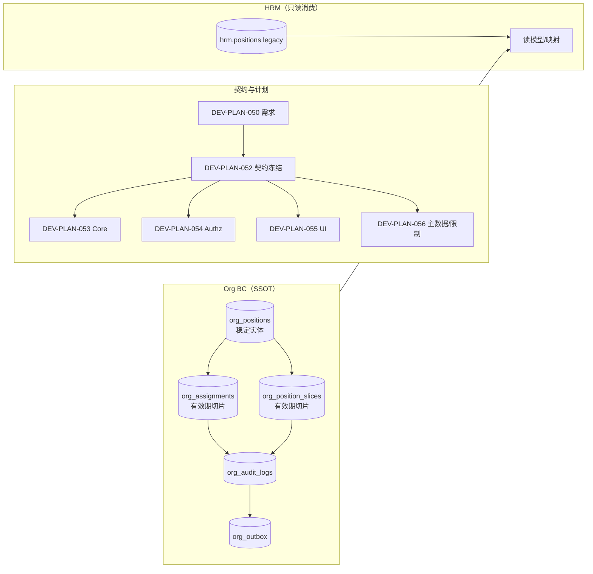

# DEV-PLAN-052：职位管理（Position）契约冻结与关键决策（对齐 050/051）

**状态**: 草拟中（2025-12-20 04:33 UTC）

> 本计划是 051 的“阶段 A（Contract First）”可执行化版本；内容结构参考 [DEV-PLAN-001](001-technical-design-template.md) 的技术设计模板，但仅冻结**契约与决策**，不展开到具体代码实现细节（实现由 053+ 承接）。

## 1. 背景与上下文 (Context)
- **需求来源**：[DEV-PLAN-050](050-position-management-business-requirements.md)（业务需求）与 [DEV-PLAN-051](051-position-management-implementation-blueprint.md)（实施蓝图）。
- **目标问题**：Position/Assignment 进入“有效期治理 + 审计 + 强校验”后，如果 SSOT/口径/API/事件不先冻结，后续会在 schema、Authz、UI、报表之间产生漂移与返工。
- **本计划定位**：冻结以下内容，作为 053/054/055/056 的单一事实源输入：
  - 领域边界与 SSOT（Org vs HRM；System/Managed 兼容）
  - 生命周期状态 vs 填充状态（派生口径）
  - v1 数据模型（字段/类型/约束的“合同级”规格）
  - v1 API 面与错误码口径
  - 事件契约如何扩展 022（不新增重复 SSOT）

## 2. 目标与非目标 (Goals & Non-Goals)
- **核心目标**：
  - [ ] 冻结“Position 与 Org 的关系与 SSOT”：Position/Assignment 以 Org BC（`modules/org`）为主干；HRM 仅消费只读映射，避免双 SSOT。
  - [ ] 冻结核心口径：生命周期状态、填充状态（EMPTY/PARTIALLY_FILLED/FILLED）、VACANT 语义、容量/占用（FTE 为主）与 as-of 计算口径。
  - [ ] 冻结 v1 数据模型合同：字段清单、字段类型、空值/默认值、关键约束（时间窗、无重叠、唯一性、占编基础不变量）。
  - [ ] 冻结 v1 最小稳定 API 面（Position/Assignment/统计）与错误码口径，避免 UI/API 各自演进。
  - [ ] 冻结事件契约的演进方式：复用 022/026 的 Topic/字段规则，先改契约文档再进入实现（053+）。
- **非目标（Out of Scope）**：
  - [ ] 不在 052 实施任何 Go/DB/UI 变更（实现由 053+ 承接）。
  - [ ] 不在 052 引入招聘流程（Job Requisition/Offer/Hire）与外部 ATS 集成（050 明确非范围）。
  - [ ] 不在 052 设计完整报表/看板 UI（057 承接）；本计划只冻结统计口径与最小查询合同。

## 2.1 工具链与门禁（SSOT 引用）
> 本计划为“契约冻结”，通常只改文档；如在本计划执行中需要同步更新 022/026 等契约文档，仍按文档门禁收口。

- **触发器清单（勾选本计划命中的项）**：
  - [ ] Go 代码
  - [ ] `.templ` / Tailwind
  - [ ] 多语言 JSON
  - [ ] Authz
  - [ ] 路由治理
  - [ ] DB 迁移 / Schema
  - [ ] sqlc
  - [ ] Outbox
  - [X] 文档（`make check doc`）
- **SSOT 链接**：
  - 触发器矩阵与本地必跑：`AGENTS.md`
  - 命令入口与脚本实现：`Makefile`
  - CI 门禁定义：`.github/workflows/quality-gates.yml`
  - Org 时间/审计/冻结窗口口径：`docs/dev-plans/025-org-time-and-audit.md`
  - Org 事件契约（SSOT）：`docs/dev-plans/022-org-placeholders-and-event-contracts.md`
  - Org API/Authz/Outbox 门禁（SSOT）：`docs/dev-plans/026-org-api-authz-and-events.md`

## 3. 架构与关键决策 (Architecture & Decisions)
### 3.1 架构图（边界与数据流）


### 3.2 关键设计决策（ADR 摘要）
> 说明：本节只冻结“必须先定”的决策。实现细节与迁移脚本由 053/056 落地。

1. **SSOT 与边界（选定）**
   - 选项 A：HRM 维护 Position SSOT。缺点：与 Org 的有效期/审计/冻结窗口工具链重复，漂移风险高。
   - 选项 B（选定）：Org BC 维护 Position/Assignment SSOT；HRM 仅做人员主数据与只读映射（如 `pernr/subject_id`）。
2. **Position 的稳定标识与有效期建模（选定）**
   - 选项 A：Position 以“code+时间窗”作为稳定标识（每个时间片一个 UUID）。缺点：Position 更新会迫使 Assignment 随之改 FK，导致隐式改人、审计噪声与事件风暴。
   - 选项 B（选定）：Position 采用“稳定实体 + 有效期切片”两层结构（对齐 Org Node 的建模思想），Assignment FK 永远指向稳定实体，Position 变更仅新增切片。
3. **System/Managed Position（选定）**
   - 选项 A：不区分，所有 Position 强制同一套必填/校验。缺点：会破坏既有 auto position 主链。
   - 选项 B（选定）：沿用 `is_auto_created` 区分 System/Managed；Managed 才启用强校验与 UI 默认展示；System 仅用于兼容与迁移期。
4. **HRM legacy `positions` 的定位（选定）**
   - 选项 A（选定）：冻结为 legacy 字典（不扩展语义/不承载有效期/不作为 SSOT）；如需演进为 Job Profile，在 056 中以迁移方式收口。
   - 选项 B：继续扩展 HRM positions。缺点：双 SSOT 漂移，且与 Org 的 Position 概念同名冲突。
5. **生命周期状态 vs 填充状态（选定）**
   - 生命周期状态（Lifecycle）：决定“席位是否可用/是否允许新占编”。
   - 填充状态（Staffing）：按 as-of 派生，反映“占编是否为空/部分/满编”。

## 4. 契约冻结范围（v1 合同）
### 4.1 术语与对象（本计划的 SSOT）
- **Position（稳定实体）**：`org_positions.id`，生命周期跨版本不变；供 Assignment、reports-to 等外键引用。
- **Position Slice（有效期切片）**：`org_position_slices` 的一行，表达 Position 在某个有效期窗内的属性版本。
- **Assignment（有效期切片）**：`org_assignments` 的一行，表达某个 subject 在某个有效期窗内对某个 Position 的占编（含 FTE）。

### 4.2 状态模型（冻结口径）
#### 4.2.1 Lifecycle Status（生命周期状态，v1）
- 目标枚举（对齐 050）：`planned | active | inactive | rescinded`
- 与存量 `org_positions.status` 的映射（兼容期口径）：
  - `active` → `active`
  - `retired` → `inactive`
  - `rescinded` → `rescinded`
  - `planned`：v1 新增（用于未来生效职位）

#### 4.2.2 Staffing State（填充状态，派生，v1）
- 派生输入：as-of 视角下
  - `capacity_fte`（来自 Position Slice）
  - `occupied_fte = sum(allocated_fte)`（来自 as-of 有效且“计入占编”的 Assignment slices；v1 仅统计 `assignment_type='primary'`）
- 派生枚举：
  - `empty`：`occupied_fte = 0`
  - `partially_filled`：`0 < occupied_fte < capacity_fte`
  - `filled`：`occupied_fte = capacity_fte`（v1 必须阻断 `occupied_fte > capacity_fte`）
- **VACANT 标签**（对齐 050 §7.2/§8.1）：`staffing_state=empty` 且该 Position 在历史上曾出现 `occupied_fte>0` 的窗口（统计口径由 057 收口）。
- 说明（v1）：024/028 写入路径当前仅允许 `assignment_type=primary`；若后续在 058 放开 `matrix/dotted`，是否计入占编需在 058 冻结并与报表口径同步。

#### 4.2.3 停用策略（v1 选定：阻断）
- v1 选定策略（对齐 050 §7.6.1 的推荐 A）：当目标生效日 as-of 存在占编（`occupied_fte>0`）时，禁止停用/撤销（例如将 `lifecycle_status` 变更为 `inactive` 或执行 Rescind），返回 409 `ORG_POSITION_NOT_EMPTY` 并提示先结束/转移任职释放占编。
- 未来如业务选择“允许停用但仍在任”（050 的策略 B），必须通过 059 的 feature flag/rollout 分租户灰度，并在 054 明确更高权限动作边界；该策略不作为 v1 默认口径。

#### 4.2.4 `inactive` vs `rescinded`（v1 冻结语义）
- `inactive`：关闭席位（Close Position）。默认行为：禁止新增任职/新增占编；历史可查询、可统计。
- `rescinded`：撤销（Rescind）从某个 `effective_date` 起的未来席位/版本（常用于撤销计划职位或撤销未来变更）；外部行为对齐 025 Rescind：删除 future slices，并插入 `lifecycle_status=rescinded` 的新切片以保留可追溯历史。

### 4.3 有效期治理与变更类型（冻结口径）
> 变更类型语义复用 025 的口径；本计划只冻结“Position/Assignment 必须支持哪些操作”与“API/事件的外部行为”。

- Update：在未来/当前某个 `effective_date` 插入新切片（截断旧切片）。
- Correct：对某个切片的 `effective_date` 原位更正（不新增切片；强审计与高权限）。
- Rescind：撤销从某个 `effective_date` 起的未来（对齐 025）：删除 future slices，并插入 `lifecycle_status=rescinded` 的新切片 `[effective_date,'9999-12-31')`（必要时先截断前驱切片）。
- ShiftBoundary：调整切片边界（仅变更 `effective_date/end_date`），强审计与冻结窗口约束。
- 冻结窗口（Freeze Window）：沿用 `org_settings.freeze_mode/freeze_grace_days`，对“影响 cutoff 之前的 effective_date”进行治理（disabled/shadow/enforce）。

### 4.4 Reason Code（冻结口径）
- v1 要求：Position/Assignment 的 Create/Update/Correct/Rescind/ShiftBoundary 操作都必须携带 `reason_code`（字符串）。
- 落点：`org_audit_logs.meta.reason_code`（JSON key 固定），并在事件 `new_values` 中可选透传（是否透传由 5.3 冻结）。
- 兼容期（最佳实践：逐步加严）：在 legacy 客户端尚未补齐前，允许灰度期由后端填充 `meta.reason_code="legacy"`；进入 enforce 后缺失 `reason_code` 直接 400 `ORG_INVALID_BODY`（收口由 059 定义）。
- 建议同时支持 `reason_note`（可选自由文本）并落点 `org_audit_logs.meta.reason_note`，用于补充上下文但不参与校验（UI 055 承接）。
- 枚举治理：最小集合以 050 的示例为起点；是否允许“全局字典 + 租户扩展/自定义”在 056 冻结（本计划先要求“必填且可审计追溯”）。

### 4.5 Job Profile 与 Job Catalog 冲突校验（对齐 050 §3.1，冻结口径）
> 目的：澄清“岗位定义（Job Profile）”与“职务（Job Role）”不重复，并通过绑定/允许集合避免形成两套并行主数据。

- 结论（沿用 050 的建议并冻结为 v1 口径）：
  - Job Catalog（四级）用于分类/统计/报表维度；Job Profile 用于职责模板/能力要求/外部对接。
  - **每个 Job Profile 必须绑定一个 Job Role**（可选绑定 Job Level，或配置允许的 Job Level 集合）。
  - Position 选择 `job_profile_id` 时，必须满足：
    - `job_role_code` 与 Job Profile 绑定的 Job Role 一致；
    - 若 Job Profile 配置了允许的 Job Level 集合，则 `job_level_code` 必须在允许集合内；
    - 不满足则拒绝（建议错误码：`ORG_JOB_PROFILE_CONFLICT`）。
- SSOT：Profile↔Catalog 的映射与维护入口由 [DEV-PLAN-056](056-job-catalog-profile-and-position-restrictions.md) 定义与落地；Core（053）只做“按映射校验”的调用与错误码稳定性。

### 4.6 字段可变性矩阵（对齐 050 §7.8，v1 冻结）
| 字段/能力 | Update（新增切片） | Correct（原位更正） | 占编（`occupied_fte>0`）时的额外约束 |
|---|---|---|---|
| `title` / `profile` | 允许 | 允许 | 无 |
| `capacity_fte` | 允许 | 允许（强审计） | 下调不得低于 `occupied_fte`；不得导致超编 |
| `org_node_id`（组织转移） | 允许 | 不建议 | 转移后占编随 Position 归属变化；必须可追溯 |
| `reports_to_position_id` | 允许 | 允许（强审计） | 必须防环；禁止自指；必要时要求先调整下属 |
| `job_*_code` / `job_profile_id` | 允许 | 限制（高权限） | v1 默认：占编>0 时禁止变更；如需放开需业务签字并补前置检查 |
| `lifecycle_status`（停用/撤销） | 允许 | N/A | 停用策略见 4.2.3；撤销需前置检查（4.7） |

### 4.7 组织转移与撤销前置检查（对齐 050 §7.4/§7.6，冻结口径）
- 组织转移（Transfer）：
  - 表达方式：对 `org_node_id` 执行 Update（新增切片），保留历史。
  - Assignment 不直接改写；as-of 视角下 Assignment 的组织归属由 Position Slice 决定。
- 撤销/停用的前置检查（v1 最小集）：
  - 若在目标生效日 as-of 存在占编（`occupied_fte>0`），默认拒绝（409 `ORG_POSITION_NOT_EMPTY`；见 4.2.3）。
  - 若存在下属职位（其它 Position 的 `reports_to_position_id` 指向本 Position 且在目标窗内有效），默认拒绝（409 `ORG_POSITION_HAS_SUBORDINATES`）并要求先处理下属（避免孤儿汇报链）。

### 4.8 FTE vs Headcount（待决事项收口：v1 以 FTE 为主）
- v1 唯一强约束口径：`capacity_fte/allocated_fte/occupied_fte`；所有容量校验与 `staffing_state` 派生只基于 FTE。
- `capacity_headcount` 仅作为可选记录字段（允许 `NULL`），v1 不派生 `occupied_headcount`、不参与校验；报表与并行口径在 057 再冻结。

## 5. 数据模型与约束 (Data Model & Constraints, v1)
> 说明：这里冻结“合同级规格”（字段/类型/约束）。实际 Atlas/Goose 迁移脚本由 053 生成与落地。

### 5.1 `org_positions`（Position 稳定实体，拟调整）
| 列 | 类型 | 约束 | 默认 | 说明 |
| --- | --- | --- | --- | --- |
| `tenant_id` | `uuid` | not null, FK tenants |  | 租户 |
| `id` | `uuid` | pk | `gen_random_uuid()` | 稳定 Position ID（System 可用确定性 ID） |
| `code` | `varchar(64)` | not null, unique(`tenant_id`,`code`) |  | 业务编号（v1 冻结为不可变） |
| `is_auto_created` | `boolean` | not null | `false` | `true`=System Position |
| `created_at` | `timestamptz` | not null | `now()` |  |
| `updated_at` | `timestamptz` | not null | `now()` |  |

**约束补充（v1 必需）**：
- 保留/补齐 `UNIQUE (tenant_id, id)`：用于跨表复合 FK（对齐 Org 现有表风格，如 `org_nodes(tenant_id,id)`）。

### 5.2 `org_position_slices`（Position 切片，拟新增）
| 列 | 类型 | 约束 | 默认 | 说明 |
| --- | --- | --- | --- | --- |
| `tenant_id` | `uuid` | not null, FK tenants |  | 租户 |
| `id` | `uuid` | pk | `gen_random_uuid()` | 切片 ID（审计/事件引用） |
| `position_id` | `uuid` | not null, FK (`tenant_id`,`id`)->`org_positions` |  | 稳定 Position ID |
| `org_node_id` | `uuid` | not null, FK (`tenant_id`,`id`)->`org_nodes` |  | 归属组织单元（业务从属） |
| `title` | `text` | null |  | 头衔 |
| `lifecycle_status` | `text` | not null, check | `active` | `planned/active/inactive/rescinded` |
| `position_type` | `text` | null |  | 050 §4.1（Managed 必填；System 可空） |
| `employment_type` | `text` | null |  | 050 §4.1（Managed 必填；System 可空） |
| `capacity_fte` | `numeric(9,2)` | not null, check `>0` | `1.0` | v1 主口径（System 回填默认值；Managed 必填） |
| `capacity_headcount` | `int` | null, check `>=0` |  | 可选并行口径（050 §11 决策点） |
| `reports_to_position_id` | `uuid` | null, FK (`tenant_id`,`id`)->`org_positions`, check `!= position_id` |  | 汇报关系（防环在 service 层；自指由 DB+service 兜底） |
| `job_family_group_code` | `varchar(64)` | null |  | 050 §4.1（Managed 必填；System 可空；强校验在 056 收口） |
| `job_family_code` | `varchar(64)` | null |  | 050 §4.1（Managed 必填；System 可空） |
| `job_role_code` | `varchar(64)` | null |  | 050 §4.1（Managed 必填；System 可空） |
| `job_level_code` | `varchar(64)` | null |  | 050 §4.1（Managed 必填；System 可空） |
| `job_profile_id` | `uuid` | null |  | Job Profile（由 056 定义 SSOT） |
| `cost_center_code` | `varchar(64)` | null |  | 可选 |
| `profile` | `jsonb` | not null, check object | `'{}'::jsonb` | 扩展字段（避免跨域强耦合） |
| `effective_date` | `timestamptz` | not null, check `< end_date` |  | 生效时间 |
| `end_date` | `timestamptz` | not null | `'9999-12-31'` | 终止时间（半开区间） |
| `created_at` | `timestamptz` | not null | `now()` |  |
| `updated_at` | `timestamptz` | not null | `now()` |  |

**关键约束（v1 必需）**：
- 无重叠：`EXCLUDE USING gist (tenant_id WITH =, position_id WITH =, tstzrange(effective_date,end_date,'[)') WITH &&)`
- 组织有效性：FK 保障 org_node 存在；“as-of 存在性”校验由 service 层完成（对齐 050 §7.1）。
- `UNIQUE (tenant_id, id)`：与 Org 现有表风格保持一致，便于跨表复合 FK 与一致的审计引用。

### 5.3 `org_assignments`（Assignment 切片，拟扩展/调整）
**字段扩展（v1）**：
- 新增 `allocated_fte numeric(9,2) not null default 1.0`，并加 `check (allocated_fte > 0)`。

**约束调整（v1）**：
- 移除 `org_assignments_position_unique_in_time`（否则无法“一岗多人/部分填充”）。
- 新增“同一 subject 在同一 position 的时间窗不重叠”约束（建议）：
  - `EXCLUDE USING gist (tenant_id WITH =, position_id WITH =, subject_type WITH =, subject_id WITH =, assignment_type WITH =, tstzrange(effective_date,end_date,'[)') WITH &&)`
- 保留 `org_assignments_primary_unique_in_time`（默认一个人同一时间最多一个 primary assignment；若业务未来要放开，需另立决策并评审）。

## 6. 接口契约 (API Contracts, v1)
> 说明：本节冻结“接口形状与错误码口径”；实现由 053（API）与 054（Authz）承接。

### 6.1 JSON API（建议形状，沿用 `/org/api/**` 习惯）
- `POST /org/api/positions`：创建 Position（含首个切片）。
- `GET /org/api/positions`：按 as-of 视角列表查询（过滤维度对齐 050 §8.1）。
- `GET /org/api/positions/{id}`：按 as-of 获取 Position 快照。
- `GET /org/api/positions/{id}/timeline`：获取切片列表（对齐 050 §8.2）。
- `PATCH /org/api/positions/{id}`：Update（新增切片；`effective_date` 必填且不得等于当前切片 `effective_date`）。
- `POST /org/api/positions/{id}:correct`：Correct（原位更正；`effective_date` 用于定位覆盖该时点的切片；该切片的 `effective_date/end_date` 不得修改）。
- `POST /org/api/positions/{id}:rescind`：Rescind（撤销切片；按 025 语义执行）。
- `POST /org/api/positions/{id}:shift-boundary`：ShiftBoundary（边界调整；按 025 语义执行）。

**`POST /org/api/positions`（示例）**：
```json
{
  "code": "POS-0001",
  "org_node_id": "00000000-0000-0000-0000-000000000000",
  "effective_date": "2025-01-01T00:00:00Z",
  "title": "财务经理",
  "lifecycle_status": "planned",
  "position_type": "regular",
  "employment_type": "full_time",
  "capacity_fte": 1.0,
  "job_family_group_code": "FIN",
  "job_family_code": "FIN-ACCOUNTING",
  "job_role_code": "FIN-MGR",
  "job_level_code": "L5",
  "reason_code": "create"
}
```

**`PATCH /org/api/positions/{id}`（示例：Update 插入新切片）**：
```json
{
  "effective_date": "2025-02-01T00:00:00Z",
  "capacity_fte": 2.0,
  "reason_code": "headcount_increase"
}
```

### 6.2 Assignment（补齐 v1 合同变更点）
- `POST /org/api/assignments`：新增 `allocated_fte`（可选；缺省 1.0），并要求传入 `reason_code`（v1 冻结为必填）。
- `PATCH /org/api/assignments/{id}` / `:correct` / `:rescind`：同样要求 `reason_code`（校验与审计口径一致）。

### 6.3 错误码（v1 冻结最小集）
> 说明：本表只冻结 Position v1 的新增/关键错误码与 reason_code 相关口径；Assignment 既有错误码与状态码沿用 024/025（避免复制导致漂移）。

| HTTP | code | 场景 |
| --- | --- | --- |
| 400 | `ORG_INVALID_BODY` | 缺少 `effective_date/reason_code` 等必填 |
| 404 | `ORG_POSITION_NOT_FOUND` | `position_id` 不存在 |
| 422 | `ORG_NODE_NOT_FOUND_AT_DATE` | org_node 在 as-of 不存在（对齐 050 §7.1） |
| 422 | `ORG_POSITION_NOT_FOUND_AT_DATE` | Position 在 as-of 不存在 |
| 422 | `ORG_USE_CORRECT` | `effective_date` 等于目标切片生效日时，提示用 `:correct` |
| 409 | `ORG_POSITION_CODE_CONFLICT` | `code` 冲突（同租户唯一） |
| 422 | `ORG_JOB_PROFILE_CONFLICT` | Job Profile 与 Job Catalog（Role/Level）不匹配 |
| 422 | `ORG_POSITION_OVER_CAPACITY` | 占编导致 `occupied_fte > capacity_fte` |
| 409 | `ORG_POSITION_NOT_EMPTY` | as-of 存在占编（`occupied_fte>0`）或有效任职，阻断停用/撤销/受限字段变更 |
| 409 | `ORG_POSITION_HAS_SUBORDINATES` | as-of 存在下属职位（其它 Position 的 `reports_to_position_id` 指向本 Position） |
| 422 | `ORG_POSITION_REPORTS_TO_CYCLE` | reports-to 形成环 |

## 7. 事件契约（对齐 022/026，Contract First）
### 7.1 Topic 策略（选定）
- 不新增 Topic：Position 复用 `org.changed.v1`（entity_type 扩展为 `org_position`）。
- Assignment 继续使用 `org.assignment.changed.v1`。

### 7.2 对 022 的增量（v1 允许的兼容性变更）
- `org.changed.v1`
  - `change_type` 新增：
    - `position.created`
    - `position.updated`
    - `position.corrected`
    - `position.rescinded`
    - 说明：`ShiftBoundary` 操作在事件层复用 `position.corrected`（对齐 `nodes/{id}:shift-boundary` 复用 `node.corrected` 的现有口径）。
  - `entity_type` 允许 `org_position`（并在 022 的约束描述中补齐）。
  - `new_values`（当 `entity_type=org_position`）必须包含：
    - `position_id`（uuid，同 `entity_id`）
    - `code`（string）
    - `org_node_id`（uuid）
    - `lifecycle_status`（string）
    - `is_auto_created`（bool）
    - `capacity_fte`（number, v1 建议带出，便于下游统计）
    - `effective_date/end_date`（与 `effective_window` 一致）
- `org.assignment.changed.v1`
  - `new_values` 建议补齐 `allocated_fte`（number，v1 允许作为新增字段；消费者应忽略未知字段）。

### 7.3 reason_code 是否进入事件（选定：不进入）
- 选项 A（选定）：只进 `org_audit_logs.meta`，事件不透传（integration events 保持最小、避免把治理元数据变成业务依赖）。
- 选项 B：在事件 `new_values.reason_code` 透传，便于下游报表/工作流。
- 后续策略：如业务确需事件透传，优先以“新增可选字段”方式兼容（消费者忽略未知字段），并先更新 022 的示例与约束说明后再进入实现。

## 8. 核心逻辑与算法（消歧义，v1）
### 8.1 填充状态派生（as-of）
1. 查 Position Slice：`position_id` 在 `[effective_date,end_date)` 覆盖 as-of 的切片。
2. 查 Assignment slices：同一 `position_id` 在 as-of 视角有效且“计入占编”的记录集合（v1 仅 `assignment_type=primary`）。
3. `occupied_fte = sum(allocated_fte)`；比较 `capacity_fte` 得到 `staffing_state`。

### 8.2 reports-to 防环（as-of，v1 简化）
- 写入/变更 `reports_to_position_id` 时，从候选上级开始沿 `reports_to_position_id` 向上走，若遇到自身 `position_id` 则拒绝（`ORG_POSITION_REPORTS_TO_CYCLE`）。

## 9. 安全与鉴权（Security & Authz, v1）
> 说明：本节冻结 object/action 的命名与边界，供 [DEV-PLAN-054](054-position-authz-policy-and-gates.md) 落地策略；具体策略碎片与测试以 054 为准。

- **租户隔离**：所有 Position/Assignment 查询与写入必须包含 `tenant_id` 条件（对齐 019A/026 的口径）。
- **对象命名（沿用 026 的 object 空间）**：
  - `org.positions`
  - `org.assignments`
- **动作边界（v1 最小集；SSOT：026）**：
  - `org.positions`：
    - `read`：列表/详情/时间线/统计读取
    - `write`：创建/Update（新增切片）、组织转移、reports-to 更新、容量变更等“正向演进”
    - `admin`：Correct/Rescind/ShiftBoundary、修改历史版本、越权放开停用策略等强治理能力
  - `org.assignments`：
    - `read`：列表/详情读取
    - `assign`：创建/Update 任职（含 `allocated_fte`）
    - `admin`：Correct/Rescind 等强治理能力

## 10. 依赖与里程碑（与 053+ 的对齐点）
### 10.1 依赖
- 业务需求与口径：050
- 总体拆分与并行路线图：051
- 时间/审计/冻结窗口：025
- 事件契约 SSOT：022
- API/Authz/Outbox 门禁：026

### 10.2 里程碑（本计划完成条件）
1. [ ] 冻结决策清单：ADR 结论与影响面明确（§3.2 + §4-§7）。
2. [ ] 冻结 v1 数据模型合同（§5），并与 053 的 schema 落地范围一致。
3. [ ] 冻结 v1 API 合同与错误码（§6），并同步给 055（UI）与 054（Authz）作为输入。
4. [ ] 形成对 022 的变更提案清单（§7.2），并按 contract-first 流程在实施前完成评审。
5. [ ] 文档门禁通过（执行时记录）：`make check doc`。

## 11. 交付物（Deliverables）
- 冻结决策清单（SSOT、System/Managed、HRM legacy positions 处置、状态/口径、停用策略、reason code 口径）。
- v1 数据模型合同（字段/类型/约束）与对 022/026 的契约变更清单。
- v1 API 合同与错误码口径（供 053/054/055 对齐实现）。
