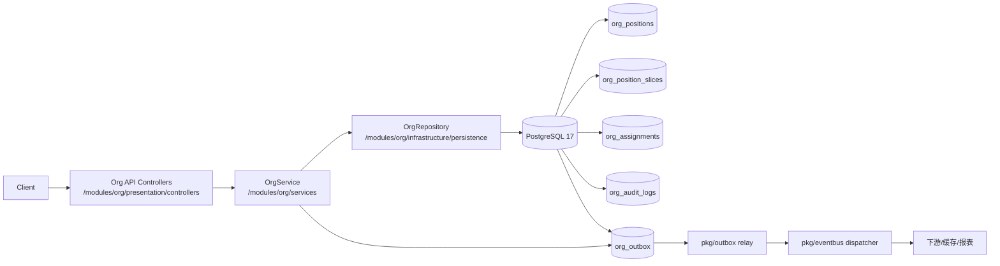

# DEV-PLAN-053：Position Core（Schema + Service + API 最小闭环）（对齐 050/051/052）

**状态**: 已完成（Schema + Service + API 最小闭环收口；见 §8.3 实施记录）（2025-12-20 18:36 UTC）

> 本计划按 [DEV-PLAN-001](001-technical-design-template.md) 的结构补齐“可直接编码”的详细设计（Level 4-5），并以 [DEV-PLAN-052](052-position-contract-freeze-and-decisions.md) 的契约冻结为准：若本计划与 052 冲突，以 052 为 SSOT。

## 1. 背景与上下文 (Context)
- **需求来源**：[DEV-PLAN-050](050-position-management-business-requirements.md)（业务需求）、[DEV-PLAN-051](051-position-management-implementation-blueprint.md)（实施蓝图）、[DEV-PLAN-052](052-position-contract-freeze-and-decisions.md)（契约冻结）。
- **现状**（与 050 差距）：
  - Org 已有 `org_positions/org_assignments`，但 Position 仍偏“空壳/自动创建”，缺少容量（FTE）、填充状态派生、reports-to、防环、组织转移版本化等 050 核心语义。
  - `org_assignments_position_unique_in_time` 使“同一时窗一岗只能有一条任职”，无法支持“一岗多人/部分填充”（050 §7.3）。
  - 事件契约 022 已支持 `org_position` 的 entity_type 检查，但 `org.changed.v1` 目前未定义 Position 变更事件形状；快照/报表/下游消费链路未对 Position v1 准备好。
- **本计划目标**：在 Org BC 内落地 Position Core：schema + service + API 最小闭环（可写、可查、可审计、可投递事件），并确保不破坏既有 Org 主链（尤其是 auto position）。

## 2. 目标与非目标 (Goals & Non-Goals)
- **核心目标**：
  - [x] **Schema（已完成）**：新增 `org_position_slices`（no-overlap + FK + 关键 check），扩展 `org_assignments.allocated_fte`，并调整约束以支持“一岗多人/部分填充”。
- [x] **Service（已完成）**：Create / Update（Insert 新切片）/ Correct / Rescind + Transfer（更新 `org_node_id`）+ 占编校验与审计/outbox；已补齐 ShiftBoundary 与 reports-to 防环（见 §8.2/§8.3）。
- [x] **API（已完成）**：已落地 `/org/api/positions*`（含 `:shift-boundary`）并扩展 `/org/api/assignments*` 支持 `allocated_fte/reason_code/reason_note`（见 §8.2）。
  - [x] **占编口径（已完成）**：按 as-of 派生 `occupied_fte=sum(allocated_fte)` 与 `staffing_state`，并在 Assignment 写入与 Position 容量下调时阻断 `occupied_fte > capacity_fte`（`ORG_POSITION_OVER_CAPACITY`）。
  - [x] **事件与 outbox（已完成）**：Position 复用 `org.changed.v1`（`entity_type=org_position`），Assignment v1 payload 增量带出 `allocated_fte`；写路径事务内 enqueue。
  - [x] **兼容性（已完成）**：保留既有 auto position 口径并完成 backfill；`/org/api/snapshot` 的 Position payload 已切换为 slice 口径且保持可用。
- **非目标（Out of Scope）**：
  - [ ] Job Catalog/Profile 主数据与冲突校验 SSOT（由 [DEV-PLAN-056](056-job-catalog-profile-and-position-restrictions.md) 承接；本计划只预留字段并提供校验 hook）。
  - [ ] Position Restrictions（056 承接）。
  - [ ] Position UI（055 承接；本计划仅提供 API 合同与最小查询数据）。
  - [ ] 报表与运营看板（057 承接）。
  - [ ] 任职管理增强（多段任职/计划任职/任职类型）（058 承接）。
  - [ ] Readiness/回滚/可观测性收口记录（059 承接）。

## 2.1 工具链与门禁（SSOT 引用）
> 目的：声明“本计划命中哪些触发器/工具链”；命令细节以 SSOT 为准，除非是本次实际执行记录。

- **触发器清单（勾选本计划命中的项）**：
  - [X] Go 代码
  - [ ] `.templ` / Tailwind
  - [ ] 多语言 JSON
  - [ ] Authz（若与 054 同 PR 落地策略碎片，则命中）
  - [X] 路由治理（新增 `/org/api/positions*`）
  - [X] DB 迁移 / Schema（Org Atlas+Goose）
  - [ ] sqlc
  - [X] Outbox（Position/Assignment 事件 enqueue + 投递链路）
  - [X] 文档（Contract First：需更新 022/026）
- **SSOT 链接**：
  - 触发器矩阵与本地必跑：`AGENTS.md`
  - 命令入口与脚本实现：`Makefile`
  - CI 门禁定义：`.github/workflows/quality-gates.yml`
  - 路由治理（allowlist 策略 SSOT）：`docs/dev-plans/018-routing-strategy.md`
  - Org Atlas+Goose：`docs/dev-plans/021A-org-atlas-goose-toolchain-and-gates.md`
  - Org 时间/审计/冻结窗口：`docs/dev-plans/025-org-time-and-audit.md`
  - Org 事件契约（SSOT）：`docs/dev-plans/022-org-placeholders-and-event-contracts.md`
  - Org API/Authz/Outbox 门禁（SSOT）：`docs/dev-plans/026-org-api-authz-and-events.md`
  - Outbox 工具链：`docs/dev-plans/017-transactional-outbox.md`
  - v1 合同冻结：`docs/dev-plans/052-position-contract-freeze-and-decisions.md`

## 3. 架构与关键决策 (Architecture & Decisions)
### 3.1 架构图 (Mermaid)


### 3.2 关键设计决策（ADR 摘要）
1. **Position 建模（选定）**：采用“稳定实体 + 有效期切片”两层（对齐 052），避免 Position 更新导致 Assignment FK 变动。
2. **一岗多人/部分填充（选定）**：移除 `org_assignments_position_unique_in_time`，改为“同一 subject+position+type 时间窗不重叠”，并引入 `allocated_fte` + 容量校验。
3. **事件策略（选定）**：Position 复用 `org.changed.v1`（`entity_type=org_position`）；`ShiftBoundary` 在事件层复用 `position.corrected`（对齐 `node.shift-boundary` 现有口径）。
4. **并发写入（选定）**：对影响占编的 Assignment 写入，在同一事务内先锁定 as-of 的 Position Slice（`SELECT ... FOR UPDATE`），串行化同一 Position 在该有效期窗内的占编变更，避免并发写导致超编穿透（若 position_id 发生变更，按 position_id 排序锁两侧 slice 以避免死锁）。
5. **System/Managed（选定）**：System Position（`is_auto_created=true`）允许缺省业务字段；Managed Position 才执行更严格的必填/校验（强校验逐步在 056 收口）。

## 4. 数据模型与约束 (Data Model & Constraints)
> 标准：精确到字段类型/空值/默认值/索引/约束。合同以 052 §5 为准；本节补齐“与现有 schema 的差异”与“迁移落地策略”。

### 4.1 Schema 定义（v1，摘要）
#### 4.1.1 新增：`org_position_slices`
```sql
CREATE TABLE org_position_slices (
  tenant_id uuid NOT NULL REFERENCES tenants(id) ON DELETE CASCADE,
  id uuid PRIMARY KEY DEFAULT gen_random_uuid(),
  position_id uuid NOT NULL,
  org_node_id uuid NOT NULL,

  title text NULL,
  lifecycle_status text NOT NULL DEFAULT 'active',
  position_type text NULL,
  employment_type text NULL,
  capacity_fte numeric(9,2) NOT NULL DEFAULT 1.0,
  capacity_headcount int NULL,

  reports_to_position_id uuid NULL,

  job_family_group_code varchar(64) NULL,
  job_family_code varchar(64) NULL,
  job_role_code varchar(64) NULL,
  job_level_code varchar(64) NULL,
  job_profile_id uuid NULL,
  cost_center_code varchar(64) NULL,

  profile jsonb NOT NULL DEFAULT '{}'::jsonb,

  effective_date timestamptz NOT NULL,
  end_date timestamptz NOT NULL DEFAULT '9999-12-31',
  created_at timestamptz NOT NULL DEFAULT now(),
  updated_at timestamptz NOT NULL DEFAULT now(),

  CONSTRAINT org_position_slices_tenant_id_id_key UNIQUE (tenant_id, id),
  CONSTRAINT org_position_slices_effective_check CHECK (effective_date < end_date),
  CONSTRAINT org_position_slices_profile_is_object_check CHECK (jsonb_typeof(profile) = 'object'),
  CONSTRAINT org_position_slices_lifecycle_status_check CHECK (lifecycle_status IN ('planned','active','inactive','rescinded')),
  CONSTRAINT org_position_slices_capacity_fte_check CHECK (capacity_fte > 0),
  CONSTRAINT org_position_slices_capacity_headcount_check CHECK (capacity_headcount IS NULL OR capacity_headcount >= 0),
  CONSTRAINT org_position_slices_reports_to_not_self_check CHECK (reports_to_position_id IS NULL OR reports_to_position_id <> position_id),
  CONSTRAINT org_position_slices_org_node_fk FOREIGN KEY (tenant_id, org_node_id) REFERENCES org_nodes (tenant_id, id) ON DELETE RESTRICT,
  CONSTRAINT org_position_slices_position_fk FOREIGN KEY (tenant_id, position_id) REFERENCES org_positions (tenant_id, id) ON DELETE RESTRICT,
  CONSTRAINT org_position_slices_reports_to_fk FOREIGN KEY (tenant_id, reports_to_position_id) REFERENCES org_positions (tenant_id, id) ON DELETE RESTRICT
);

ALTER TABLE org_position_slices
  ADD CONSTRAINT org_position_slices_no_overlap
  EXCLUDE USING gist (
    tenant_id gist_uuid_ops WITH =,
    position_id gist_uuid_ops WITH =,
    tstzrange(effective_date, end_date, '[)') WITH &&
  );

CREATE INDEX org_position_slices_tenant_position_effective_idx
  ON org_position_slices (tenant_id, position_id, effective_date);

CREATE INDEX org_position_slices_tenant_org_node_effective_idx
  ON org_position_slices (tenant_id, org_node_id, effective_date);
```

#### 4.1.2 调整：`org_positions`（稳定实体）
- 保留：`tenant_id/id/code/is_auto_created/created_at/updated_at`（并确保 `UNIQUE (tenant_id, id)` 存在，以支持复合 FK）。
- 迁移：将 `org_node_id/title/status/effective_date/end_date` 等“切片字段”从读写链路迁移到 `org_position_slices`；旧列是否删除由 4.2 的迁移策略决定（推荐两阶段避免一次性破坏）。
- 唯一性（v1 必需）：新增 `UNIQUE (tenant_id, code)` 以收敛为“code 按租户全局唯一”（对齐 052/050）；`org_positions_code_unique_in_time` 的移除可延后到读写链路完全切换后再做，避免一次性破坏。

#### 4.1.3 调整：`org_assignments`（支持占编）
- 新增列：
  - `allocated_fte numeric(9,2) NOT NULL DEFAULT 1.0`
  - `CHECK (allocated_fte > 0)`
- 约束变更：
  - 移除 `org_assignments_position_unique_in_time`
  - 新增“同一 subject+position+assignment_type 时间窗不重叠”的 EXCLUDE 约束（见 052 §5.3）
  - 保留 `org_assignments_primary_unique_in_time`

### 4.2 迁移策略（Org Atlas+Goose）
> 目标：兼容存量数据与写链路（尤其是 auto position），避免一次性破坏；同时保证新写链路以 `org_position_slices` 为 SSOT。

- **Up（推荐两阶段）**：
  1. 新增 `org_position_slices`（含索引/约束）。
  2. Backfill：把现有 `org_positions` 的 as-of 有效行写入首个 slice：
     - `lifecycle_status`：按 052 映射把存量 `status` 映射为 `active/inactive/rescinded`（如无 planned 则不产生）。
     - `capacity_fte`：System Position（`is_auto_created=true`）回填默认 `1.0`；Managed 如缺失则按 052 策略拒绝新写入但允许历史 backfill。
     - `position_type/employment_type/job_*_code`：System 允许为 NULL。
  3. 扩展 `org_assignments`：新增 `allocated_fte` 并回填默认；移除/新增相关 EXCLUDE 约束。
  4. 切换读链路：Repository/Service/Snapshot 查询改为 join `org_position_slices`（见 6.1/6.2）；保证 `/org/api/snapshot?include=positions,assignments` 仍可用。
  5. （后续迁移）删除 `org_positions` 中的 legacy 列与 `org_positions_code_unique_in_time`，避免双 SSOT 漂移（以全链路读写切换完成为前置）。
- **Down**：
  - 生产通常不执行破坏性 down；如需回滚，按 059 收口计划提供“禁写/只读/feature flag 关闭”的回退路径优先于 schema down。

## 5. 接口契约 (API Contracts)
> 标准：定义 URL/Method/Payload/错误码。时间参数沿用 024（支持 `YYYY-MM-DD` 或 RFC3339，统一 UTC）。错误码清单以 052 §6.3 为准；鉴权 object/action 映射以 026 为准（策略由 054 落地）。

### 5.1 `POST /org/api/positions`（Create）
**Request**
```json
{
  "code": "POS-0001",
  "org_node_id": "uuid",
  "effective_date": "2025-01-01",
  "title": "Finance Manager",
  "lifecycle_status": "planned",
  "position_type": "regular",
  "employment_type": "full_time",
  "capacity_fte": 1.0,
  "reports_to_position_id": "uuid|null",
  "job_family_group_code": "FIN",
  "job_family_code": "FIN-ACCOUNTING",
  "job_role_code": "FIN-MGR",
  "job_level_code": "L5",
  "job_profile_id": "uuid|null",
  "cost_center_code": "CC-001|null",
  "profile": {},
  "reason_code": "create"
}
```

**Rules（v1）**
- `code/org_node_id/effective_date/capacity_fte/reason_code` 必填。
- `capacity_fte > 0`（对齐 schema check；禁止 0/负数）。
- Managed Position（`is_auto_created=false`）v1 要求 `position_type/employment_type/job_family_group_code/job_family_code/job_role_code/job_level_code` 为非空字符串；System Position 允许为空（强校验与主数据校验在 056 收口）。
- `code` 在同租户唯一（409 `ORG_POSITION_CODE_CONFLICT`）。
- `org_node_id` 必须在 as-of `effective_date` 视角存在且可用，否则 422 `ORG_NODE_NOT_FOUND_AT_DATE`。

**Response 201**
```json
{
  "position_id": "uuid",
  "slice_id": "uuid",
  "effective_window": { "effective_date": "2025-01-01T00:00:00Z", "end_date": "9999-12-31T00:00:00Z" }
}
```

### 5.2 `GET /org/api/positions`（List, as-of）
**Query**
- `effective_date`：可选；缺省为 `nowUTC`（对齐 024/026；若传 `YYYY-MM-DD` 则按 UTC day start 解析）
- `org_node_id`：可选
- `include_descendants`：可选（默认 false；当为 true 时使用 029 的 active closure build 展开后代节点集合）
- `lifecycle_status`：可选
- `staffing_state`：可选（`empty|partially_filled|filled`）
- `position_type`：可选
- `employment_type`：可选
- `job_family_group_code/job_family_code/job_role_code/job_level_code`：可选
- `job_profile_id`：可选
- `cost_center_code`：可选
- `is_auto_created`：可选（true/false）
- `occupied`：可选（true=仅 `occupied_fte>0`；false=仅 `occupied_fte=0`）
- `q`：可选（code/title 关键词）
- `limit/page`：可选（复用 `pkg/composables.UsePaginated`）

**Response 200（示意）**
```json
{
  "tenant_id": "uuid",
  "as_of": "2025-01-01T00:00:00Z",
  "page": 1,
  "limit": 25,
  "positions": [
    {
      "position_id": "uuid",
      "code": "POS-0001",
      "org_node_id": "uuid",
      "title": "Finance Manager",
      "lifecycle_status": "active",
      "is_auto_created": false,
      "capacity_fte": 1.0,
      "occupied_fte": 0.5,
      "staffing_state": "partially_filled",
      "effective_date": "2025-01-01T00:00:00Z",
      "end_date": "9999-12-31T00:00:00Z"
    }
  ]
}
```

### 5.3 `GET /org/api/positions/{id}`（Get, as-of）
**Query**
- `effective_date`：可选（同 List）

**Response 200**
- 返回 Position 稳定信息 + as-of 切片 + 派生占编字段（`occupied_fte/staffing_state`）。

### 5.4 `GET /org/api/positions/{id}/timeline`
**Response 200（示意）**
- 返回按 `effective_date ASC` 的切片列表；每条包含 `effective_window` 与核心字段。
- 若需要“原因/操作者/变更时间”，以 `org_audit_logs` 关联补齐（策略在 055/059 收口；v1 可先返回 slice 再由 UI 拉 audit）。

### 5.5 `PATCH /org/api/positions/{id}`（Update = Insert 新切片）
**Request**
```json
{
  "effective_date": "2025-02-01",
  "capacity_fte": 2.0,
  "org_node_id": "uuid",
  "reason_code": "headcount_increase"
}
```

**Rules**
- 必须提供 `effective_date`；禁止显式提交 `end_date`。
- 不允许修改 `code`；若 `effective_date` 等于当前切片起点，返回 422 `ORG_USE_CORRECT`。
- 组织转移通过更新 `org_node_id` 表达（050 §7.4）。
- 若提供 `org_node_id`：必须在 as-of `effective_date` 视角存在且可用，否则 422 `ORG_NODE_NOT_FOUND_AT_DATE`。
- 若提供 `capacity_fte`：必须 `> 0`，且若为下调还需满足 052/6.3 的容量不变量（见 6.3）。

### 5.6 `POST /org/api/positions/{id}:correct`（Correct）
**Request**
```json
{ "effective_date": "2025-02-01", "title": "Corrected Title", "reason_code": "correct" }
```

**Rules**
- 必须提供 `effective_date`，用于定位覆盖该时点的切片；该切片的 `effective_date/end_date` 不得被修改。
- 触发冻结窗口校验（025/052）。

### 5.7 `POST /org/api/positions/{id}:rescind`（Rescind）
**Request**
```json
{ "effective_date": "2025-02-01", "reason_code": "rescinded" }
```

**Rules（v1 安全口径）**
- 默认要求 as-of `effective_date` 时 `occupied_fte=0`，否则 409 `ORG_POSITION_NOT_EMPTY`（052 §4.7）。
- 若 as-of `effective_date` 存在下属职位仍指向本 Position（`reports_to_position_id`），默认拒绝：409 `ORG_POSITION_HAS_SUBORDINATES`（052 §4.7）。
- Rescind 的时间线语义对齐 025：删除该日期起的未来切片，并插入 `lifecycle_status=rescinded` 的新切片（算法见 6.5）。

### 5.8 `POST /org/api/positions/{id}:shift-boundary`（ShiftBoundary）
**Request**
```json
{
  "target_effective_date": "2025-02-01",
  "new_effective_date": "2025-02-05",
  "reason_code": "correct"
}
```

**Rules**
- 语义与 025 的节点 ShiftBoundary 一致：移动相邻切片交界线；触发冻结窗口校验。

### 5.9 Assignment 兼容性扩展（`allocated_fte`）
- `POST /org/api/assignments` 与 `PATCH /org/api/assignments/{id}`：
  - 新增字段 `allocated_fte`（可选，缺省 1.0）。
  - v1 增加容量校验：写入后不得导致 `occupied_fte > capacity_fte`（422 `ORG_POSITION_OVER_CAPACITY`）。
- `reason_code`：对齐 052 的 v1 合同：Assignment 的 Create/Update/Correct/Rescind 统一要求携带 `reason_code` 并写入 `org_audit_logs.meta.reason_code`（必要时通过 feature flag/rollout 在 059 收口）。
- Contract First：Assignment 的 JSON API 形状 SSOT 在 024/025；本节为增量变更点，实施前需同步更新 024/025（避免契约漂移）。

### 5.10 错误码（SSOT 引用）
- v1 错误码与 HTTP 状态码以 052 §6.3 为 SSOT；本计划实现不得自创新 code（如需新增，先回到 052 评审冻结）。

### 5.11 Authz 映射（对齐 026，Contract First）
> 说明：Authz 的 object/action 命名与映射表以 026 为 SSOT；本计划新增 endpoints 必须同步更新 026 的映射表（避免“实现写了但 SSOT 未登记”）。

- `GET /org/api/positions` / `GET /org/api/positions/{id}` / `GET /org/api/positions/{id}/timeline`：`org.positions` + `read`
- `POST /org/api/positions` / `PATCH /org/api/positions/{id}`：`org.positions` + `write`
- `POST /org/api/positions/{id}:correct` / `:rescind` / `:shift-boundary`：`org.positions` + `admin`

### 5.12 事件契约（对齐 052/022，Contract First）
> 说明：本计划会在实现前先更新 022（`org.changed.v1` 扩展 `org_position` 与 change_type 枚举）；事件 payload 不透传 reason_code（对齐 052 §7.3）。

- Position：
  - topic：`org.changed.v1`
  - `entity_type=org_position`
  - `change_type`：`position.created/position.updated/position.corrected/position.rescinded`
  - `new_values`：复用本次写入后 as-of 切片的最小快照字段（字段集合以 052 §7.2 为 SSOT）
- Assignment：
  - topic：`org.assignment.changed.v1`
  - `new_values`：在 022/024 的既有字段基础上新增 `allocated_fte`（v1 允许新增字段；消费者忽略未知字段）

## 6. 核心逻辑与算法 (Business Logic & Algorithms)
### 6.1 as-of 派生：`occupied_fte` / `staffing_state`
对齐 052 §8.1：
1. 查 Position Slice：`position_id` 在 `[effective_date,end_date)` 覆盖 as-of 的切片 `S`。
2. 查 Assignments：同一 `position_id` 在 as-of 视角有效且计入占编的任职集合（v1 仅 `assignment_type='primary'`）。
3. `occupied_fte = sum(allocated_fte)`；对比 `capacity_fte`：
   - `empty`：`occupied_fte = 0`
   - `partially_filled`：`0 < occupied_fte < capacity_fte`
   - `filled`：`occupied_fte = capacity_fte`（必须阻断 `occupied_fte > capacity_fte`）

### 6.2 Position：Create（创建稳定实体 + 首个切片）
1. 事务内校验：`code/org_node_id/effective_date/capacity_fte/reason_code` 必填；`capacity_fte>0`。
2. 校验 `org_node_id` 在 as-of `effective_date` 存在且可用（否则 422 `ORG_NODE_NOT_FOUND_AT_DATE`）。
3. 插入 `org_positions`（`is_auto_created=false`）；若 `code` 冲突返回 409 `ORG_POSITION_CODE_CONFLICT`。
4. 插入首个 `org_position_slices`（`effective_date` 起、`end_date=end_of_time`）。
5. 写 `org_audit_logs`：`entity_type=org_position`，`change_type=position.created`，`meta.reason_code=...`。
6. enqueue outbox：`org.changed.v1`（`entity_type=org_position`；`new_values` 字段对齐 052 §7.2；不透传 `reason_code`）。

### 6.3 Position：Update（Insert Slice）
与 024/025 的 Node Update（Insert）一致：
1. `freezeCheck(settings, txTime, effective_date)`（对齐 025/024）。
2. 锁定并读取覆盖 `effective_date=X` 的当前切片 `S`（`FOR UPDATE`）；若不存在返回 422 `ORG_POSITION_NOT_FOUND_AT_DATE`。
3. 若 `S.effective_date == X`：拒绝（422 `ORG_USE_CORRECT`）。
4. 计算新切片结束 `Y`：下一切片的 `effective_date` 或 `end_of_time`。
5. 字段继承：未提供字段从 `S` 继承；显式提供字段覆盖（含 Transfer：更新 `org_node_id`）。
6. 容量下调校验：若 `capacity_fte` 变更为更小值，必须满足 as-of `X` 的 `occupied_fte <= capacity_fte`，否则 422 `ORG_POSITION_OVER_CAPACITY`。
7. 将 `S.end_date` 截断为 `X`；插入新切片 `[X,Y)`。
8. 写 `org_audit_logs`（`operation=Update`，`meta.reason_code=...`）；enqueue outbox：`position.updated`。

### 6.4 Position：Correct（In-place Patch）
语义对齐 025 的 Node Correct：
1. 锁定并读取覆盖 `effective_date=X` 的切片 `S`（`FOR UPDATE`）。
2. `freezeCheck(settings, txTime, S.effective_date)`（对齐 025：冻结窗口以切片起点为 affected_at）。
3. 原位更新切片字段（禁止修改 `effective_date/end_date`）。
4. 写 `org_audit_logs`（`operation=Correct`，`meta.reason_code=...`）；enqueue outbox：`position.corrected`。

### 6.5 Position：Rescind（撤销未来）
语义对齐 025 的 Node Rescind：
1. `freezeCheck(settings, txTime, effective_date)`。
2. 预检：
   - as-of `effective_date` 的 `occupied_fte` 必须为 0（否则 409 `ORG_POSITION_NOT_EMPTY`）。
   - as-of `effective_date` 不得存在下属职位（否则 409 `ORG_POSITION_HAS_SUBORDINATES`）。
3. 删除该日期起的未来切片：`DeletePositionSlicesFrom(position_id, effective_date)`。
4. 若存在覆盖该日期的切片 `S` 且 `S.effective_date < effective_date`：截断 `S.end_date=effective_date`。
5. 插入 `lifecycle_status=rescinded` 的新切片 `[effective_date,end_of_time)`（字段从 `S` 继承但状态覆盖）。
6. 写审计与 outbox：`position.rescinded`。

### 6.6 Position：ShiftBoundary（边界移动）
对齐 025 的 `ShiftBoundaryNode`：
- `target_effective_date` 必须等于目标切片起点；
- `new_effective_date` 不得吞并前驱且小于目标 end；
- `affected_at = min(target_effective_date, new_effective_date)` 用于冻结窗口检查；
- 审计：两条 audit log（前驱截断 + 目标起点调整），事件层复用 `position.corrected`。

### 6.7 Assignment：占编校验（并发安全）
写入 Assignment（Create/Update/Correct/Rescind）前，先锁定 as-of 的 Position Slice，避免并发写导致“超编穿透”：
1. 确定本次写入影响到的 `position_id` 集合：
   - Create/Rescind：只涉及一个 position_id
   - Update（可能换岗）：涉及 old/new 两个 position_id
2. 对每个受影响的 position_id，锁定 as-of 的 Position Slice（按 position_id 排序，避免死锁）：
   - `SELECT ... FROM org_position_slices WHERE tenant_id=$1 AND position_id=$2 AND effective_date <= $3 AND end_date > $3 ORDER BY effective_date DESC LIMIT 1 FOR UPDATE`
3. 从锁定的 slice 读取 `capacity_fte`；随后执行 Assignment 写入（含 `allocated_fte`）。
4. 在同一事务内计算写入后的占编（v1 仅统计 `assignment_type='primary'`）：
   - `occupied_fte = COALESCE(SUM(allocated_fte),0)` over as-of window（`WHERE assignment_type='primary' AND effective_date <= as_of AND end_date > as_of`）
5. 若任一受影响 position 出现 `occupied_fte > capacity_fte`：拒绝并返回 422 `ORG_POSITION_OVER_CAPACITY`（错误信息需包含 `capacity_fte/occupied_fte`，便于 UI 展示）。

### 6.8 reports-to 防环（as-of）
对齐 052 §8.2：
- 禁止自指（DB check + service 校验）；
- 以 as-of 视角沿 `reports_to_position_id` 向上迭代，若遇到自身 `position_id` 则拒绝（422 `ORG_POSITION_REPORTS_TO_CYCLE`）。

### 6.9 Positions List：`include_descendants`（避免 N+1）
为对齐 050 §8.1 的“包含下级组织”过滤并避免 N+1：
1. 若 `org_node_id` 为空：不做组织过滤。
2. 若 `org_node_id` 非空且 `include_descendants=false`：仅过滤 `org_node_id` 本身。
3. 若 `include_descendants=true`：用 029 的 active closure build 将 `org_node_id` 展开为后代集合（as-of 视角过滤），再以 `org_position_slices.org_node_id IN (...)` 做过滤（应在 SQL 中一次性完成，不得对每个 Position 单独查子树）。

## 7. 安全与鉴权 (Security & Authz)
- **租户隔离**：所有 Position/Assignment 相关 SQL 必须带 `tenant_id` 条件；写事务按 019A/026 的 RLS 口径执行。
- **Authz object/action（SSOT：026）**：
  - `org.positions`：`read` / `write` / `admin`
  - `org.assignments`：`read` / `assign` / `admin`
- **高风险操作**：Position 的 Correct/Rescind/ShiftBoundary 归为 `admin`（策略由 054 落地）。

## 8. 依赖与里程碑 (Dependencies & Milestones)
### 8.1 依赖
- 合同冻结：`docs/dev-plans/052-position-contract-freeze-and-decisions.md`
- Org schema/约束与工具链：`docs/dev-plans/021-org-schema-and-constraints.md`、`docs/dev-plans/021A-org-atlas-goose-toolchain-and-gates.md`
- 时间/审计/冻结窗口：`docs/dev-plans/025-org-time-and-audit.md`
- 事件契约与 outbox：`docs/dev-plans/022-org-placeholders-and-event-contracts.md`、`docs/dev-plans/026-org-api-authz-and-events.md`、`docs/dev-plans/017-transactional-outbox.md`
- 路由治理：`docs/dev-plans/018-routing-strategy.md`

### 8.2 里程碑（建议拆分）
0. [x] Contract First：更新 022（Position 事件扩展）与 024/025（assignments 增量字段），并通过 `make check doc`。
1. [x] Schema 迁移：新增 `org_position_slices`、扩展 `org_assignments`、约束调整与 backfill。
2. [x] Repository：Position/PositionSlice 的读写接口落地；修复依赖 `org_positions` 旧列的查询（snapshot/assignments join 等）。
3. [x] Service：补齐 reports-to 防环（422 `ORG_POSITION_REPORTS_TO_CYCLE`）与 ShiftBoundary（见 §6.6/§6.8）。
4. [x] API：补齐 `POST /org/api/positions/{id}:shift-boundary` 并在 026 登记 positions endpoints 的 Authz 映射（避免 SSOT 漂移）。
5. [x] 事件：Position/Assignment 的 v1 payload 与 022 对齐；outbox 投递冒烟通过。
6. [x] 测试：补齐时间线边界/防环回归用例（`ShiftBoundary` + cycle）；门禁回归（本地与 CI）通过。

### 8.3 实施记录（本计划内）
- [x] 已落地：见 PR `#97`（分支 `feature/dev-plan-052-impl`），CI 全绿。
- [x] 已验证门禁：`make org plan && make org lint && make org migrate up`；`go fmt ./... && go vet ./... && make check lint && make test`。
- [x] 已处理 CI 补充门禁：SQL 格式化（`pg_format`）对齐（`make check sqlfmt` 通过）。
- [x] 已补齐：`ShiftBoundaryPosition` + reports-to 防环 + `POST /org/api/positions/{id}:shift-boundary`；并补齐 053 回归用例。

## 9. 测试与验收标准 (Acceptance Criteria)
- **Schema**：Atlas plan/lint 通过；迁移在 PG17 冒烟通过；backfill 后 as-of 查询能返回合理数据。
- **关键用例**：
  - 一岗多人：同一 Position 在同一 as-of 下允许多条 Assignment（不同 subject），且 `occupied_fte` 聚合正确。
  - 部分填充：`allocated_fte` 支持 0.5 等小数；`staffing_state` 派生正确。
  - 超编阻断：并发写入不会绕过容量校验。
  - Update/Correct/Rescind/ShiftBoundary：时间线不重叠、无断档；冻结窗口策略生效。
- **门禁**：按 `AGENTS.md` 触发器矩阵执行（Go/Org schema/routing/outbox），CI 全绿。

## 10. 运维与监控 (Ops & Monitoring)
- **Feature Flag（建议）**：
  - v1 推荐：复用 027 的 rollout allowlist（`ORG_ROLLOUT_MODE/ORG_ROLLOUT_TENANTS`）做租户级灰度，不新增新的全局开关；“reason_code/强校验”的 shadow/enforce 细分策略由 059 收口冻结。
- **关键日志**：占编拒绝、冻结窗口拒绝、防环拒绝需结构化日志，包含 `tenant_id/position_id/effective_date/reason_code`。
- **回滚**：优先通过“禁写/只读/关闭 feature flag”回退；schema 回滚按 059 的不可逆点清单与策略执行。
