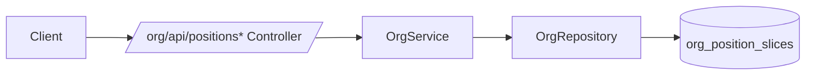

# DEV-PLAN-053A：Position 合同字段贯通（对齐 053；为 056/055 解耦前置）

**状态**: 已完成（2025-12-20 17:31 UTC）

## 1. 背景与上下文 (Context)
- **需求来源**：
  - `docs/dev-plans/052-position-contract-freeze-and-decisions.md`（v1 合同冻结）
  - `docs/dev-plans/053-position-core-schema-service-api.md`（Position Core v1 合同）
  - `docs/dev-plans/056-job-catalog-profile-and-position-restrictions.md`（主数据/强校验依赖这些字段落盘）
  - `docs/dev-plans/055-position-ui-org-integration.md`（UI 表单需要可写字段入口）
- **当前痛点**：
  - `org_position_slices` 已包含 `position_type/employment_type/job_*_code/job_profile_id/cost_center_code/profile` 等列，但 053 的 API/Service/Repository 尚未接收并落盘这些字段，导致 056 无法在写入口做强校验与灰度，055 UI 也无法对齐 053 合同。
- **业务价值**：
  - 让“字段契约（053/052）”与“实现（代码）”重新一致，使 056/055 可以并行推进且不互相卡住。

## 2. 目标与非目标 (Goals & Non-Goals)
### 2.1 核心目标
- [X] **字段贯通（写）**：对齐 053 的 Position Create/Update/Correct 合同字段，贯通 `/org/api/positions*` → `OrgService` → `OrgRepository` → `org_position_slices` 落盘：
  - `position_type`、`employment_type`
  - `job_family_group_code`、`job_family_code`、`job_role_code`、`job_level_code`
  - `job_profile_id`、`cost_center_code`
  - `profile`（JSON object；缺省 `{}`）
- [X] **字段贯通（读）**：`GET /org/api/positions/{id}` 与 `GET /org/api/positions/{id}/timeline` 可读回上述字段（用于 UI/排障/后续校验）。
- [X] **兼容 System/Managed**：System Position（`is_auto_created=true`）允许上述字段为空；Managed Position（`is_auto_created=false`）在 v1 保持 053 的“非空字符串”必填边界（主数据存在/启用/层级校验由 056 收口）。
- [X] **门禁对齐**：通过仓库 Go 门禁（fmt/vet/lint/test）与文档门禁（若本文档/链接有变更）。

### 2.2 非目标（Out of Scope）
- 不实现 Job Catalog / Job Profile 主数据表与维护 API（由 056 承接）。
- 不引入主数据存在/启用/层级自洽与 Profile 映射冲突拒绝（由 056 在 `org_settings.position_catalog_validation_mode` 下灰度收口）。
- 不新增 UI（由 055 承接）。

## 2.3 工具链与门禁（SSOT 引用）
> 仅声明触发器与 SSOT；命令细节以 `AGENTS.md`/`Makefile`/CI 为准。

- **触发器清单（本计划预计命中）**：
  - [X] Go 代码（`go fmt ./... && go vet ./... && make check lint && make test`）
  - [ ] DB 迁移 / Schema（本计划不改 schema；只贯通既有列）
  - [ ] Authz（不新增 object/action；沿用 053 既有 positions endpoints）
  - [X] 文档（`make check doc`）
- **SSOT 链接**：
  - 触发器矩阵与本地必跑：`AGENTS.md`
  - 命令入口：`Makefile`
  - CI 门禁：`.github/workflows/quality-gates.yml`
  - v1 合同冻结：`docs/dev-plans/052-position-contract-freeze-and-decisions.md`
  - Position Core 合同：`docs/dev-plans/053-position-core-schema-service-api.md`

## 3. 架构与关键决策 (Architecture & Decisions)
### 3.1 架构图 (Mermaid)

### 3.2 关键设计决策（ADR 摘要）
1. **不改 schema（选定）**：仅使用 053 已落地的 `org_position_slices` 既有列，避免在 056 前引入新的迁移耦合点。
2. **profile 形状强约束（选定）**：入参 `profile` 必须为 JSON object（与 DB check 一致）；缺省值为 `{}`。
3. **Managed 必填边界（选定）**：Managed Position 仅做“非空字符串”校验，不做主数据存在/启用/层级校验（避免与 056 的灰度/错误码语义冲突）。

## 4. 数据模型与约束 (Data Model & Constraints)
> 本计划不新增表/列；以下为 053 已存在且本计划需要贯通的列集合。

- `org_position_slices.position_type text null`
- `org_position_slices.employment_type text null`
- `org_position_slices.job_family_group_code varchar(64) null`
- `org_position_slices.job_family_code varchar(64) null`
- `org_position_slices.job_role_code varchar(64) null`
- `org_position_slices.job_level_code varchar(64) null`
- `org_position_slices.job_profile_id uuid null`
- `org_position_slices.cost_center_code varchar(64) null`
- `org_position_slices.profile jsonb not null default '{}'::jsonb`（并有 `jsonb_typeof(profile)='object'` check）

## 5. 接口契约 (API Contracts)
> 053 为 SSOT；本节仅声明“本计划补齐的字段承载点”。

- `POST /org/api/positions`：新增接收并落盘上述字段（Managed v1 非空字符串校验）。
- `PATCH /org/api/positions/{id}`：允许对上述字段做 patch；未提供字段沿用当前切片值（Insert 新切片语义）。
- `POST /org/api/positions/{id}:correct`：允许对上述字段做 in-place patch（不改 effective window）。
- `GET /org/api/positions/{id}`：响应包含上述字段（as-of 切片视角）。
- `GET /org/api/positions/{id}/timeline`：响应切片列表包含上述字段。

## 6. 核心逻辑与算法 (Business Logic & Algorithms)
### 6.1 Create（Managed）
1. 校验字段：`position_type/employment_type/job_*_code` 非空字符串；`profile` 为 object（缺省 `{}`）。
2. 插入 `org_positions`（稳定实体）+ `org_position_slices`（首个切片），并写审计/outbox（沿用 053）。

### 6.2 Update（Insert 新切片）
1. 锁定 as-of 当前切片。
2. 计算新切片字段：对每个可变字段采用“入参优先，否则沿用当前切片”。
3. 插入新切片并截断旧切片（沿用 053 的 no-overlap 语义）。

### 6.3 Correct（In-place）
1. 锁定目标切片（覆盖 `effective_date` 的切片）。
2. 对可变字段做 in-place 更新。

## 7. 安全与鉴权 (Security & Authz)
- 不新增 object/action；沿用 053 的 `org.positions write/admin` 鉴权边界（具体映射以 054/026 为 SSOT）。

## 8. 依赖与里程碑 (Dependencies & Milestones)
### 8.1 依赖
- `docs/dev-plans/052-position-contract-freeze-and-decisions.md`：字段与可变性冻结（Managed/System 边界）。
- `docs/dev-plans/053-position-core-schema-service-api.md`：Position v1 写入口与切片语义。

### 8.2 里程碑
- 本计划完成后，056 可在写入口接入“主数据存在/启用/层级/冲突拒绝”与灰度；055 可在 UI 表单中稳定读写这些字段。

## 9. 测试与验收标准 (Acceptance Criteria)
- 新增/调整的单元或集成测试可验证：
  - Create/Update/Correct 后，字段在 `org_position_slices` 中可被读回；
  - System Position 不因字段缺失而失败；
  - `profile` 非 object 会被拒绝（422/400 以实现为准，但需稳定错误码）。
- 本地门禁通过（Go 门禁 + 文档门禁）。

## 10. 运维与可观测性 (Ops & Monitoring)
- 结构化日志：当入参 `profile` 形状非法时，日志至少包含 `tenant_id/position_id/request_id` 与错误码，便于排障（具体字段以现有 logging 约定为准）。

## 11. 实施步骤（执行清单）
1. [X] 扩展 Position API 请求/响应 DTO 与解码校验（controller）
2. [X] 扩展 OrgService 输入/校验与切片写入（service）
3. [X] 扩展 OrgRepository 的 Insert/Update/Select（persistence）
4. [X] 补齐回归测试（最小集）
5. [X] 运行门禁并记录结果（对齐 `AGENTS.md`）——（2025-12-20 17:31 UTC）已通过：`go fmt ./... && go vet ./... && make check lint && make test && make check doc`

## 12. 交付物
- 053 合同字段在 Position 写入口全链路贯通并落盘。
- 可读回字段用于 UI/排障与 056 的后续强校验接入。
