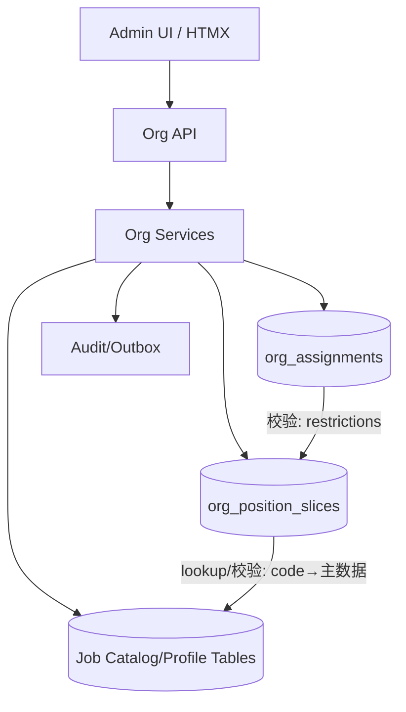

# DEV-PLAN-056：Job Catalog / Job Profile 与 Position Restrictions（对齐 051 阶段 D）

**状态**: 已完成（2025-12-20 17:31 UTC）

## 1. 背景与上下文 (Context)
- **需求来源**：
  - 业务需求：`docs/dev-plans/050-position-management-business-requirements.md`（§3.1、§7.1、§7.7、§9、§11）。
  - 实施蓝图：`docs/dev-plans/051-position-management-implementation-blueprint.md`（阶段 D：D0/D1/D2；覆盖矩阵：D-12/13/14）。
  - 决策冻结：`docs/dev-plans/052-position-contract-freeze-and-decisions.md`（HRM legacy `positions` 处置、System/Managed 边界）。
- **当前痛点**：
  - Position v1 在 Org BC 的闭环（053）可以先跑通，但 Job Catalog / Job Profile 仍缺少主数据 SSOT，导致分类/映射规则无法稳定复用，写入口校验只能“弱约束或散落在多处”。
  - 050 明确要求“分类启用/层级自洽/冲突拒绝”和“Position Restrictions 写入口强校验”；若不先收敛主数据与校验口径，后续 UI/报表/权限会产生漂移。
  - 仓库存在 HRM `positions` 的历史包袱；若继续并行扩展，会与 Org Position 形成双 SSOT（051/052 已明确要避免）。
- **业务价值**：
  - 把“岗位分类/岗位定义/限制规则”变成可维护、可审计、可复用的主数据与规则层，为 Position/Assignment 写入口提供稳定的强校验依据。
  - 为阶段 E 的统计/报表提供可对齐的维度（按职类/职种/职务/职级、按 Profile）。

## 2. 目标与非目标 (Goals & Non-Goals)
### 2.1 核心目标
- [X] **Job Catalog 主数据可用**：四级分类（Job Family Group → Job Family → Job Role → Job Level）具备 code/name/启停与层级自洽约束；查询与维护入口可用。
- [X] **Job Profile 主数据可用**：Profile 必须绑定 Job Role，可选配置“允许的 Job Level 集合”，并作为“Profile→Catalog 冲突拒绝”的 SSOT（对齐 050 §3.1/§7.1）。
- [X] **Position 写入口强校验**：对 Managed Position 强制校验 Job Catalog 四级必填 + 启用状态 + 层级自洽；若选择 Job Profile，则必须通过映射校验，否则冲突拒绝（对齐 050 §7.1）。
- [X] **Position Restrictions 可配置且可校验**：限制条件可被维护；对 Position/Assignment 写入口执行强校验，并提供稳定的拒绝原因（可观测、可审计追溯）（对齐 050 §7.7）。
- [X] **兼容与灰度**：对 System Position（auto-created）保持兼容；对 Managed Position 优先启用强校验；强校验支持 `disabled/shadow/enforce` 三态灰度，收口策略与 `docs/dev-plans/059-position-rollout-readiness-and-observability.md` 对齐。

### 2.2 非目标（Out of Scope）
- 不实现招聘全链路（Job Requisition/Offer/Hire）与外部 ATS 对接（见 051 §2.2）。
- 不在本计划内交付统计看板与空缺分析（阶段 E：`docs/dev-plans/057-position-reporting-and-operations.md`）。
- 不在本计划内引入与 HRM 人员属性强耦合的 Restrictions 强校验（如雇佣类型/地点/成本中心）；v1 仅保留可扩展结构，强校验范围以 Job Catalog/Profile 为主（后续以独立计划收口）。
- HRM legacy `positions` 的最终处置（冻结为字典 vs 迁移/重命名为 Job Profile）以 052 的冻结结论为准；本计划只负责按冻结结论落地“对齐与避免双 SSOT”的实现路径。

## 2.3 工具链与门禁（SSOT 引用）
> 本节仅声明“本计划命中哪些触发器/工具链”；具体命令以 SSOT 为准，避免复制导致 drift。

- **触发器清单（本计划预计命中）**：
  - [X] Go 代码（`go fmt ./... && go vet ./... && make check lint && make test`）
  - [X] DB 迁移 / Schema（Org Atlas+Goose；见 `docs/dev-plans/021A-org-atlas-goose-toolchain-and-gates.md`）
  - [X] Authz（新增/调整 Job Catalog/Profile/Restrictions 维护权限；见 `docs/runbooks/AUTHZ-BOT.md` 与 `docs/dev-plans/054-position-authz-policy-and-gates.md`）
  - [X] 路由治理（新增 `/org/api/job-*` 等路由；见 `docs/dev-plans/018-routing-strategy.md`）
  - [ ] `.templ` / Tailwind（仅当新增维护 UI 时触发；`make generate && make css` 且生成物需提交）
  - [ ] 多语言 JSON（仅当新增文案时触发；`make check tr`）
  - [X] 文档（`make check doc`）
- **SSOT 链接**：
  - 触发器矩阵与本地必跑：`AGENTS.md`
  - 命令入口：`Makefile`
  - CI 门禁：`.github/workflows/quality-gates.yml`
  - Org 工具链：`docs/dev-plans/021A-org-atlas-goose-toolchain-and-gates.md`
  - 事件契约与 Outbox：`docs/dev-plans/022-org-placeholders-and-event-contracts.md`、`docs/dev-plans/026-org-api-authz-and-events.md`、`docs/dev-plans/017-transactional-outbox.md`

## 2.4 并行实施说明（与 057/058）
- 本计划与 `docs/dev-plans/057-position-reporting-and-operations.md`、`docs/dev-plans/058-assignment-management-enhancements.md` 采用并行实施；最终灰度/回滚/Readiness 由 `docs/dev-plans/059-position-rollout-readiness-and-observability.md` 统一收口。
- **注意事项**：
  - **口径/字段 SSOT**：Job 维度与 Restrictions 的字段名/落点如需调整，必须同步更新 056/057/058，并确保不破坏 052/053 已冻结的 v1 合同与错误码口径。
  - **灰度默认**：所有强校验必须先 `shadow`（租户级 `org_settings.*_validation_mode`），避免直接 `enforce` 误伤 System/auto-created 链路；`enforce` 的启用与回退按 059 执行。
  - **并行冲突面**：`modules/org/services/**`、`modules/org/infrastructure/persistence/**`、`modules/org/presentation/**`、`config/access/**`、`migrations/org/**` 易产生 merge 冲突；建议拆分 PR 并约定文件 ownership 与迁移时间戳。
  - **中间态兼容**：在 056 未完全落地前，057 的维度统计应能降级为 `unknown`；058 的 Restrictions 校验在缺失配置/数据时应保持“默认放行”（或仅记录 shadow 审计），避免阻断写链路。

## 3. 架构与关键决策 (Architecture & Decisions)
### 3.1 SSOT 与边界（对齐 051/052）
- Job Catalog / Job Profile / Restrictions 作为 Position/Assignment 写入口的强校验依据，主干落在 Org BC（`modules/org`），避免在 HRM 侧另起一套主数据与规则（对齐 051 §1、052 §5.1）。
- HRM legacy `positions` 若需要保留，只能作为只读/legacy 字典；若需要演进，优先迁移/映射到 Job Profile（由 052 冻结结论决定）。

### 3.2 Job Catalog 数据模型选型（四表分层，优先强约束）
- 选项 A：单表 `job_catalog_nodes (type,parent_id,...)`。优点：扩展灵活；缺点：DB 级约束难保证“层级自洽”（尤其是 parent 类型校验），容易把错误留到应用层。
- 选项 B（选定）：四张表分层（Family Group/Family/Role/Level）+ 外键，确保层级自洽主要由 DB 约束兜底，应用层只需补齐“启用状态/业务规则”。

### 3.3 Job Profile→Catalog 映射语义（对齐 050 §3.1）
- Profile 必须绑定一个 Job Role；可选配置允许的 Job Level 集合：
  - 若允许集合为空：表示“允许该 Role 下所有 Level”（默认）。
  - 若允许集合非空：表示“只允许集合中的 Level”。
- Position 写入时（对齐 052/053 的字段命名）：
  - Managed Position 的 `job_family_group_code/job_family_code/job_role_code/job_level_code` 必填（053 v1 先做“非空字符串”校验；本计划补齐“主数据存在/启用/层级自洽”校验）。
  - 若 `job_profile_id` 非空：
    - 先用上述四级 code 解析出 `resolved_job_role_id/resolved_job_level_id`（通过 Job Catalog 表 lookup）。
    - 要求 `org_job_profiles.job_role_id == resolved_job_role_id`；且（若配置 allowed-levels）`resolved_job_level_id` 在 allowlist 中；不满足返回 `ORG_JOB_PROFILE_CONFLICT`（422，对齐 052 §6.3）。

### 3.4 Restrictions 语义与灰度策略（对齐 050 §7.7）
- Restrictions 是“对某个 Position 时间片的 staffing/占用/变更 的限制条件”，v1 聚焦于可落地且能被写入口强校验的维度：
  - **Job Profile / Job Catalog 相关限制**：用于阻止“不在允许范围内的分类/Profile”的写入或占用。
  - 其余维度（雇佣类型/用工类型、地点、成本中心等）先以可扩展结构承载；其中雇佣类型等维度需要 HRM/subject attributes SSOT 支撑，v1 不做强制校验（留待后续计划收口）。
- 强校验灰度采用三态：`disabled`（不校验）、`shadow`（不阻断但记录审计/日志）、`enforce`（阻断并返回稳定错误码）；灰度开关建议落在租户级 `org_settings`，与 025 的冻结窗口一致（避免把“策略”塞进业务数据字段）。

### 3.5 设计图（数据流）


## 4. 数据模型与约束 (Data Model & Constraints)
> 命名遵循 Org 表前缀 `org_`；所有外键均使用 `(tenant_id, id)` 复合键以保持租户隔离一致性（对齐现有 Org schema 习惯）。

### 4.1 Job Catalog（四级）
#### 4.1.1 `org_job_family_groups`
| 列 | 类型 | 约束 | 默认 | 说明 |
| --- | --- | --- | --- | --- |
| `tenant_id` | `uuid` | `not null` |  | FK → `tenants` |
| `id` | `uuid` | `pk` | `gen_random_uuid()` | |
| `code` | `varchar(64)` | `not null` |  | 业务编码 |
| `name` | `text` | `not null` |  | 展示名 |
| `is_active` | `boolean` | `not null` | `true` | 启用/停用 |
| `created_at` | `timestamptz` | `not null` | `now()` | |
| `updated_at` | `timestamptz` | `not null` | `now()` | |

**约束/索引**：
- `unique (tenant_id, code)`
- `unique (tenant_id, id)`（用于 `(tenant_id,id)` 复合外键引用）
- `index (tenant_id, is_active, code)`

#### 4.1.2 `org_job_families`
| 列 | 类型 | 约束 | 默认 | 说明 |
| --- | --- | --- | --- | --- |
| `tenant_id` | `uuid` | `not null` |  | |
| `id` | `uuid` | `pk` | `gen_random_uuid()` | |
| `job_family_group_id` | `uuid` | `not null` |  | FK → `org_job_family_groups` |
| `code` | `varchar(64)` | `not null` |  | |
| `name` | `text` | `not null` |  | |
| `is_active` | `boolean` | `not null` | `true` | |
| `created_at` | `timestamptz` | `not null` | `now()` | |
| `updated_at` | `timestamptz` | `not null` | `now()` | |

**约束/索引**：
- `fk (tenant_id, job_family_group_id) -> org_job_family_groups (tenant_id, id) on delete restrict`
- `unique (tenant_id, job_family_group_id, code)`
- `unique (tenant_id, id)`（用于 `(tenant_id,id)` 复合外键引用）
- `index (tenant_id, job_family_group_id, is_active, code)`

#### 4.1.3 `org_job_roles`
| 列 | 类型 | 约束 | 默认 | 说明 |
| --- | --- | --- | --- | --- |
| `tenant_id` | `uuid` | `not null` |  | |
| `id` | `uuid` | `pk` | `gen_random_uuid()` | |
| `job_family_id` | `uuid` | `not null` |  | FK → `org_job_families` |
| `code` | `varchar(64)` | `not null` |  | |
| `name` | `text` | `not null` |  | |
| `is_active` | `boolean` | `not null` | `true` | |
| `created_at` | `timestamptz` | `not null` | `now()` | |
| `updated_at` | `timestamptz` | `not null` | `now()` | |

**约束/索引**：
- `fk (tenant_id, job_family_id) -> org_job_families (tenant_id, id) on delete restrict`
- `unique (tenant_id, job_family_id, code)`
- `unique (tenant_id, id)`（用于 `(tenant_id,id)` 复合外键引用）
- `index (tenant_id, job_family_id, is_active, code)`

#### 4.1.4 `org_job_levels`
| 列 | 类型 | 约束 | 默认 | 说明 |
| --- | --- | --- | --- | --- |
| `tenant_id` | `uuid` | `not null` |  | |
| `id` | `uuid` | `pk` | `gen_random_uuid()` | |
| `job_role_id` | `uuid` | `not null` |  | FK → `org_job_roles` |
| `code` | `varchar(64)` | `not null` |  | |
| `name` | `text` | `not null` |  | |
| `display_order` | `int` | `not null` | `0` | UI 排序（可选） |
| `is_active` | `boolean` | `not null` | `true` | |
| `created_at` | `timestamptz` | `not null` | `now()` | |
| `updated_at` | `timestamptz` | `not null` | `now()` | |

**约束/索引**：
- `fk (tenant_id, job_role_id) -> org_job_roles (tenant_id, id) on delete restrict`
- `unique (tenant_id, job_role_id, code)`
- `unique (tenant_id, id)`（用于 `(tenant_id,id)` 复合外键引用）
- `index (tenant_id, job_role_id, is_active, display_order, code)`

### 4.2 Job Profile
#### 4.2.1 `org_job_profiles`
| 列 | 类型 | 约束 | 默认 | 说明 |
| --- | --- | --- | --- | --- |
| `tenant_id` | `uuid` | `not null` |  | |
| `id` | `uuid` | `pk` | `gen_random_uuid()` | |
| `code` | `varchar(64)` | `not null` |  | Profile 编码 |
| `name` | `text` | `not null` |  | |
| `description` | `text` | `null` |  | |
| `job_role_id` | `uuid` | `not null` |  | FK → `org_job_roles`（绑定 Role） |
| `is_active` | `boolean` | `not null` | `true` | |
| `external_refs` | `jsonb` | `not null` | `'{}'::jsonb` | 预留：对接 HRM legacy/外部系统（由 052 冻结） |
| `created_at` | `timestamptz` | `not null` | `now()` | |
| `updated_at` | `timestamptz` | `not null` | `now()` | |

**约束/索引**：
- `fk (tenant_id, job_role_id) -> org_job_roles (tenant_id, id) on delete restrict`
- `unique (tenant_id, code)`
- `unique (tenant_id, id)`（用于 `(tenant_id,id)` 复合外键引用）
- `check (jsonb_typeof(external_refs) = 'object')`
- `index (tenant_id, job_role_id, is_active, code)`

#### 4.2.2 `org_job_profile_allowed_job_levels`
| 列 | 类型 | 约束 | 默认 | 说明 |
| --- | --- | --- | --- | --- |
| `tenant_id` | `uuid` | `not null` |  | |
| `job_profile_id` | `uuid` | `not null` |  | FK → `org_job_profiles` |
| `job_level_id` | `uuid` | `not null` |  | FK → `org_job_levels` |
| `created_at` | `timestamptz` | `not null` | `now()` | |

**约束/索引**：
- `pk (tenant_id, job_profile_id, job_level_id)`
- `fk (tenant_id, job_profile_id) -> org_job_profiles (tenant_id, id) on delete cascade`
- `fk (tenant_id, job_level_id) -> org_job_levels (tenant_id, id) on delete restrict`
- 额外一致性（level 必须属于 profile 的 role）由应用层强校验保证（写入口可复现错误码）。

### 4.3 Position（对齐 052/053：以 `org_position_slices` 为 SSOT）
> 本计划不引入 `job_*_id` 外键列；Position 侧保持 052/053 已冻结的 `job_*_code` + `job_profile_id`，主数据校验由服务层根据 `org_settings.position_catalog_validation_mode` 执行（支持 shadow/enforce）。

**字段（已在 052/053 冻结，由 053 迁移落地）**：
- `job_family_group_code varchar(64) null`
- `job_family_code varchar(64) null`
- `job_role_code varchar(64) null`
- `job_level_code varchar(64) null`
- `job_profile_id uuid null`
- `profile jsonb not null default '{}'::jsonb`（扩展字段；本计划在其中定义 `position_restrictions` 结构）

**`profile.position_restrictions`（JSON object，缺省 `{}`；可扩展）**：
```json
{
  "allowed_employment_types": ["full_time", "part_time", "contract", "intern"],
  "allowed_job_profile_ids": ["uuid", "uuid"],
  "allowed_job_role_ids": ["uuid"],
  "allowed_job_level_ids": ["uuid"],
  "notes": "optional free text"
}
```

> 说明：`allowed_employment_types` 等跨域字段需要 HRM/subject attributes 的 SSOT 支撑；v1 仅持久化，不作为 Assignment 写入口的强制校验前置。

### 4.4 租户级灰度开关（建议落在 `org_settings`）
> 复用 025 已落地的 `org_settings`（per-tenant）作为“策略/灰度开关”的承载处；避免把策略嵌入业务数据导致难以运维。

建议新增（或等价配置项）：
- `position_catalog_validation_mode text not null default 'shadow'`（`disabled/shadow/enforce`）
- `position_restrictions_validation_mode text not null default 'shadow'`（`disabled/shadow/enforce`）
并添加 check 约束：
- `check (position_catalog_validation_mode in ('disabled','shadow','enforce'))`
- `check (position_restrictions_validation_mode in ('disabled','shadow','enforce'))`

### 4.5 迁移策略（Up/Down，最小可回退）
- **Up**：
  1. 新增 Job Catalog/Profile 表与索引/约束。
  2. 扩展 `org_settings`：增加上述灰度开关列（默认 `shadow`）。
  3. （不新增 Position 列）Position 字段以 052/053 已冻结的 `job_*_code/job_profile_id/profile` 为准；Restrictions 落在 `org_position_slices.profile.position_restrictions`。
  4. 应用层上线后，再逐步将租户的校验模式从 `shadow` 切到 `enforce`。
- **Down（本地/非生产）**：
  - 移除新增列/表（需评估数据丢失风险）；生产环境通常不建议破坏性 down，以 059 的回滚策略为准。

## 5. 接口契约 (API Contracts)
> 具体路由/JSON-only/HTMX 约束以 `docs/dev-plans/018-routing-strategy.md` 与 `docs/dev-plans/026-org-api-authz-and-events.md` 为准；本节只冻结“最小稳定 API 面”。

### 5.1 JSON API（主数据维护）
#### 5.1.1 Job Catalog
> 说明：本节以“最小可用维护入口”为准；如需批量导入/层级移动等高级能力，建议另立 dev-plan，避免扩大本计划范围。

**Family Groups**
- `GET /org/api/job-catalog/family-groups`（List）
- `POST /org/api/job-catalog/family-groups`（Create）
  - Request（最小集）：
    ```json
    { "code": "FIN", "name": "Finance", "is_active": true }
    ```
  - Response（201）：
    ```json
    { "id": "uuid", "code": "FIN", "name": "Finance", "is_active": true }
    ```
- `PATCH /org/api/job-catalog/family-groups/{id}`（Update：`name/is_active`）

**Families**
- `GET /org/api/job-catalog/families?job_family_group_id=...`（List）
- `POST /org/api/job-catalog/families`（Create）
  - Request：
    ```json
    { "job_family_group_id": "uuid", "code": "FIN-ACCOUNTING", "name": "Accounting", "is_active": true }
    ```
  - Response（201）：`{ "id": "uuid", ... }`
- `PATCH /org/api/job-catalog/families/{id}`（Update：`name/is_active`）

**Roles**
- `GET /org/api/job-catalog/roles?job_family_id=...`（List）
- `POST /org/api/job-catalog/roles`（Create）
  - Request：`{ "job_family_id": "uuid", "code": "FIN-MGR", "name": "Manager", "is_active": true }`
  - Response（201）：`{ "id": "uuid", ... }`
- `PATCH /org/api/job-catalog/roles/{id}`（Update：`name/is_active`）

**Levels**
- `GET /org/api/job-catalog/levels?job_role_id=...`（List）
- `POST /org/api/job-catalog/levels`（Create）
  - Request：`{ "job_role_id": "uuid", "code": "L5", "name": "Level 5", "display_order": 0, "is_active": true }`
  - Response（201）：`{ "id": "uuid", ... }`
- `PATCH /org/api/job-catalog/levels/{id}`（Update：`name/is_active/display_order`）

**错误码（最小集）**：
- `409 CONFLICT`：`ORG_JOB_CATALOG_CODE_CONFLICT`
- `422 UNPROCESSABLE ENTITY`：`ORG_JOB_CATALOG_PARENT_NOT_FOUND`

#### 5.1.2 Job Profile
**Profiles**
- `GET /org/api/job-profiles?job_role_id=...`（List；可选按 Role 过滤）
- `POST /org/api/job-profiles`（Create）
  - Request（最小集）：
    ```json
    { "code": "FIN-MGR-PROFILE", "name": "Finance Manager", "description": "optional", "job_role_id": "uuid", "is_active": true }
    ```
  - Response（201）：`{ "id": "uuid", ... }`
- `PATCH /org/api/job-profiles/{id}`（Update：`name/description/is_active`）
- `POST /org/api/job-profiles/{id}:set-allowed-levels`（全量设置允许集合）
  - Request：
    ```json
    { "job_level_ids": ["uuid", "uuid"] }
    ```
  - 语义：空数组表示“清空显式 allowlist（= 允许该 Role 下所有 Level）”。

**错误码（最小集）**：
- `409 CONFLICT`：`ORG_JOB_PROFILE_CODE_CONFLICT`
- `422 UNPROCESSABLE ENTITY`：`ORG_JOB_PROFILE_LEVEL_NOT_UNDER_ROLE`

### 5.2 Position/Assignment API 合同扩展点（对齐 052/053）
> 053 已冻结 Position/Assignment 的写入口与字段命名；本计划不改 053 的主干端点，只补齐“主数据校验语义 + restrictions payload”。

- Position Create/Update/Correct（053 已包含；Managed 强制，System 可空）：
  - `job_family_group_code/job_family_code/job_role_code/job_level_code`
  - `job_profile_id`（可选）
  - `profile.position_restrictions`（可选；缺省 `{}`）
- 建议新增独立端点（便于对齐 054 的 `org.position_restrictions` object，并减少“编辑 restrictions 需要 positions write”的耦合）：
  - `GET /org/api/positions/{id}/restrictions?effective_date=...`
  - `POST /org/api/positions/{id}:set-restrictions`
    - Request：
      ```json
      { "effective_date": "2025-01-01", "position_restrictions": {}, "reason_code": "restrictions_update" }
      ```
    - 语义：按 053 的 Update 语义插入新切片，仅变更 `profile.position_restrictions`。
- Assignment 占用/释放：若命中 restrictions，则返回稳定错误码并可观测拒绝原因（见 §6.3）。

### 5.3 HTMX UI（维护入口，最小可用）
- 入口建议挂在 Org UI 的“设置/主数据”区：
  - Job Catalog：树形/分级列表（四级），支持启停与创建。
  - Job Profile：列表 + 详情编辑（绑定 Role，配置允许 Level 集合）。
  - Position Restrictions：在 Position 详情页提供只读摘要 +（可选）编辑入口（受权限控制）。

## 6. 核心逻辑与校验 (Business Logic & Validation)
### 6.1 Job Catalog 层级自洽校验（写入口）
- 创建/更新 Family 时：必须存在且可访问的 Family Group；否则 `ORG_JOB_CATALOG_PARENT_NOT_FOUND`。
- 创建/更新 Role 时：必须存在且可访问的 Family；否则 `ORG_JOB_CATALOG_PARENT_NOT_FOUND`。
- 创建/更新 Level 时：必须存在且可访问的 Role；否则 `ORG_JOB_CATALOG_PARENT_NOT_FOUND`。

### 6.2 Position 分类/Profile 冲突拒绝（对齐 050 §3.1/§7.1）
在 Position Create/Update/Correct 时执行：
0. 读取租户级 `org_settings.position_catalog_validation_mode`：
   - `disabled`：跳过本节“主数据存在/启用/层级/冲突”校验（仅保留 053 v1 的必填/类型校验）。
   - `shadow/enforce`：执行以下校验；`shadow` 仅审计/结构化日志不阻断；`enforce` 阻断并返回错误码。
1.（Managed Position）四级 code 必须可解析到 Job Catalog 且全部为 active；否则 `ORG_JOB_CATALOG_INACTIVE_OR_MISSING`（422）。
2. 层级关系必须自洽（Family 属于 Group、Role 属于 Family、Level 属于 Role）；否则 `ORG_JOB_CATALOG_INVALID_HIERARCHY`（422）。
3. 若 `job_profile_id` 非空：
   - Profile 必须存在且 active；否则 `ORG_JOB_PROFILE_NOT_FOUND` / `ORG_JOB_PROFILE_INACTIVE`（422）。
   - Profile→Catalog 映射必须满足 052 的冻结口径（role 一致 + allowed-levels 覆盖 level）；不满足返回 `ORG_JOB_PROFILE_CONFLICT`（422，对齐 052 §6.3）。

### 6.3 Restrictions 校验（对齐 050 §7.7）
#### 6.3.1 Position 写入校验（设置/变更 restrictions 时）
- `profile.position_restrictions` 必须为 JSON object；若字段形状非法（非 array/uuid 列表等），返回 `ORG_POSITION_RESTRICTIONS_PAYLOAD_INVALID`（422）。
- 若配置 `allowed_job_profile_ids`：
  - Position 必须设置 `job_profile_id` 且在 allowlist 中；否则 `ORG_POSITION_RESTRICTIONS_PROFILE_MISMATCH`（422）。
- 若配置 `allowed_job_role_ids` / `allowed_job_level_ids`：
  - Position 的（解析后的）`job_role_id/job_level_id` 必须在 allowlist 中；否则 `ORG_POSITION_RESTRICTIONS_CATALOG_MISMATCH`（422）。

#### 6.3.2 Assignment 写入校验（占用/释放）
- 读取租户级 `org_settings.position_restrictions_validation_mode`：
  - `disabled`：不校验。
  - `shadow/enforce`：按 Position 当前时间片的 `profile.position_restrictions` 进行校验：
  - `shadow`：允许写入，但必须写审计（meta 标记）并输出结构化日志；
  - `enforce`：拒绝并返回与 §6.3.1 对齐的稳定错误码。

> 说明：v1 暂不引入“雇佣类型/地点/成本中心”等跨域限制的强校验；这些维度保留在 restrictions 结构中作为扩展点，后续以独立计划补齐落地与门禁。

## 7. 安全与鉴权 (Security & Authz)
- Authz SSOT：以 `docs/dev-plans/054-position-authz-policy-and-gates.md` 的 object/action 为准；本计划新增端点需与 054 的映射表对齐，并按 `docs/runbooks/AUTHZ-BOT.md` 流程生成聚合产物（不要手改聚合文件）。
- 最小权限拆分建议：
  - 只读：可查询 Job Catalog/Profile（用于选择与过滤）。
  - 管理：可创建/启停/编辑 Job Catalog/Profile；可编辑 Position Restrictions（高风险，建议仅 admin）。

### 7.1 Endpoint → object/action 映射（对齐 054）
| Endpoint | Object | Action | 备注 |
| --- | --- | --- | --- |
| `GET /org/api/job-catalog/*` | `org.job_catalog` | `read` | 主数据读取 |
| `POST/PATCH /org/api/job-catalog/*` | `org.job_catalog` | `admin` | 主数据治理（启停/编辑） |
| `GET /org/api/job-profiles` | `org.job_profiles` | `read` | |
| `POST/PATCH /org/api/job-profiles*` | `org.job_profiles` | `admin` | 含 `:set-allowed-levels` |
| `GET /org/api/positions/{id}/restrictions` | `org.position_restrictions` | `read` | 如落地独立端点 |
| `POST /org/api/positions/{id}:set-restrictions` | `org.position_restrictions` | `admin` | 如落地独立端点 |

## 8. 依赖与里程碑 (Dependencies & Milestones)
### 8.1 依赖
- `docs/dev-plans/052-position-contract-freeze-and-decisions.md`：冻结 HRM legacy positions 处置与 System/Managed 策略。
- `docs/dev-plans/053-position-core-schema-service-api.md`：Position/Assignment 写入口与时间线治理能力。
- `docs/dev-plans/054-position-authz-policy-and-gates.md`：新增/调整的 object/action 与门禁测试。
- `docs/dev-plans/055-position-ui-org-integration.md`：若将 Restrictions 摘要/入口集成到 Position 详情页。

### 8.2 里程碑（建议按 D0/D1/D2 对齐 051）
1. [X] D0：模型与契约冻结（本文件）—— 数据模型、API 面、错误码与校验语义评审通过。
2. [X] D1：Schema + 迁移落地（Org Atlas+Goose）—— 新表/新列/约束/索引可通过 `plan/lint/migrate` 门禁；回滚策略明确。
3. [X] D1：主数据维护入口最小闭环（API + 可选 UI）—— 可创建/启停/查询 Job Catalog/Profile。
4. [X] D2：写入口强校验接入（Position/Assignment）—— Managed 强校验启用；System 兼容；shadow/enforce 灰度可切换。
5. [X] D2：测试与门禁记录 —— 单元/集成/越权用例覆盖最小集，readiness 记录可复现（对齐 059）。

## 9. 测试与验收标准 (Acceptance Criteria)
- **数据一致性**：
  - Job Catalog 四级层级自洽由 DB 外键兜底；启用状态由服务层强校验。
  - Profile→Catalog 冲突拒绝可复现（包含 role 冲突与 level 冲突）。
- **Restrictions**：
  - `disabled/shadow/enforce` 行为一致且可观测（shadow 必须记录审计/日志；enforce 必须稳定错误码）。
- **门禁**：
  - 触发的本地门禁按 `AGENTS.md` 执行并在 readiness 记录中留痕（命令/结果/时间戳）。

## 10. 运维与可观测性 (Ops & Monitoring)
- **灰度开关**：建议通过租户级 `org_settings` 提供（`disabled/shadow/enforce`），并确保“切换不绕过审计”；回滚优先通过切回 `shadow/disabled` 实现（对齐 059）。
- **结构化日志**：冲突拒绝/限制拒绝需包含 `tenant_id`、`position_code`/`position_id`、`job_profile_id`、`job_family_group_code/job_family_code/job_role_code/job_level_code`、`mode` 与错误码（可选带出解析后的 role_id/level_id 便于排障）。
- **审计**：shadow 模式的“本应拒绝但放行”必须落审计 meta，便于阶段 059 收口定位与回放。

## 11. 实施步骤（执行清单）
1. [X] 数据模型与契约评审（对齐 050/051/052）
2. [X] Schema 与迁移（Org Atlas+Goose）
3. [X] 主数据维护入口（API；可选 UI）
4. [X] Position Catalog/Profile 强校验接入（对齐 053 的 `job_*_code/job_profile_id` 字段）
5. [X] Position Restrictions 接入（落在 `org_position_slices.profile.position_restrictions`，包含 shadow/enforce）
6. [X] Authz 补齐（如新增 object/action）+ 测试门禁
7. [X] 验收与 readiness 记录（对齐 059）——（2025-12-20 17:31 UTC）已通过：`go fmt ./... && go vet ./... && make check lint && make test && make org plan && make org lint && make org migrate up && make authz-pack && make authz-test && make authz-lint && make check doc`

## 12. 交付物
- Job Catalog（四级）与 Job Profile 主数据（含启停、唯一性、层级自洽）与最小维护入口。
- Position Catalog/Profile/Restrictions 的写入口强校验（含灰度与可观测拒绝原因；Restrictions 落在 `org_position_slices.profile`）。
- 与 054/059 对齐的权限门禁与 readiness 记录（可复现）。
