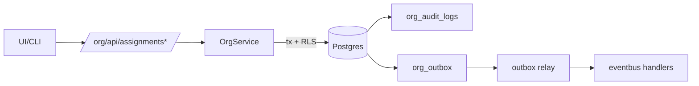

# DEV-PLAN-058：任职管理增强（对齐 050 §10，051 阶段 F）

**状态**: 草拟中（2025-12-20 05:12 UTC）

## 0. 进度速记
- 本计划对齐 050 §10 的“任职管理后续能力清单”，作为 051 阶段 F 的独立里程碑：在不阻塞 053（v1）上线的前提下，分增量交付“任职类型/计划任职/多段任职/历史更正与审计增强”。
- 已有基线能力（当前代码）：
  - Org API 已提供 `/org/api/assignments`（list/create/update/correct/rescind）与 batch command（`assignment.*`）。
  - Correct/Rescind 已复用 025 的冻结窗口与审计落盘；但扩展任职类型目前被禁用（`EnableOrgExtendedAssignmentTypes` 尚未启用）。
  - “计划任职/未来调岗”已可通过 `PATCH /org/api/assignments/{id}`（Insert slice）在单事务内完成：截断旧窗 + 插入新窗（可换岗）。

## 1. 背景与上下文 (Context)
- **需求来源**：
  - 业务需求：`docs/dev-plans/050-position-management-business-requirements.md`（§10）。
  - 实施蓝图：`docs/dev-plans/051-position-management-implementation-blueprint.md`（阶段 F：任职管理增强）。
- **依赖链路（必须对齐）**：
  - `docs/dev-plans/052-position-contract-freeze-and-decisions.md`：状态/口径冻结、System/Managed 策略。
  - `docs/dev-plans/053-position-core-schema-service-api.md`：Assignment v1 的写入口与稳定错误码（本计划不改变 v1 合同，只做增量扩展）。
  - `docs/dev-plans/025-org-time-and-audit.md`：冻结窗口、审计、Correct/Rescind/ShiftBoundary 口径（Assignment 必须复用）。
  - `docs/dev-plans/026-org-api-authz-and-events.md`：Authz/403 payload、outbox、batch、subject_id 映射（Assignment 以此为 SSOT）。
  - `docs/dev-plans/054-position-authz-policy-and-gates.md`：Assignment 的 object/action 与测试门禁（新增能力需补齐）。
  - `docs/dev-plans/059-position-rollout-readiness-and-observability.md`：灰度/回滚/可观测收口（本计划需提供可回退路径）。
- **当前痛点**：
  - 仅支持 `primary` 任职：无法表达“兼任/代理”等业务场景，也无法支持后续 vacancy/time-to-fill 的更精细口径。
  - “计划任职/未来调岗”虽可通过 `PATCH /org/api/assignments/{id}`（Insert slice）原子完成，但缺少单一推荐路径与示例；客户端易误用“直接 Create 未来 primary”导致 409 `ORG_PRIMARY_CONFLICT`，或误解 Insert/Correct 的边界。
  - 多段任职事件缺少明确的数据契约与操作语义（如何表示、如何更正、如何审计对账），后续报表口径会漂移。
- **业务价值**：
  - 以最小增量补齐 050 §10 的任职能力：支持历史/当前/未来任职、同一员工多段任职、任职类型，并确保“可审计、可回滚、可复现”。

## 2. 目标与非目标 (Goals & Non-Goals)
### 2.1 核心目标
- [ ] **任职类型可用**：支持至少“主任职/兼任/代理”（050 §10），并明确默认规则、互斥约束与对占编/统计的影响。
- [ ] **计划任职可用**：允许创建未来生效的任职；提供“调岗/转任职”的原子命令，避免人工拼接导致冲突。
- [ ] **多段任职事件可追溯**：同一员工在同一职位可出现多段任职；列表/时间线可解释；vacancy/time-to-fill 可复用。
- [ ] **历史更正与审计增强**：支持更正历史（Correct）与撤销（Rescind）并保留可追溯审计；冻结窗口策略一致且可灰度（disabled/shadow/enforce）。
- [ ] **门禁与可回滚**：触发的本地门禁可通过；扩展能力具备 feature flag 灰度与快速回退路径（对齐 059）。

### 2.2 非目标（Out of Scope）
- 不实现招聘全链路与招聘事件（本计划的 vacancy/time-to-fill 仍以 Position/Assignment 的时间线推导为准）。
- 不在本计划内引入跨域强耦合（例如直接依赖 HRM domain types）；跨域通过 subject_id 映射与只读字段对齐。

### 2.3 工具链与门禁（SSOT 引用）
> 本节只声明触发器与 SSOT 引用，避免复制命令矩阵导致 drift。

- **触发器清单（本计划预计命中）**：
  - [X] Go 代码（Org service/repo/controller、测试）
  - [ ] 路由治理（仅当新增/调整 `/org/api/assignments*` 等端点时触发；默认不新增路由）
  - [X] Authz（Assignment 扩展能力的 object/action 与测试）
  - [ ] DB 迁移 / Schema（本计划默认不改 schema；若后续确需新增列/约束/索引，需按 Org Atlas+Goose 工具链执行）
  - [X] 文档（本计划更新；readiness 记录以 059 为准）
- **SSOT 链接**：
  - 触发器矩阵与本地必跑：`AGENTS.md`
  - 命令入口：`Makefile`
  - CI 门禁：`.github/workflows/quality-gates.yml`
  - Org 时间/审计：`docs/dev-plans/025-org-time-and-audit.md`
  - Org API/Authz/outbox：`docs/dev-plans/026-org-api-authz-and-events.md`
  - Authz 工作流：`docs/runbooks/AUTHZ-BOT.md`
  - Org 迁移工具链：`docs/dev-plans/021A-org-atlas-goose-toolchain-and-gates.md`

### 2.4 并行实施说明（与 056/057）
- 本计划与 `docs/dev-plans/056-job-catalog-profile-and-position-restrictions.md`、`docs/dev-plans/057-position-reporting-and-operations.md` 采用并行实施；本计划的写入口增量必须以 feature flag/灰度模式保护，避免阻断 053（v1）主链上线。
- **注意事项**：
  - **占编口径不可漂移**：v2 放开 `matrix/dotted` 仅改变“可表达的任职类型”，不改变 v1 的占编/容量/报表口径：`occupied_fte` 仍仅统计 `assignment_type='primary'`（对齐 052/057）。任何变更必须回到 052/057 重新冻结并评审。
  - **与 056 的校验协同**：若 056 在 Assignment 写入口引入 Restrictions 强校验，必须统一复用同一套 `disabled/shadow/enforce` 语义与稳定错误码；并确保缺失主数据/限制配置时不误伤写链路（shadow 记录优先）。
  - **迁移与开关协同**：本计划默认不改 schema；若并行期间确需 schema/约束调整，必须与 056 的迁移排序协同，并提供 059 要求的回滚演练路径（优先开关回滚）。
  - **reason_code 收口归口 059**：不得在 058 中提前把 reason_code 从兼容态直接加严到 enforce；收口策略以 052/059 为准。

## 3. 架构与关键决策 (Architecture & Decisions)
### 3.1 任职以“时间片 + 审计/outbox”作为 SSOT（选定）
- 任职仍使用 Org 的 valid-time 时间片模型（`effective_date/end_date`），并复用 025 的冻结窗口与审计落盘；禁止绕过 service 直接写表（否则无法保证审计/outbox/冻结窗口一致）。



### 3.2 任职类型落地策略（选定：复用现有 `assignment_type` 枚举）
- DB 已允许 `assignment_type in ('primary','matrix','dotted')`；本计划在业务语义上做映射：
  - `primary`：主任职（同一 subject 同窗仅一个 primary，现有排他约束兜底）
  - `matrix`：兼任（允许与 primary 重叠；是否占编由 v1 规则冻结）
  - `dotted`：代理/临时任职（允许与 primary 重叠；默认需显式 end_date 或通过 rescind 截断）
- 若业务最终要求不同命名（例如 `acting`），以“新增值 + 兼容旧值”的方式演进，避免破坏存量数据与审计链路。

### 3.3 计划任职优先复用现有 `assignment.update`（Insert slice）（选定）
- “调岗/转任职/计划任职”本质是对任职时间线做 Insert：在 `effective_date=X` 处截断当前窗并插入新窗。
- 现状：`PATCH /org/api/assignments/{id}` 已实现上述语义（同一事务内完成：截断旧窗 + 插入新窗，可换岗），且与 025/026 的审计/outbox/冻结窗口口径一致。
- 本计划仅补齐：文档冻结、任职类型启用（feature flag）、以及多段任职/计划任职在报表口径上的对齐说明。

## 4. 数据模型与约束 (Data Model & Constraints)
> 以 `modules/org/infrastructure/persistence/schema/org-schema.sql` 为 schema SSOT；本节冻结“本计划需要的最小字段与约束”。

### 4.1 `org_assignments`（扩展字段，v2）
> 说明：若 053 已引入同名字段/约束，以 053 的最终契约为准；058 只追加必要的增量，不重复定义。

- `assignment_type text not null default 'primary'`：任职类型（`primary|matrix|dotted`）。
- `is_primary boolean not null default true`：冗余/对账字段；受 DB check 约束：`(assignment_type='primary') = is_primary`。
- `allocated_fte numeric(9,2) not null default 1.0`：主任职占用 FTE（支持 0.5/1.0 等），用于占编/填充状态与报表（对齐 050 §7.3；v1/v2 默认仅统计 `assignment_type='primary'`）。
- `reason_code/reason_note` 不落在 `org_assignments`：以 025/026 的审计（`org_audit_logs.meta`）作为 SSOT；如未来确需提升导出性能，优先考虑“派生视图/离线汇总”，避免直接把 reason 字段写入业务表导致口径漂移。

**约束（v2）**
- `allocated_fte > 0`（不允许 `0`；计划任职通过“未来 effective_date”表达即可）。
- primary 互斥：`org_assignments_primary_unique_in_time`（同一 subject 同一时间最多一个 primary；对齐 052）。
- 同一 subject/position/assignment_type 时间窗不重叠：`org_assignments_subject_position_unique_in_time`（允许多段，但禁止重叠）。
- 容量校验/占编派生：按 052/053/057 的 v1 口径冻结——仅统计 `assignment_type='primary'`；启用 `matrix/dotted` 不改变占编口径（如需改变，必须先回到 052/057 冻结并评审）。

### 4.2 迁移策略（Up/Down，最小可回退）
- **Up**：
  - 默认不涉及 schema 了解/迁移；主要工作在 service/controller/tests（启用任职类型、补齐语义与对齐口径）。
  - 若后续确需 schema 变更（新增列/索引/约束），必须按 `docs/dev-plans/021A-org-atlas-goose-toolchain-and-gates.md` 执行并提供 Up/Down 与回滚演练。
- **Down（生产优先）**：
  - 优先通过 feature flag 禁用新能力（对齐 059）；避免依赖 schema 回滚。

## 5. 接口契约 (API Contracts)
> 约定：内部 API 前缀 `/org/api`；JSON-only；Authz/403 payload 对齐 026；时间参数支持 `YYYY-MM-DD` 或 RFC3339（统一 UTC）。

### 5.1 现有 Assignment API（v1，作为基线）
- `GET /org/api/assignments?subject=person:{pernr}[&effective_date=...]`：查询任职（as-of 或时间线）
- `POST /org/api/assignments`：创建任职（支持未来 effective_date）
- `PATCH /org/api/assignments/{id}`：Update（新增版本）
- `POST /org/api/assignments/{id}:correct`：Correct（原位更正）
- `POST /org/api/assignments/{id}:rescind`：Rescind（截断 end_date）

### 5.2 变更：开放扩展任职类型（v2）
- `POST /org/api/assignments` 的 `assignment_type` 允许值扩展为 `primary|matrix|dotted`（受 feature flag 控制）。
- `GET /org/api/assignments` 返回中保留 `assignment_type/is_primary` 字段（作为对账口径）。

**错误码（最小集）**
- `422 ORG_ASSIGNMENT_TYPE_DISABLED`：当 feature flag 未开启且请求非 primary。
- `409 ORG_PRIMARY_CONFLICT`：违反 primary 互斥（同一 subject 同窗仅一个 primary）。
- `409 ORG_OVERLAP`：时间窗重叠（例如同一 subject/position/assignment_type overlap）。

### 5.3 说明：原子转任职/未来调岗（复用 `PATCH /org/api/assignments/{id}`）
> “调岗/转任职”不新增端点：直接复用 Assignment Update（Insert slice）的既有合同，避免再造一套 `transfer` contract。

**Payload（示意）**
```json
{
  "effective_date": "2025-03-01",
  "reason_code": "transfer",
  "reason_note": "optional",
  "position_id": "uuid",
  "org_node_id": "uuid|null",
  "allocated_fte": 1.0
}
```

**Result（示意）**
```json
{ "assignment_id": "uuid", "position_id": "uuid", "effective_window": { "effective_date": "...", "end_date": "..." } }
```

### 5.4 计划任职（planned assignments，v2 口径）
- 任职 `effective_date > nowUTC` 即视为“计划任职”；该任职：
  - 不影响 `as-of now` 的占编与填充状态；
  - 会在到达生效日后自动纳入 as-of 统计（无需额外迁移步骤）。
- 备注：对 primary 来说，直接创建未来任职可能因“primary 互斥”失败（409 `ORG_PRIMARY_CONFLICT`）；推荐使用 §5.3 的 Update（Insert slice）在目标生效日自动截断旧窗并插入新窗。
- 报表/看板若需要展示“已计划填补”的空缺，必须明确：
  - “vacant but planned”的判定口径（例如：当前 vacant 且存在未来 primary assignment）；
  - 该口径以 057 的 SSOT 为准，本计划只提供必要查询支撑。

## 6. 核心逻辑与算法 (Business Logic & Algorithms)
### 6.1 任职类型校验（v2）
输入：`assignment_type`
1. 若 `assignment_type=primary`：允许（维持 v1 行为）。
2. 若 `assignment_type!=primary`：
   - 需要启用 feature flag（例如 `EnableOrgExtendedAssignmentTypes=true`）；
   - **不改变占编口径（选定）**：v2 仍仅统计 `assignment_type='primary'` 进入 `occupied_fte/staffing_state/vacancy`（对齐 052/057）。如业务希望 matrix/dotted 计入占编，必须先回到 052/057 重新冻结并评审，同时修改 `SumAllocatedFTEAt` 等实现与对账策略（对齐 059）。

### 6.2 原子转任职（复用 `assignment.update` 的 Insert 语义）
输入：`tenant_id, assignment_id, effective_date, position_id|org_node_id, allocated_fte, reason_code, reason_note`
1. 开启事务并应用租户 RLS（对齐 026）。
2. 冻结窗口校验：`affected_at = effective_date`（对齐 025；Update 属于 Insert 切片）。
3. 锁定并读取 as-of `effective_date` 覆盖的当前 assignment（`FOR UPDATE`）；若 `effective_date` 恰好等于切片起点，返回 422 `ORG_USE_CORRECT`（避免把 Insert 当作 In-place Patch）。
4. 解析目标 position：
   - `position_id`：校验目标 Position 在 as-of `effective_date` 存在；
   - `org_node_id`：校验 Node 在 as-of 存在，且 auto position 开关开启；以 SSOT 算法生成/插入 auto position。
5. 锁定受影响 position slices（old/new，按 position_id 排序避免死锁）；并计算新 position 在 as-of `effective_date` 的 `occupied_fte`（仅 primary）。
6. 容量校验：写入后不得导致 `occupied_fte > capacity_fte`（422 `ORG_POSITION_OVER_CAPACITY`）。
7. 截断旧窗并插入新窗（`effective_date` 起生效）；写审计并 enqueue outbox（对齐 025/026）。

### 6.3 多段任职事件（segments）表示与约束（v2）
- 表示方式：每段任职对应 `org_assignments` 一行时间片 `[effective_date,end_date)`；同一员工在同一职位出现多次任职即为多段时间片（050 §10）。
- 约束策略（最小集）：
  - primary：同一 subject 同窗最多一个（`org_assignments_primary_unique_in_time`）。
  - 非 primary：允许与 primary 重叠；允许跨 position 并行存在多条（matrix/dotted 的业务含义），同一 subject/position/assignment_type 仍禁止 overlap（`org_assignments_subject_position_unique_in_time`）。
  - 多段任职：允许“离开后再回来”的多段（多行），但任一维度禁止时间窗 overlap（由 DB EXCLUDE 兜底）。

## 7. 安全与鉴权 (Security & Authz)
> 以 054 为 SSOT；本节只冻结 endpoint/command → object/action 的最小映射。

- `assignment.create/update`：object=`org.assignments` action=`assign`
- `assignment.correct/rescind`：object=`org.assignments` action=`admin`（历史更正/强治理能力默认高权限）
- `assignment.list`：object=`org.assignments` action=`read`

## 8. 依赖与里程碑 (Dependencies & Milestones)
### 8.1 依赖
- 053：Assignment v1 合同稳定（写入口/错误码/事件）。
- 025/026：冻结窗口、审计、outbox、subject_id 映射。
- 054：Authz 能力与门禁测试。

### 8.2 里程碑（建议拆分为独立增量）
1. [ ] F1：任职类型（primary/matrix/dotted）启用 + 最小测试集 + Authz 对齐
2. [ ] F2：计划任职/原子转任职（复用 `assignment.update` Insert slice）+ 文档/示例/对账查询
3. [ ] F3：多段任职事件回归（同一员工同一职位多段任职）+ 对账查询/导出入口
4. [ ] F4：历史更正审计增强（reason/回放）+ readiness 记录（对齐 059）

## 9. 测试与验收标准 (Acceptance Criteria)
- **正确性**：
  - 主任职互斥可复现：同一 subject 同窗只能存在一个 primary。
  - 转任职原子性：同一 request 内完成“截断旧任职 + 创建新任职”，且审计/outbox 一致。
  - 多段任职可追溯：同一员工在同一职位多段任职可被查询并可用于 vacancy/time-to-fill 推导。
- **门禁**：
  - 触发的门禁按 `AGENTS.md` 执行；涉及 Authz 必跑 `make authz-test && make authz-lint`；如触发 schema 变更按 021A 执行。

## 10. 运维与监控 (Ops & Monitoring)
- **Feature Flag（灰度）**：
  - `EnableOrgExtendedAssignmentTypes`：控制非 primary 类型写入（默认关闭）。
- **结构化日志**：对非 primary 写入、以及“换岗/调岗”（`assignment.update` 且 position_id 发生变化）与冻结窗口拒绝路径输出 `tenant_id, pernr, subject_id, assignment_type, effective_date, error_code`。
- **回滚策略**：优先通过关闭 feature flag 禁用新能力；必要时通过 `assignment.correct` 纠偏未来切片或 `assignment.rescind` 截断（对齐 059 的收口策略）。
