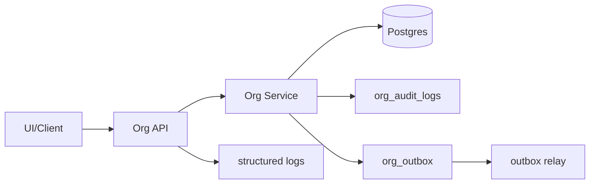

# DEV-PLAN-059：Position 交付收口（Readiness / 回滚 / 可观测性）（对齐 051 收口）

**状态**: 草拟中（2025-12-20 05:30 UTC）

## 0. 进度速记
- 本计划负责把 052-058 的交付收口成“可上线、可回滚、可观测、可复现”的整体：readiness 记录 + 灰度/回滚开关 + 最小冒烟/演示闭环 + 关键指标与审计追溯。
- 收口原则：**先口径冻结、再灰度启用、最后 enforce**；任何强校验/强治理能力必须具备 `disabled/shadow/enforce` 的回退路径（对齐 025 的冻结窗口模式）。

## 1. 背景与上下文 (Context)
- **需求来源**：
  - 业务需求：`docs/dev-plans/050-position-management-business-requirements.md`（effective dating、Correct/Rescind、冻结窗口、FTE、限制、统计与空缺分析）。
  - 实施蓝图：`docs/dev-plans/051-position-management-implementation-blueprint.md`（052-059 拆分与收口门槛；Readiness/回滚/可观测）。
- **依赖链路（必须对齐）**：
  - Contract/口径冻结：`docs/dev-plans/052-position-contract-freeze-and-decisions.md`
  - Position Core：`docs/dev-plans/053-position-core-schema-service-api.md`
  - Authz：`docs/dev-plans/054-position-authz-policy-and-gates.md`
  - UI：`docs/dev-plans/055-position-ui-org-integration.md`
  - 主数据/限制：`docs/dev-plans/056-job-catalog-profile-and-position-restrictions.md`
  - 报表/运营：`docs/dev-plans/057-position-reporting-and-operations.md`
  - 任职增强：`docs/dev-plans/058-assignment-management-enhancements.md`
  - 时间/冻结窗口/审计：`docs/dev-plans/025-org-time-and-audit.md`
  - 事件契约/outbox：`docs/dev-plans/022-org-placeholders-and-event-contracts.md`、`docs/dev-plans/026-org-api-authz-and-events.md`、`docs/dev-plans/017-transactional-outbox.md`
  - 组织范围/性能/运维：`docs/dev-plans/029-org-closure-and-deep-read-optimization.md`、`docs/dev-plans/027-org-performance-and-rollout.md`、`docs/dev-plans/034-org-ops-monitoring-and-load.md`
- **当前痛点**：
  - 变更项分散在多个子计划：如果缺少统一收口清单与复现记录，reviewer 无法判断“是否可上线/可回滚/可定位问题”。
  - 强校验（冻结窗口/冲突拒绝/超编/限制）若直接 enforce，容易误伤兼容链路（System Position/auto position）并造成线上写阻断。
  - 可观测不足会导致“拒绝原因不可定位、审计串不起来、outbox 堆积无法发现”。
- **业务价值**：
  - 形成一套可复跑的 readiness 记录 + 冒烟闭环脚本，让 Position 交付满足“可验证、可演示、可回退、可运维”的工程化上线门槛。

## 2. 目标与非目标 (Goals & Non-Goals)
### 2.1 核心目标
- [ ] **readiness 可复现**：关键门禁命令、结果与时间戳有记录，reviewer 可复跑（对齐 CI 门禁口径）。
- [ ] **灰度与回滚可执行**：关键写入口与强校验具备灰度/禁写/只读等最小回退路径，并明确不可逆点（优先“开关回滚”，避免依赖 destructive down）。
- [ ] **兼容性回归**：System/Managed 策略不破坏存量链路；口径映射在 UI/API/统计中一致（对齐 052 冻结）。
- [ ] **可观测可排障**：Correct/Rescind/冻结窗口拒绝/超编阻断/冲突拒绝等关键路径可通过结构化日志 + 审计 + outbox 追溯定位。
- [ ] **最小冒烟闭环可演示**：在单租户环境完成“创建/变更/更正/撤销/查询/统计/空缺”最小链路，并把请求/结果写入 readiness 记录。

### 2.2 非目标（Out of Scope）
- 不在本计划内新增大范围业务能力；本计划只做“收口与上线门槛”，不引入与 050 无关的新功能。
- 不在本计划内建设长期 BI/告警体系；只交付最小可观测与排障入口（与 034 对齐）。

## 2.3 工具链与门禁（SSOT 引用）
> 目的：避免在 dev-plan 中复制工具链细节导致 drift；本节只声明“本计划命中哪些触发器/工具链”并引用 SSOT。

- **触发器清单（本计划预计命中）**：
  - [X] Go 代码（Position/Assignment/Reports/ops 相关实现与测试）
  - [X] DB 迁移 / Schema（Org Atlas+Goose；若子计划引入 schema 变更）
  - [X] Authz（Position/Assignment/Reports 的 object/action、策略碎片与测试门禁）
  - [X] Outbox（Position/Assignment 事件必须通过 outbox 落盘投递）
  - [X] 路由治理（新增/调整 API 时需对齐 routing 策略）
  - [ ] `.templ` / Tailwind（仅当 055/Position UI 触发）
  - [ ] 多语言 JSON（仅当新增/修改 locales）
  - [X] 文档（本计划与 readiness 记录）
- **SSOT 链接**：
  - 触发器矩阵与本地必跑：`AGENTS.md`
  - 命令入口：`Makefile`
  - CI 门禁：`.github/workflows/quality-gates.yml`
  - Org 工具链：`docs/dev-plans/021A-org-atlas-goose-toolchain-and-gates.md`
  - Authz 流程：`docs/runbooks/AUTHZ-BOT.md`
  - Outbox 与排障：`docs/runbooks/transactional-outbox.md`

## 3. 架构与关键决策 (Architecture & Decisions)
### 3.1 收口分层：模块开关 / 能力开关 / 校验模式（选定）
- **模块级灰度（已存在，复用 027）**：按租户 allowlist 启用 Org（含 Position）：
  - `ORG_ROLLOUT_MODE` + `ORG_ROLLOUT_TENANTS`（一键下线与逐租户灰度）。
- **能力级灰度（建议）**：Position/Assignment/Reports 的高风险能力（Correct/历史改动/限制强校验/扩展任职类型/转任职）必须可单独开关。
- **校验模式三态（选定）**：所有强校验统一采用 `disabled/shadow/enforce`：
  - `disabled`：不校验（仅用于紧急止血/回滚）
  - `shadow`：不阻断，但必须写审计/日志（用于观察与评估误伤）
  - `enforce`：阻断并返回稳定错误码

### 3.2 Readiness 记录作为 SSOT（选定）
- 本系列收口 readiness 记录统一落盘：`docs/dev-records/DEV-PLAN-051-READINESS.md`。
- 记录要求：
  - 必须包含：环境要素（Go/PG 版本、DB、tenant）、开关配置、关键门禁命令与结果、最小冒烟步骤与响应摘要。
  - 禁止“只写结论不写命令”；reviewer 必须能按记录复跑得到一致结论。

### 3.3 可观测链路：request_id → audit → outbox（选定）

- `request_id` 必须贯穿：API 响应、日志、审计（`org_audit_logs.request_id`）、事件（outbox payload/headers）。
- 任何“拒绝/阻断”必须可定位到：错误码 + 关键字段（tenant、entity、effective_date、change_type、mode）。

## 4. Readiness 记录与最小冒烟（Contract）
### 4.1 Readiness 记录模板（v1）
`docs/dev-records/DEV-PLAN-051-READINESS.md` 至少包含：
1. 本次交付范围（涉及哪些子计划：053/054/055/056/057/058）
2. 开关与配置（env + 租户级 settings；含 `disabled/shadow/enforce` 的模式）
3. 本地门禁命令（按 `AGENTS.md` 触发器矩阵；记录命令/结果/时间戳）
4. 最小冒烟闭环（见 §4.2）：请求/响应摘要 + 关联 request_id
5. 回滚演练：至少一次“开关回滚”或“禁写回退”演练记录

### 4.2 最小冒烟闭环（v1，执行时填写）
> 目标：覆盖 050 的关键治理链路，并对齐 051 的“可演示/可回滚/可观测”门槛；具体 API 以 053/057/058 的最终合同为准。

- Position：
  - 创建（Managed）→ Update（新版本）→ Correct（原位更正）→ Rescind（撤销/截断）
- Assignment：
  - 占用/释放（FTE）→ 计划任职（未来生效，若 058 落地）→ 转任职（若落地）
- 查询：
  - as-of 查询（Position/Assignment）→ 时间线查询（Position/Assignment）
- 报表（若 057 落地）：
  - 编制汇总（FTE）→ vacancies 列表 → time-to-fill（基础）
- 可观测：
  - 对任一 Correct/Rescind/拒绝路径：能从 response/request_id 找到对应审计与 outbox 事件（或 shadow 记录）。

## 5. 回滚与灰度（Rollout & Rollback）
### 5.1 回滚优先级（选定）
1. **开关回滚（优先）**：从 `ORG_ROLLOUT_TENANTS` 移除租户或切 `ORG_ROLLOUT_MODE=disabled`。
2. **校验降级**：把高风险校验从 `enforce` 切回 `shadow`/`disabled`（保留审计告警）。
3. **禁写/只读**：对 Position/Assignment 写入口启用只读（如实现）；保留查询与审计。
4. **数据回滚（最后手段）**：仅在有 manifest/明确范围时执行（对齐 023/031 的“默认 dry-run + 可回滚”口径）。

### 5.2 不可逆点清单（必须明确）
- schema 破坏性变更（drop/rename/类型缩窄）在生产环境不可依赖 down 回滚；必须以兼容期/双写/开关回滚替代。
- audit/outbox 属于可追溯链路：历史审计不删除；回滚只能通过新事件/新更正补偿。

## 6. 可观测性（Observability）
- **结构化日志（最低字段）**：
  - `request_id`, `tenant_id`, `initiator_id`, `change_type`, `entity_type`, `entity_id`, `effective_date`, `mode`, `error_code`
- **关键指标（建议纳入 034 Prometheus）**：
  - `org_position_write_total{op,result}`、`org_assignment_write_total{op,result}`
  - `org_position_validation_shadow_total{kind}`（shadow 模式命中计数）
  - `outbox_pending{table=\"public.org_outbox\"}`（复用 017/034）
- **审计追溯**：
  - 必须能按 `request_id` 查询 `org_audit_logs`，并从 `meta` 看见 `freeze_mode/freeze_violation`、限制冲突等关键上下文（对齐 025/056/057/058）。

## 7. 依赖与里程碑 (Dependencies & Milestones)
- **依赖**：`DEV-PLAN-053/054/055/056/057/058` 的核心交付完成（或明确 scope 缩减）；并对齐 025/026 的冻结窗口、审计与 outbox。
- **里程碑**：
  1. [ ] readiness 记录落盘：创建 `docs/dev-records/DEV-PLAN-051-READINESS.md` 并补齐模板项
  2. [ ] 灰度/回滚开关到位：至少包含模块开关 + 关键校验模式切换
  3. [ ] 可观测收口：日志字段/指标/审计链路可追溯
  4. [ ] 最小冒烟跑通并记录（含 request_id 追溯）

## 8. 测试与验收标准 (Acceptance Criteria)
- readiness 记录可复现：关键门禁与冒烟步骤可按记录复跑。
- 强校验具备回退路径：从 `enforce → shadow/disabled` 可在不回滚代码/不改库的情况下止血。
- 关键拒绝可定位：任一拒绝/冻结窗口阻断/冲突拒绝能在日志+审计中定位原因与影响范围。

## 9. 交付物
- `docs/dev-records/DEV-PLAN-051-READINESS.md`（收口记录，含门禁/冒烟/回滚演练）。
- 回滚/灰度/兼容策略清单（含不可逆点说明与回退优先级）。
- 可观测性清单与落地要求（日志字段/指标/outbox 排障入口）。
