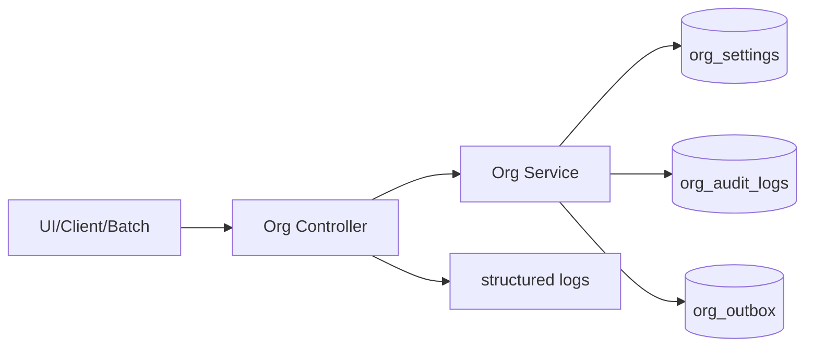

# DEV-PLAN-059A：Position 收口补齐（`reason_code_mode` + Readiness 冒烟/回滚/追溯）

**状态**: 实施中（核心能力与门禁已落地；线上 rollout 演练待执行，2025-12-21）

## 0. 进度速记
- 本计划是 [DEV-PLAN-059](059-position-rollout-readiness-and-observability.md) 的补齐子计划：落地 `org_settings.reason_code_mode`（三态灰度）并把 Readiness 记录补齐到“可复跑冒烟 + 可回滚演练 + 可追溯证据”的门槛。
- 约束：遵循 Contract First；工具链与命令入口以 SSOT 为准（见 §2.3）。
- 当前进度：已完成 schema+服务层落地+审计 meta 统一、补齐 059A 集成冒烟测试与 `scripts/org/059A_smoke.sh`；并完成 Org 工具链 plan/lint/migrate up/down（隔离 DB）回填。

## 1. 背景与上下文 (Context)
- 上游依赖（已完成）：
  - 契约冻结：`docs/dev-plans/052-position-contract-freeze-and-decisions.md`
  - Core/API：`docs/dev-plans/053-position-core-schema-service-api.md`
  - Authz：`docs/dev-plans/054-position-authz-policy-and-gates.md`
  - UI：`docs/dev-plans/055-position-ui-org-integration.md`
  - 主数据/限制：`docs/dev-plans/056-job-catalog-profile-and-position-restrictions.md`
  - 报表/运营：`docs/dev-plans/057-position-reporting-and-operations.md`
  - 任职增强：`docs/dev-plans/058-assignment-management-enhancements.md`
- 当前缺口（阻塞 059 验收）：
  1. 线上 rollout 演练与证据回填尚未完成（对齐 059 的上线/观测口径）。

## 2. 目标与非目标 (Goals & Non-Goals)
### 2.1 核心目标
- [X] 落地租户级 `org_settings.reason_code_mode`（`disabled|shadow|enforce`，默认 `shadow`），并在 Position/Assignment/Restrictions 等写入口统一生效。
- [X] 明确 `shadow/enforce` 的兼容期语义：`shadow` 自动补 `legacy`，`enforce` 缺失则返回 400 `ORG_INVALID_BODY`（对齐 059 §4.2）。
- [X] 为缺失/填充行为补齐可观测证据：审计 `meta` 字段补齐（`reason_code_mode/original_missing/filled`）。
- [X] 补齐 `docs/dev-records/DEV-PLAN-051-READINESS.md`：开关矩阵、最小冒烟步骤（含固定 request_id）、回滚演练记录、追溯 SQL 结果摘要。
- [X] 提供可复跑的“最小冒烟脚本/步骤”规范（优先脚本化，便于 reviewer 复跑）。

### 2.2 非目标（Out of Scope）
- 不新增 050/051 范围外的业务能力；不改变 052 的业务口径冻结。
- 不在本计划内引入新的告警平台或长期 BI/仪表盘；仅补齐最小可观测与复现链路（对齐 059/034）。

## 2.3 工具链与门禁（SSOT 引用）
> 本节只声明“触发器命中项 + SSOT 链接”，不复制命令矩阵；命令细节以 `AGENTS.md`/`Makefile`/`.github/workflows/quality-gates.yml` 为准。

- **触发器清单（本计划预计命中）**：
  - [X] Go 代码（reason_code 校验与审计/日志、测试）
  - [X] DB 迁移 / Schema（Org Atlas+Goose：新增 `org_settings.reason_code_mode`）
  - [X] 文档（059A + readiness 记录补齐）
  - [ ] Authz（仅当新增“治理 object”或新增管理入口权限；本计划默认不扩展权限模型）
  - [ ] 路由治理（默认不新增路由；若新增 smoke endpoint/ops endpoint 则必须对齐 018）
- **SSOT 链接**：
  - 触发器矩阵与本地必跑：`AGENTS.md`
  - 命令入口：`Makefile`
  - CI 门禁：`.github/workflows/quality-gates.yml`
  - Org 工具链：`docs/dev-plans/021A-org-atlas-goose-toolchain-and-gates.md`
  - Outbox 与排障：`docs/runbooks/transactional-outbox.md`

## 3. 架构与关键决策 (Architecture & Decisions)
### 3.1 架构图（Mermaid）


### 3.2 统一校验入口（选定）
- `reason_code_mode` 的判定与缺省填充必须在**服务层**统一处理（避免 UI/API/Batch 各自校验造成漂移）。
- `shadow/enforce` 的行为必须与 059 §4.2 完全一致，且可逐租户配置（DB）。

### 3.3 可观测最小口径（选定）
- `request_id` 贯穿链路：API 响应 + 结构化日志 +（成功写入的）审计 + outbox payload（现状事件模型已包含 `request_id`）。
- 对于“缺失 reason_code”的处理：
  - `shadow`：允许写入，但必须在审计 `meta` 和日志标记“被填充/原始缺失”。
  - `enforce`：拒绝写入，返回 400；必须在结构化日志中标记 `error_code=ORG_INVALID_BODY` 与 `reason_code_mode=enforce`（用于线上定位与评估误伤）。

## 4. 数据模型与约束 (Data Model & Constraints)
### 4.1 `org_settings.reason_code_mode`（已新增，租户级）
- 位置：`org_settings`
- 类型：`text`
- 约束：`NOT NULL`，`CHECK (reason_code_mode IN ('disabled','shadow','enforce'))`
- 默认值：`shadow`

迁移策略（SSOT）：
- 新增 Org Goose migration（`migrations/org/*.sql`）并同步 schema SSOT：`modules/org/infrastructure/persistence/schema/org-schema.sql`。
- 生产环境回滚优先通过“降级到 shadow/disabled”实现；不依赖 destructive down（对齐 059 §6）。

### 4.2 DDL（v1，精确到可迁移）
> 说明：以下为合同级 DDL 形状；具体 migration 文件名以新增时间戳为准，并需同步 schema SSOT。

```sql
ALTER TABLE org_settings
  ADD COLUMN IF NOT EXISTS reason_code_mode text NOT NULL DEFAULT 'shadow';

DO $$
BEGIN
  IF NOT EXISTS (
    SELECT 1 FROM pg_constraint WHERE conname = 'org_settings_reason_code_mode_check'
  ) THEN
    ALTER TABLE org_settings
      ADD CONSTRAINT org_settings_reason_code_mode_check
      CHECK (reason_code_mode IN ('disabled','shadow','enforce'));
  END IF;
END $$;
```

## 5. 接口契约 (API Contracts)
> 标准：不新增路由/不改变 payload 形状；本节只冻结“缺失 reason_code 的行为与错误码”，避免 UI/API/Batch 漂移。

### 5.1 适用写入口（v1 选定）
本计划覆盖以下入口的 `reason_code` 行为（不改变 URL/形状，只补齐“缺失时怎么处理”的合同）：
- Position：Create/Update/Correct/Rescind/ShiftBoundary（`/org/api/positions*` 与 UI 写入口）
- Assignment：Create/Update（Insert slice）/Correct/Rescind（`/org/api/assignments*` 与 UI 写入口）
- Position Restrictions：`/org/api/positions/{id}:set-restrictions`

> 说明：Job Catalog/Profile 的维护 API 目前不携带 `reason_code`；如后续要把主数据维护也纳入 reason_code 强制治理，需另立 dev-plan 冻结接口形状与审计口径，避免在 059A 扩大范围导致漂移。

### 5.2 输入字段（v1）
- `reason_code`：trim 后字符串；在 `enforce` 下必须非空。
- `reason_note`：可选；trim 后为空视为 nil。

### 5.3 返回与错误码（v1，冻结）
- 当 `reason_code_mode=enforce` 且 `reason_code` 缺失/为空：
  - HTTP 400
  - `code=ORG_INVALID_BODY`
  - `meta.request_id` 必须存在（由现有 APIError 结构保证）
- 当 `reason_code_mode=shadow` 且 `reason_code` 缺失/为空：
  - 写入被允许；
  - 服务层将 `reason_code` 视为 `legacy`（兼容期）；
  - 必须在审计与日志打点（见 §6/§10）。
- 当 `reason_code_mode=disabled` 且 `reason_code` 缺失/为空：
  - 写入被允许；
  - 不填充 `legacy`（保留输入原样，避免影响分析与调用方行为）；
  - 必须在审计 `meta` 标记 `reason_code_mode=disabled` 与 `reason_code_original_missing=true`（便于区分调用方是否提供 reason_code）。

## 6. 核心逻辑与算法 (Business Logic & Algorithms)
### 6.1 `NormalizeReasonCode`（服务层统一算法，v1）
> 目的：消除各入口“缺失 reason_code 时到底是填充/拒绝/放行”的分叉。

伪代码（合同级）：
1. `raw := strings.TrimSpace(inputReasonCode)`
2. `missing := (raw == "")`
3. `mode := normalizeValidationMode(settings.ReasonCodeMode)`（`disabled|shadow|enforce`；默认 `shadow`）
4. 分支：
   - `mode=enforce && missing`：返回 `ServiceError(400, ORG_INVALID_BODY, "reason_code is required")`（不写审计、不写 outbox）
   - `mode=shadow && missing`：`reason_code="legacy"`，并返回 `metaFlags={reason_code_mode:"shadow", reason_code_filled:true, reason_code_original_missing:true}`
   - `mode=disabled && missing`：`reason_code=""`，返回 `metaFlags={reason_code_mode:"disabled", reason_code_original_missing:true}`
   - 非 missing：`reason_code=raw`，返回 `metaFlags={reason_code_mode:mode, reason_code_original_missing:false}`

### 6.2 审计 `meta` 字段（v1，最小集）
对所有“成功写入并产生审计”的写入口，必须在 `org_audit_logs.meta` 中补齐：
- `reason_code`（现状已有写入）
- `reason_note`（现状已有写入）
- `reason_code_mode`：`disabled|shadow|enforce`
- `reason_code_original_missing`：`true|false`
- `reason_code_filled`：`true|false`（仅当 shadow 且填充发生时为 true）

> 说明：冻结窗口相关字段（`freeze_mode/freeze_violation/...`）继续由 025 的审计逻辑写入；本计划不改变其口径。

## 7. 安全与鉴权 (Security & Authz)
- 本计划不新增新的 Authz object/action；所有写入口仍沿用现有 `ensureOrgAuthz/ensureOrgAuthzUI` 与 054 的策略碎片边界。
- `reason_code_mode` 为“租户级校验策略”，不提供“按用户绕过”的能力（对齐 054：冻结窗口/强治理不提供用户级 bypass）。

## 8. 依赖与里程碑 (Dependencies & Milestones)
### 8.1 依赖
- 收口基线：`docs/dev-plans/059-position-rollout-readiness-and-observability.md`
- 上游实现：`docs/dev-plans/053-position-core-schema-service-api.md`、`docs/dev-plans/056-job-catalog-profile-and-position-restrictions.md`、`docs/dev-plans/058-assignment-management-enhancements.md`
- 审计/冻结窗口：`docs/dev-plans/025-org-time-and-audit.md`
- Outbox：`docs/dev-plans/017-transactional-outbox.md`

### 8.2 里程碑（v1）
1. [X] Schema：新增 `org_settings.reason_code_mode`（migration + schema SSOT 同步）；按 Org 工具链完成 plan/lint/migrate 验证（SSOT：021A/Makefile）。
2. [X] Repository：`GetOrgSettings` 读取并返回 `reason_code_mode`（含无行时的默认值）。
3. [X] Service：统一落地 `NormalizeReasonCode` 并覆盖 Position/Assignment/Restrictions 的写入口。
4. [X] 审计：成功写入时补齐 `meta.reason_code_mode/reason_code_original_missing/reason_code_filled`。
5. [X] 冒烟脚本：新增 `scripts/org/059A_smoke.sh`（或等价脚本），按 059 §5.2 覆盖最小闭环，且每步固定 `X-Request-ID`。
6. [X] Readiness：补齐 `docs/dev-records/DEV-PLAN-051-READINESS.md`（开关矩阵、冒烟步骤、追溯证据、回滚演练）。
7. [X] 门禁：按触发器矩阵执行并回填 readiness（命令/结果/时间戳）。

### 8.3 交付物 (Deliverables)
- `docs/dev-plans/059A-position-rollout-reason-code-mode-and-readiness-smoke.md`（本文件）
- `migrations/org/*.sql` + `modules/org/infrastructure/persistence/schema/org-schema.sql`：新增 `org_settings.reason_code_mode`
- Go 实现：统一 reason_code_mode 校验与填充 + 审计/日志标记 + 最小测试集
- 集成冒烟测试：`modules/org/services/org_059a_reason_code_mode_integration_test.go`
- `docs/dev-records/DEV-PLAN-051-READINESS.md`：补齐并回填证据
- `scripts/org/059A_smoke.sh`（建议交付）：最小冒烟可复跑入口

## 9. 测试与验收标准 (Acceptance Criteria)
### 9.1 自动化测试（最小集，v1）
- `reason_code_mode=shadow`：缺失 `reason_code` 的写入成功，且审计 `meta.reason_code='legacy'` 且 `meta.reason_code_filled=true`。
- `reason_code_mode=enforce`：缺失 `reason_code` 的写入返回 400 `ORG_INVALID_BODY`（至少覆盖 Position 与 Assignment 各一个入口）。
- `reason_code_mode=disabled`：缺失 `reason_code` 的写入成功，且审计 `meta.reason_code_mode='disabled'`、`meta.reason_code_original_missing=true`，同时 `meta.reason_code` 保持为空（不填充 `legacy`）。

### 9.2 Readiness（v1）
- `docs/dev-records/DEV-PLAN-051-READINESS.md` 按 §8.2 补齐：包含开关矩阵、冒烟步骤、追溯证据、回滚演练。

### 9.3 门禁（执行时回填）
- 命中触发器按 `AGENTS.md` 执行，并将“命令/结果/时间戳”回填到 readiness 记录。

## 10. 运维与监控 (Ops & Monitoring)
### 10.1 回滚策略（优先级，v1）
1. 模块级回滚：`ORG_ROLLOUT_MODE=disabled` 或将租户从 `ORG_ROLLOUT_TENANTS` 移除（对齐 059/027）。
2. 校验降级：将 `org_settings.reason_code_mode` 从 `enforce → shadow/disabled`（逐租户止血）。

### 10.2 结构化日志最低字段（v1）
对 “reason_code 缺失且被处理” 的路径，日志必须可定位到：
- `http.request_id`（已存在）
- `tenant_id`（调用方/控制器已有上下文；若当前日志体系未输出，则需在实现中补齐）
- `error_code`（当为 `enforce` 拒绝时）
- `reason_code_mode`、`reason_code_original_missing`、`reason_code_filled`

### 10.3 追溯 SQL（复用 059 §3.3）
- 成功写入：按 `org_audit_logs.request_id` 追溯审计；按 `org_outbox.payload->>'request_id'` 追溯事件。
- 拒绝写入：无审计/outbox；必须依赖日志（与 request_id 一致）定位拒绝原因。
