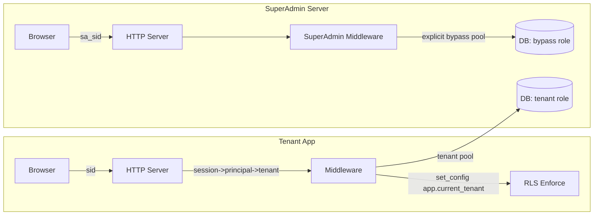

# DEV-PLAN-088A：V4 SuperAdmin 控制面认证与会话（与租户登录链路解耦）

**状态**: 草拟中（2026-01-05 08:00 UTC）

> 适用范围：**全新实现的 V4 新代码仓库（Greenfield）**。  
> 上游依赖：`DEV-PLAN-088`（V4 租户管理与登录认证总体方案）、`DEV-PLAN-081`（v4 RLS 推进）、`DEV-PLAN-019D`（控制面边界与回滚理念）。  
> 目标：把 “SuperAdmin 控制面” 的认证/会话/旁路能力收口成一个清晰、可回滚、可审计的边界，避免在 V4 早期引入第二套隐式认证模型。

## 1. 背景与现状（输入）

现仓库已有独立部署的 superadmin server（见 `docs/SUPERADMIN.md`）：
- 运行于独立入口与路由空间，加载更少模块。
- 使用与主应用相同的会话机制（`sid`），并通过 `user.type == superadmin` 做全局拦截。
- 与主应用共享同一 DB 与环境配置。

V4（Greenfield）将重构租户/认证/RLS，并要求：
- tenant app：`Host 解析 tenant（fail-closed）→ Kratos 认人 → 本地 session（sid）→ RLS 圈地 → Casbin 管事`（见 `DEV-PLAN-088`）。
- 控制面：跨租户高风险操作必须在独立边界，且 RLS 旁路必须显式（见 `DEV-PLAN-019D/019A`、`DEV-PLAN-081`）。

## 2. 目标与非目标

### 2.1 目标（Goals）
- [ ] **认证链路解耦**：SuperAdmin 不复用 tenant app 的 `sid` cookie；使用独立 cookie 名与独立 session 事实源。
- [ ] **显式旁路**：SuperAdmin 访问启用 RLS 的业务表时，必须通过独立 DB role/连接池（或 BYPASSRLS role）实现旁路；tenant app 永远不可获得该连接。
- [ ] **可回滚**：认证故障时，能降级到“环境级保护 + 只读/停写”，而不是引入 legacy 分支。
- [ ] **可审计**：所有跨租户写操作必须记录审计事件（最小字段即可：who/when/what/target_tenant）。
- [ ] **Bootstrap 可用**：在没有任何租户/用户数据时，也能创建第一个 superadmin 并登录进入控制面。

### 2.2 非目标（Non-Goals）
- 不在本计划内交付：企业 SSO（Jackson）、MFA、SCIM、复杂权限委派。
- 不在本计划内解决：运营监控/告警体系（保持早期阶段“不过度运维”原则）。

## 3. 关键决策（ADR 摘要）

### 3.1 决策 1：SuperAdmin 使用独立会话 cookie（`sa_sid`）
- 选择：控制面用 `sa_sid`（host-only cookie），tenant app 用 `sid`。
- 理由：消除“带着 tenant session 误入控制面”的偶然复杂度；并降低 middleware 复用导致的隐式耦合。

### 3.2 决策 2：SuperAdmin 不依赖 Host→tenant 解析
- 选择：控制面不做 tenant 解析；跨租户操作必须显式携带 `target_tenant_id`（路径或表单字段）。
- 理由：SuperAdmin 的本质是“跨租户操作”，把 tenant 解析留在 tenant app，可避免串租户风险模型混杂。

### 3.3 决策 3：`sessions`（tenant app）不启用 RLS；控制面会话独立
- 选择：tenant app 的 `sessions` 不启用 RLS（避免“先有 tenant 才能取 session”的循环）；控制面另建 `superadmin_sessions`，同样不启用 RLS。
- 理由：会话查找必须发生在 tenant 注入之前；RLS 适用于业务表，而非 session 表。

## 4. 架构与边界

### 4.1 组件图（Mermaid）

### 4.2 模块落位（对齐 `DEV-PLAN-082/083/088`）
- 推荐放在平台 `modules/iam` 内：
  - `modules/iam/domain/superadmin/`：`SuperAdminPrincipal`、`SuperAdminSession`、审计事件值对象。
  - `modules/iam/presentation/superadmin/`：控制面登录页与租户管理 UI/API。
  - `modules/iam/infrastructure/persistence/`：superadmin repo 使用 **bypass 连接池**。
- HR 业务域模块不依赖任何 superadmin 类型；仅依赖 `pkg/**` 的 tenancy/rls/authz 契约。

## 5. 数据模型（V4 新仓库建议）

> 本节是新仓库的目标态 schema 草案；实际建表前需用户确认（本仓库规则）。

- `superadmin_principals`
  - `id uuid pk`
  - `email text not null unique`
  - `display_name text null`
  - `status text not null`（`active|disabled`）
  - `kratos_identity_id uuid null unique`（若采用 Kratos；若 MVP 先 BasicAuth，可为空）
  - `created_at/updated_at timestamptz`

- `superadmin_sessions`
  - `token text pk`
  - `principal_id uuid not null`
  - `expires_at timestamptz not null`
  - `ip text null`、`user_agent text null`
  - `created_at timestamptz not null`

- `superadmin_audit_logs`（最小审计）
  - `id uuid pk`
  - `principal_id uuid not null`
  - `action text not null`（例如 `tenant.create` / `tenant.disable`）
  - `target_tenant_id uuid null`
  - `payload jsonb not null`（必须过滤 secret/token/cookie）
  - `created_at timestamptz not null`

## 6. 认证方案（分阶段，避免“一口吃成胖子”）

### 6.1 Phase 0（MVP）：环境级保护 + 只读/停写开关
- 入口保护：反代 BasicAuth / 内网访问 / IP allowlist（三选一或组合）。
- 优点：实现最小、回滚最直接；适合 Greenfield 早期。
- 缺点：不可审计到用户粒度；无法做细粒度授权。
- 停止线：任何需要跨租户写的功能，在没有 `principal_id` 审计前不得上线。

### 6.2 Phase 1（推荐）：Kratos 认人 + 控制面本地会话（`sa_sid`）
- SuperAdmin 登录：
  - `GET /superadmin/login`
  - `POST /superadmin/login`：Kratos login flow（server-side）→ whoami → upsert `superadmin_principals` → create `superadmin_sessions` → set `sa_sid`
- 登出：
  - `POST /superadmin/logout`：删除 `superadmin_sessions`（可选同时调用 Kratos logout）
- 重要约束：
  - SuperAdmin 入口必须是独立 host（例如 `superadmin.<apex>`），避免与 tenant 域名混用。
  - `sa_sid` cookie 必须 host-only；不得设置为 apex Domain，避免被租户站点携带。

### 6.3 Phase 2（可选）：接入企业 SSO（Jackson）
单独出计划（例如 088B），并在 Tenant Console 中管理 superadmin 的 SSO 连接与回滚策略；不在本计划内展开。

## 7. 路由、失败路径与回滚

### 7.1 路由（最小集）
- `GET /superadmin/login`
- `POST /superadmin/login`
- `POST /superadmin/logout`
- `GET /superadmin/tenants`
- `POST /superadmin/tenants`
- `POST /superadmin/tenants/{tenant_id}/disable|enable`

### 7.2 失败路径（必须显式）
- `sa_sid` 无效/过期：统一 302 到 `/superadmin/login`（或 401 for API）。
- bypass DB pool 不可用：控制面进入“只读/停写”模式，并给出明确错误提示；不得自动降级为 tenant pool（避免旁路消失导致误判）。

### 7.3 回滚策略
- Phase 1 回滚到 Phase 0：
  - 禁用 `/superadmin/login`（或让其恒返回 404），仅保留环境级保护入口。
  - 所有写操作强制 `SUPERADMIN_WRITE_MODE=disabled`（kill switch）。
  - 数据不回滚：保留 `superadmin_principals/sessions/audit_logs`，仅停止链路使用。

## 8. 测试与验收（100% 覆盖率门禁）

- 单元测试：
  - `sa_sid` cookie 生成与属性（host-only、httpOnly、sameSite）。
  - session 校验与过期、登出幂等。
  - 写操作必须产生日志（audit log）且过滤敏感字段。
- 集成测试：
  - bypass pool 与 tenant pool 严格分离：tenant app 代码路径不可拿到 bypass pool。
  - 当启用 RLS 的业务表被访问时：tenant pool 必须被圈地；bypass pool 可以跨租户读写（仅在 superadmin 路径）。

## 9. Simple > Easy Review（DEV-PLAN-045，自评）

### 结构（解耦/边界）
- 通过：用独立 cookie + 独立 session 表把控制面与数据面解耦；旁路能力仅在 superadmin 边界存在。
- 警告：若试图复用 tenant app 的 session/middleware，会快速引入“隐式 tenant 依赖”，应坚持边界隔离。

### 演化（规格/确定性）
- 通过：分阶段落地（Phase 0→1），每步都有可验证输出与回滚开关。

### 认知（本质/偶然复杂度）
- 通过：复杂度来自真实风险（跨租户旁路/审计/回滚），没有为“未来可能”引入多余抽象。

### 维护（可理解/可解释）
- 通过：控制面主流程可一句话描述：`sa_sid` 认证 → bypass pool 执行跨租户操作 → 写入审计。

