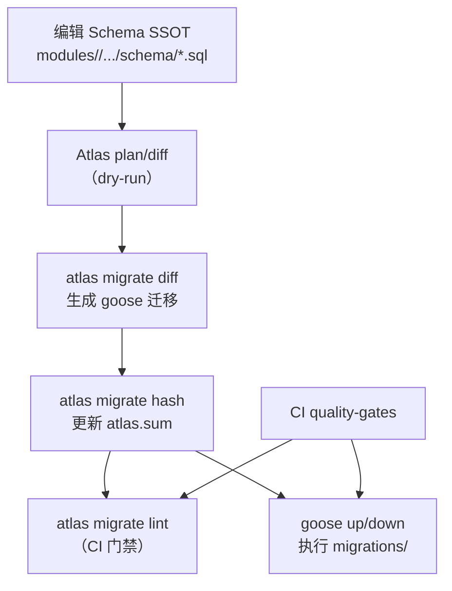

# DEV-PLAN-090：V4 Atlas + Goose 闭环指引（模块级 schema→迁移→门禁）

**状态**: 草拟中（2026-01-05 08:30 UTC）

## 1. 背景与上下文 (Context)

`DEV-PLAN-077`～`DEV-PLAN-089` 已冻结 v4 方向：Greenfield（全新实施）、DB Kernel（权威）、Go Facade（编排）、One Door Policy（唯一写入口），并在仓库内已有可复用的 Atlas+Goose 基线（Person/Org）。

为保证 v4 新模块（见 `DEV-PLAN-083`）在最早期即可做到 **“schema 变更可规划、迁移可生成、可回滚、CI 可拦截漂移”**，本计划提供一份可执行的 Atlas+Goose 闭环指引，并冻结“模块级受控目录”的统一口径。

## 2. 目标与非目标 (Goals & Non-Goals)

### 2.1 核心目标
- [ ] **闭环统一**：对 v4 模块提供统一的“Schema SSOT → Atlas plan/lint → Goose apply”闭环指引与验收标准。
- [ ] **模块级隔离**：每个 v4 模块拥有独立迁移目录与独立 goose 版本表，避免跨模块串号与门禁误触发。
- [ ] **命名与目录冻结**：冻结 `atlas.hcl` env 命名、migrations 目录命名、goose 版本表命名，降低实施期沟通成本。
- [ ] **Makefile/CI 对齐**：新增模块的入口与 CI 门禁以 `Makefile`/`.github/workflows/quality-gates.yml` 为 SSOT，对齐现有 Person/Org 样板。
- [ ] **失败路径明确**：常见故障（hash 漂移、stub 缺失、版本表冲突、破坏性变更等）提供明确处理路径，避免“凭经验修库”。

### 2.2 非目标（明确不做）
- 不在本计划内新增/修改任意业务表结构（`CREATE TABLE` 等 schema 变更由各子域实现计划承接）。
- 不在本计划内把所有模块强行合并到同一个 migrations/env（避免漂移与门禁耦合）。
- 不在本计划内引入新的迁移工具或替换 Atlas/Goose（版本冻结见 `DEV-PLAN-087`）。

## 2.3 工具链与门禁（SSOT 引用）
> 本文不复制仓库“触发器矩阵/命令清单/CI 脚本”，仅给出入口与约束；细节以 SSOT 为准。

- 触发器矩阵与红线：`AGENTS.md`
- 命令入口：`Makefile`
- CI 门禁：`.github/workflows/quality-gates.yml`
- Atlas 配置：`atlas.hcl`
- Goose runner：`scripts/db/run_goose.sh`
- 现有样板（强烈建议先读）：`docs/runbooks/person-atlas-goose.md`、`docs/dev-plans/021A-org-atlas-goose-toolchain-and-gates.md`
- v4 模块边界：`docs/dev-plans/083-greenfield-hr-modules-skeleton.md`

## 3. 统一闭环（架构与关键决策）

### 3.1 单一流水线（选定）
**选定**：v4 采用与现有 Person/Org 同构的单一流水线：



约束：
- Schema SSOT 与 migrations 必须保持一致；CI 通过 lint + smoke 证明闭环可用。
- goose 只负责 apply/rollback；迁移内容由 Schema SSOT + Atlas 约束驱动产生与校验。

### 3.2 模块级受控目录（选定）
**选定**：每个模块独立一套：
- `migrations/<module>/`（goose 格式）+ `atlas.sum`
- `atlas.hcl` env：`<module>_dev` / `<module>_ci`
- goose 版本表：`goose_db_version_<module>`（必须独立）

动机：
- 降低耦合：任一模块的 schema/迁移改动只触发其自身门禁；
- 消除串号：goose 版本表隔离后，不同 migrations 目录即使使用相同 version_id 也不会互相污染；
- 更易审计：每套目录可独立回滚与核对（对齐 dev-record 的记录口径）。

### 3.3 命名约定（冻结）
> `<module>` 采用 `DEV-PLAN-083` 的模块名（`orgunit/jobcatalog/staffing/person`）。平台能力（例如 `iam`）的边界与数据所有权见 `DEV-PLAN-088`；如需为平台模块启用 Atlas+Goose，同样按本节规则扩展。

| 项 | 约定 |
| --- | --- |
| Schema SSOT | `modules/<module>/infrastructure/persistence/schema/*.sql` |
| 依赖 stub（可选） | `modules/<module>/infrastructure/atlas/core_deps.sql` |
| migrations 目录 | `migrations/<module>/` |
| Atlas env | `<module>_dev` / `<module>_ci` |
| CI 目标库（建议） | `DB_NAME=iota_erp_<module>_atlas` |
| Atlas dev 库（建议） | `ATLAS_DEV_DB_NAME=<module>_dev` |
| goose 版本表（必须） | `GOOSE_TABLE=goose_db_version_<module>` |

### 3.4 跨模块依赖（建议口径）
**建议优先级（从高到低）**：
1. **避免跨模块 FK**：跨模块只存 ID，不在 DB 层强绑定到别的模块表，降低 toolchain stub 成本与漂移风险（对齐 `DEV-PLAN-083` 的边界原则）。
2. **若必须 FK**（典型：`tenant_id` → `tenants(id)`）：为该模块提供最小 `core_deps.sql`，仅包含被引用对象的最小定义（字段/约束以满足 FK 为限），并将其视为“工具链资产”（不作为业务查询入口）。

关于 `tenants/tenant_domains`：
- v4 推荐：除 `iam`（见 `DEV-PLAN-088`）外，业务模块默认只保存 `tenant_id` 并依赖 RLS/`assert_current_tenant` 做 fail-closed，不对 `tenants` 做 FK（减少跨模块 DB 耦合与 stub 漂移）。
- 若某模块坚持对 `tenants` 建 FK：必须在该模块的实现 dev-plan 中明确“依赖顺序（先 apply `iam` 迁移）+ plan/lint stub 策略 + 回滚影响面”，不得仅靠“本地库刚好有 tenants 表”隐式通过。

停止线：
- [ ] 任何因为“图省事”在多个模块重复维护同一份完整外部 schema（易 drift）；若出现，必须先收敛依赖策略再继续扩表。
- [ ] 任何把平台表（例如 `tenants`）的定义复制进业务模块 schema SSOT（形成双权威表达）。

### 3.5 新增表红线（仓库级合约）
- [ ] 任何将引入新表的迁移（出现 `CREATE TABLE`）在落地前必须获得人工确认（仓库红线，见 `AGENTS.md`）。

### 3.6 迁移版本号（`version_id`）与文件名规则（冻结）
为降低并行开发下的冲突与回滚误操作风险，v4 **新建模块**的 goose 迁移文件名统一采用：
- `YYYYMMDDHHMMSS_<slug>.sql`（UTC 时间戳，14 位，作为 goose `version_id`）
- 示例：`20260105083000_orgunit_baseline.sql`

约束：
- 同一模块内 `version_id` 必须严格递增（按时间戳天然满足）。
- 禁止在不同模块共享同一个 goose 版本表；否则仅按 `version_id` 记账会导致串号（已在 3.2 冻结）。
- 现仓库既有目录（例如 `migrations/person` 的 `00001_...`）不强制回迁；本规则仅约束 v4 新建模块，避免在旧资产上制造额外 churn。

### 3.7 与现有样板的对照（避免“再发明一套”）
- Person 样板：`docs/runbooks/person-atlas-goose.md`（`make db plan/lint` + `PERSON_MIGRATIONS=1 make db migrate up`）
- Org 样板：`docs/dev-plans/021A-org-atlas-goose-toolchain-and-gates.md`（`make org plan/lint/migrate` + 独立 `goose_db_version_org`）
- v4 新模块：目标形态对齐 Org（新增 `make <module> plan/lint/migrate` + CI `<module>-atlas` filter），并复用通用 runner `scripts/db/run_goose.sh`（通过 `GOOSE_MIGRATIONS_DIR/GOOSE_TABLE` 参数化）

## 4. 推荐目录结构（模板）

以 `orgunit` 为例（其余模块同构）：
```
modules/orgunit/
  infrastructure/
    atlas/
      core_deps.sql                # 可选：仅用于 plan/lint 的最小 stub
    persistence/
      schema/
        orgunit-schema.sql         # Schema SSOT（可按对象拆多个 sql）

migrations/orgunit/
  20260105083000_orgunit_baseline.sql        # goose Up/Down（首个 baseline；UTC 时间戳 version_id）
  20260105083010_orgunit_migration_smoke.sql # 可选但推荐：验证 up/down/redo 链路
  atlas.sum                        # 由 atlas migrate hash 维护
```

## 5. 接入落地步骤（给“新增模块闭环”用）

> 目标：把某个 v4 模块接入到“可 plan/lint/apply + CI 门禁”的状态；模板以 Org（021A）为参照。

### 5.1 建议接入顺序（路线图）
为减少跨模块依赖与“先有鸡还是先有蛋”，建议接入顺序为：
1. `iam`：先落 `tenants/tenant_domains/sessions` 等平台表（见 `DEV-PLAN-088`），并把其 Atlas+Goose 闭环跑通。
2. `orgunit` / `jobcatalog` / `staffing`：按业务优先级逐个接入；每个模块独立 migrations/env/版本表。
3. `person`（v4 identity）：按 `DEV-PLAN-085` 的契约落地；是否复用现有 `migrations/person` 取决于“是否新建 v4 person 模块与新表”，需在实现计划中明确。

### 5.2 接入落地步骤
1. [ ] 准备 Schema SSOT：在 `modules/<module>/infrastructure/persistence/schema/` 创建/维护 schema SQL（SSOT）。
2. [ ] 准备依赖 stub（如需要）：在 `modules/<module>/infrastructure/atlas/core_deps.sql` 提供最小外部依赖定义（例如 `tenants`）。
3. [ ] 初始化 migrations 目录：创建 `migrations/<module>/`、baseline 迁移与 `atlas.sum`（由 Atlas 生成/维护）。
4. [ ] 扩展 `atlas.hcl`：为 `<module>` 增加 `local.<module>_src` 与 `<module>_dev/<module>_ci` env，并绑定 `migration.dir=migrations/<module>`（goose 格式）。
5. [ ] 扩展 `Makefile`：新增 `make <module> plan/lint/migrate` 入口（命令语义对齐现有 `make org ...`）。
6. [ ] 扩展 CI：在 `quality-gates.yml` 新增 `<module>-atlas` filter，并在命中时执行：
   - `make atlas-install` + `make goose-install`（如需要）
   - `make <module> plan` / `make <module> lint`
   - `make <module> migrate up`（smoke；使用独立 `GOOSE_TABLE`）
   - `git status --porcelain` 必须为空（`atlas.sum` 等生成物必须提交）
7. [ ] 记录 readiness：在对应 dev-record 中登记命令与结果（时间戳/环境/结论），作为可追溯证据。

## 6. 日常开发闭环（给“改 schema 的开发者”用）

> 命令入口以 `Makefile` 为准；下述为“行为顺序”说明。若 `Makefile` 尚未为该模块提供 `diff/hash` 包装命令，可临时使用 Atlas CLI（必须通过 `atlas.hcl` 的 `<module>_dev` env，避免参数漂移）。

1. [ ] 修改 Schema SSOT（必要时同步更新 `core_deps.sql`）。
2. [ ] 运行 `<module> plan`（dry-run），确认 diff 与预期一致（避免误连到错误 DB）。
3. [ ] 用 Atlas 生成迁移（推荐）：优先使用 `Makefile` 包装；否则临时执行 `atlas migrate diff --env <module>_dev <slug>`。
4. [ ] 更新迁移 hash：优先使用 `Makefile` 包装；否则临时执行 `atlas migrate hash --dir file://migrations/<module>`，提交 `atlas.sum`。
5. [ ] 运行 `<module> lint`（`atlas migrate lint`），确保无破坏性/漂移问题。
6. [ ] 运行 `<module> migrate up`（goose apply）并做最小验证；需要回滚时用 `<module> migrate down`（建议 `GOOSE_STEPS=1`）。
7. [ ] 再次运行 `<module> plan`，期望输出为 No Changes（闭环收敛）。

## 7. 常见故障与处理（失败路径）

- [ ] `atlas migrate lint` 报 `atlas.sum` 不一致：运行 `atlas migrate hash --dir file://migrations/<module>` 后重新 lint，并提交 `atlas.sum`。
- [ ] `goose` 执行了“别的模块”的迁移：检查 `GOOSE_MIGRATIONS_DIR` 与 `GOOSE_TABLE` 是否正确；每个模块必须使用独立版本表。
- [ ] Atlas plan/lint 报引用表不存在（FK 依赖缺失）：优先移除跨模块 FK；若必须保留，则补齐 `core_deps.sql` 的最小定义。
- [ ] plan 输出出现大规模 drop/create：优先检查是否连接到错误 DB，或 DB 已被手工修改导致 drift；禁止用“手工改库”去对齐 schema，应回到迁移闭环。
- [ ] 需要破坏性变更（drop column/table）：先在子域 dev-plan 明确回滚与数据迁移策略，并通过 lint 的破坏性规则；禁止绕过门禁强推。

## 8. 验收标准 (Acceptance Criteria)

### 8.1 文档门禁（本计划交付）
- [ ] `make check doc` 通过。
- [ ] `AGENTS.md` Doc Map 已包含 `DEV-PLAN-090` 链接。

### 8.2 工具链门禁（模块接入后必须满足）
对任一接入模块 `<module>`：
- [ ] CI 在命中 `<module>-atlas` filter 时可跑通：`<module> plan`、`<module> lint`、`<module> migrate up`（smoke）。
- [ ] goose 使用独立版本表：`goose_db_version_<module>`。
- [ ] 生成物无漂移：CI 结束时 `git status --porcelain` 为空。
- [ ] migrations 文件名符合 3.6 的 `version_id` 规则（v4 新建模块）。

## 9. Simple > Easy Review（DEV-PLAN-045）

### 9.1 结构（减少耦合）
- 通过：按模块分套（独立 env/目录/版本表），把门禁耦合从“全仓库”降到“单模块”。
- 通过：goose runner 复用 `scripts/db/run_goose.sh`，避免脚本复制与参数漂移。

### 9.2 演化（确定性与可复现）
- 通过：命名约定冻结 + SSOT 引用明确（`Makefile`/CI/`atlas.hcl`），避免“口头流程”。
- 风险：跨模块 FK 会迫使 stub 扩张；已给出“避免 FK 优先”的收敛口径与停止线。

### 9.3 认知（Simple > Easy）
- 通过：把复杂度集中在一条闭环流水线（plan→diff→hash→lint→apply），不引入第二套迁移系统。
- 风险：若在 Makefile/CI 之外私自拼接 Atlas 命令，会造成不可复现；本文已明确入口与停止线。

### 9.4 维护（可替换性）
- 通过：闭环拆解成可替换环节（Schema SSOT、Atlas 校验、Goose apply），未来若替换执行器（非本计划）也有清晰边界。
